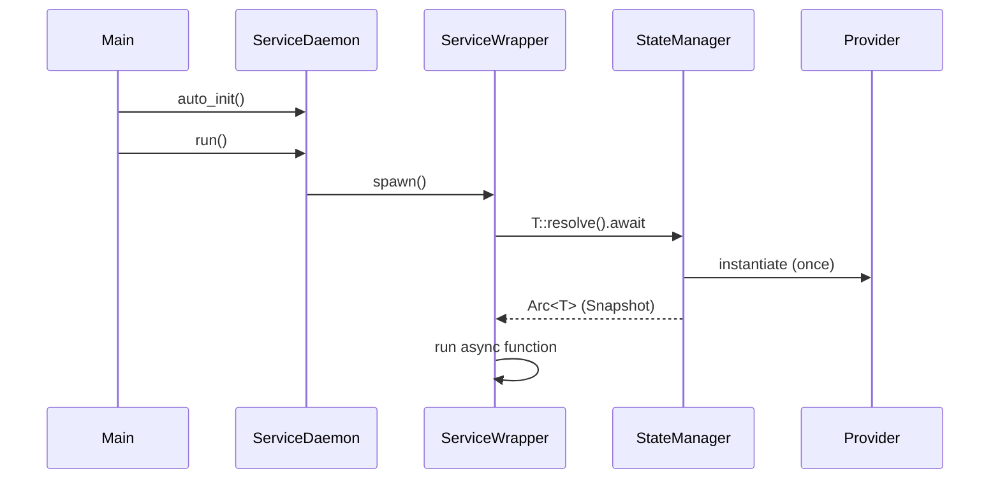
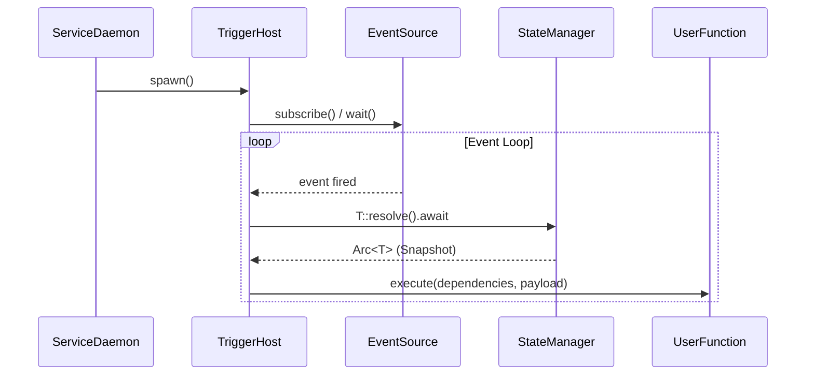

# Service Daemon

A Rust library for automatic service management with dependency injection, inspired by Python's decorator-based service registration.

## Features

- **`#[service]`** - Mark functions (sync or async) as managed services
- **`#[trigger]`** - Event-driven functions (Cron, Queue, Notify)
- **`#[provider]`** - Auto-register dependencies with once-lock singletons
- **Intelligent State** - Automatic promotion to RwLock/Mutex with lock-free snapshots
- **Cooperative Shutdown** - CancellationToken support for clean service exits
- **Automatic restart** - Failed services are restarted with exponential backoff
- **Type-safe DI** - Compile-time verified dependency resolution

> [!CAUTION]
> **Performance Warning: Synchronous Functions**
> While synchronous functions are supported for convenience, they run directly on the asynchronous executor's worker threads. **Blocking synchronous code will stall the entire daemon.**
> - For I/O or long-running tasks, always prefer `async fn`.
> - If you must use blocking code, consider wrapping it in `tokio::task::spawn_blocking` internally or converting the service to an `async fn`.

> [!TIP]
> **Suppressing Sync Warnings with `#[allow_sync]`**
> If your synchronous function is intentionally non-blocking (e.g., fast in-memory operations), you can suppress the runtime warning by adding `#[allow_sync]` before your `#[service]`, `#[trigger]`, or `#[provider]` macro:
> ```rust
> use service_daemon::{allow_sync, service};
>
> #[allow_sync]
> #[service]
> pub fn fast_sync_service() -> anyhow::Result<()> {
>     // This function is intentionally sync and safe.
>     Ok(())
> }
> ```

## Quick Start

### 1. Add dependencies

```toml
[dependencies]
service-daemon = { path = "service-daemon" }
tokio = { version = "1.40", features = ["full"] }
anyhow = "1.0"
tracing = "0.1"
tracing-subscriber = "0.3"
```

### 2. Create providers

```rust
// src/providers/typed_providers.rs
use service_daemon::provider;

#[provider(default = 8080)]
pub struct Port(pub i32);

#[provider(default = "mysql://localhost")]  // Auto-expands to .to_owned()
pub struct DbUrl(pub String);

// --- Environment Variable Provider ---
// Reads DATABASE_URL from environment, falls back to default if not set
#[provider(env_name = "DATABASE_URL", default = "postgres://localhost")]
pub struct DatabaseUrl(pub String);

// --- Async Function Provider (custom initialization) ---
pub struct AsyncConfig {
    pub connection_string: String,
}

#[provider]
pub async fn async_config() -> AsyncConfig {
    // Custom async initialization (e.g., fetching from remote)
    AsyncConfig { connection_string: "postgres://localhost".to_owned() }
}

// --- Synchronous Function Provider ---
#[provider]
pub fn sync_config() -> String {
    "some-static-value".to_owned()
}
```


### 3. Create services

```rust
// src/services/example.rs
use service_daemon::service;
use crate::providers::typed_providers::{Port, DbUrl};
use std::sync::Arc;

#[service]
pub async fn my_service(port: Arc<Port>, db_url: Arc<DbUrl>) -> anyhow::Result<()> {
    tracing::info!("Running on port {} with DB {}", **port, **db_url);
    loop {
        // do work
        tokio::time::sleep(std::time::Duration::from_secs(60)).await;
    }
}

// Synchronous services are also supported!
#[service]
pub fn my_sync_service(port: Arc<Port>) -> anyhow::Result<()> {
    tracing::info!("Sync service running on port {}", **port);
    Ok(())
}
```

### 4. Run the daemon

```rust
// src/main.rs
mod providers;
mod services;

use service_daemon::ServiceDaemon;

#[tokio::main]
async fn main() -> anyhow::Result<()> {
    tracing_subscriber::fmt::init();
    
    // Registers all services (providers are resolved lazily via OnceLock)
    let daemon = ServiceDaemon::auto_init();
    daemon.run().await
}
```

## How It Works

1. **`#[provider]`** implements the `Provided` trait for a struct or function, using `OnceCell` for thread-safe asynchronous singleton resolution.
2. **`#[service]`** generates an async wrapper that calls `T::resolve().await` for each `Arc<T>` dependency.
3. **`#[trigger]`** registers a specialized service with an embedded async event loop (Cron, Queue, or Event).
4. **`ServiceDaemon::auto_init()`** discovers all services (including triggers) via `linkme`.
5. **`daemon.run()`** spawns all services/triggers and restarts them on failure with **exponential backoff**.

## Resilience Features

### Exponential Backoff & Jitter

Services that fail are automatically restarted with exponential backoff and **randomized jitter** to prevent thundering herd issues when multiple services fail simultaneously.

```rust
use service_daemon::{ServiceDaemon, RestartPolicy};
use std::time::Duration;

// Custom restart policy with jitter
let policy = RestartPolicy::builder()
    .initial_delay(Duration::from_secs(2))
    .max_delay(Duration::from_secs(300))
    .multiplier(1.5)
    .jitter_factor(0.1) // 10% randomization
    .build();

let daemon = ServiceDaemon::from_registry_with_policy(policy);
daemon.run().await?
```

### Graceful Shutdown (Signal-Based)

The daemon uses `CancellationToken` to signal services to stop. When a shutdown signal (SIGINT/SIGTERM) is received:
1. All services are notified simultaneously.
2. The daemon waits for a grace period (default: 30s) for services to exit.
3. Services that don't exit within the grace period are forcefully aborted.

### Optimized Status Tracking

The `ServiceDaemon` uses `DashMap` for high-performance concurrent access to service health statuses, ensuring that health checks never block the main service loops.

### Service Status API

Monitor service health at runtime:

```rust
use service_daemon::ServiceStatus;

let daemon = ServiceDaemon::auto_init();
// ... after spawning services ...

// Query status (Running, Restarting, or Stopped)
let status = daemon.get_service_status("my_service").await;
match status {
    ServiceStatus::Running => println!("Service is healthy"),
    ServiceStatus::Restarting => println!("Service is recovering"),
    ServiceStatus::Stopped => println!("Service has stopped"),
}
```



## Compile-Time Dependency Verification

With Type-Based DI, missing dependencies are caught at **compile-time**:
```text
error[E0599]: no function or associated item named `resolve` found for struct `MissingType`
```

## Triggers

Triggers are specialized services with built-in event loops. They register normally as services but manage an internal "Call Host".



### 1. Cron Trigger

Executes a function based on a cron expression string.

```rust
#[provider(default = "*/30 * * * * *")]
pub struct CleanupSchedule(pub String);

#[trigger(template = Cron, target = CleanupSchedule)]
async fn hourly_cleanup() -> anyhow::Result<()> {
    tracing::info!("Cleaning up..."); // ID is in the tracing context!
    Ok(())
}
```

### 2. Broadcast Queue Trigger (Fanout)

All handlers receive every message pushed to a `BroadcastQueue`.

```rust
// Queue aliases: Queue, BQueue, BroadcastQueue
#[provider(default = Queue, item_type = "MyTask")]
pub struct TaskQueue;

// Multiple triggers can subscribe - all receive every message!
#[trigger(template = Queue, target = TaskQueue)]
async fn handler1(item: MyTask) -> anyhow::Result<()> { ... }

#[trigger(template = BQueue, target = TaskQueue)]
async fn handler2(item: MyTask) -> anyhow::Result<()> { ... }

// Push to the queue (async)
async fn trigger_handlers() {
    let _ = TaskQueue::push(MyTask { ... }).await;
}
```

### 3. Load-Balancing Queue Trigger

Messages are distributed to one handler at a time with `LoadBalancingQueue`.

```rust
// LBQueue aliases: LBQueue, LoadBalancingQueue
#[provider(default = LBQueue, item_type = "Task")]
pub struct WorkerQueue;

// Pattern 1: Implicit Payload (non-Arc parameter)
#[trigger(template = LBQueue, target = WorkerQueue)]
async fn worker(item: Task) -> anyhow::Result<()> { ... }

// Pattern 2: Explicit Arc Payload (using #[payload] marker)
#[trigger(template = LBQueue, target = WorkerQueue)]
async fn worker_arc(#[payload] item: Arc<Task>, port: Arc<Port>) -> anyhow::Result<()> {
    // Both are received as Arc! One is from event, one from DI.
    Ok(())
}

// Push to the queue (async)
async fn add_work() {
    let _ = WorkerQueue::push(Task { ... }).await;
}
```

### Parameter Mapping Rules

The `#[trigger]` macro uses a declarative approach to map parameters:
1. **Implicit Payload**: The first parameter that is *not* an `Arc<T>` is treated as the event payload.
2. **Explicit Payload**: Any parameter marked with `#[payload]` is treated as the event payload. This is required if you want to receive the payload wrapped in an `Arc<T>`.
3. **DI Resources**: All other `Arc<T>` parameters are automatically resolved via the DI system.
```


### 4. Signal Trigger (Event)

Executes a function when a `tokio::sync::Notify` is triggered.

```rust
// Provider aliases: Notify, Event, Custom
#[provider(default = Notify)]
pub struct EventNotifier;

// Trigger template aliases: Notify, Event, Custom
#[trigger(template = Event, target = EventNotifier)]
async fn on_notification() -> anyhow::Result<()> {
    tracing::info!("Event received!");
    Ok(())
}

// Trigger the signal from anywhere (async):
async fn unlock() {
    EventNotifier::notify().await;
}
```


## Intelligent State Management

The framework automatically manages shared state synchronization based on how your services declare their dependencies.

### 1. The Snapshot Pattern (High Performance)
Declare a dependency as `Arc<T>` to get a consistent, read-only snapshot.
- **Zero Lockdown**: Even if other services are writing to the state, `Arc<T>` readers never block.
- **Efficient**: Uses a zero-lock path (OnceCell) by default unless mutation is requested elsewhere.

```rust
#[service]
pub async fn reader_service(stats: Arc<GlobalStats>) -> anyhow::Result<()> {
    // Zero-overhead reading!
    tracing::info!("Processed total: {}", stats.total_processed);
    Ok(())
}
```

### 2. The Mutability Pattern (Thread-Safe Updates)
Declare a dependency as `Arc<RwLock<T>>` or `Arc<Mutex<T>>` to gain write access.
- **Automatic Promotion**: If even one service in your binary asks for a lock, the framework "promotes" that provider from a simple singleton to a **Managed State**.
- **Atomic Publishing**: When a writer finishes, the framework automatically publishes a new snapshot for future `Arc<T>` readers.

```rust
#[service]
pub async fn writer_service(stats: Arc<RwLock<GlobalStats>>) -> anyhow::Result<()> {
    let mut guard = stats.write().await;
    guard.total_processed += 1;
    // Snapshot is updated when guard is dropped
    Ok(())
}
```

### 3. Promotion Logic
1. **The Fast Path (Immutable)**: If everyone only asks for `Arc<T>`, the state is initialized once and never locked. Performance is identical to a raw pointer.
2. **The Managed Path (Mutable)**: If `Arc<RwLock<T>>` or `Arc<Mutex<T>>` is detected anywhere at link-time, the framework upgrades the provider to support consistent snapshots and concurrent locking.

---

## Project Structure

```
service-daemon-rs/
├── service-daemon/           # Core library
│   └── src/
│       ├── lib.rs            # Re-exports macros and core types
│       ├── models/           # Service, Provider, Trigger registry
│       └── utils/            # DI, ServiceDaemon, StateManager, Triggers
├── service-daemon-macro/     # Procedural macros
│   └── src/
│       ├── lib.rs            # Entry points and re-exports
│       ├── common.rs         # Shared macro utilities
│       ├── service.rs        # #[service] implementation
│       ├── provider.rs       # #[provider] implementation
│       ├── trigger.rs        # #[trigger] implementation
│       └── allow_sync.rs     # #[allow_sync] implementation
└── src/                      # Example application
    ├── main.rs
    ├── providers/            # Your providers go here
    ├── services/             # Your services go here
    └── triggers/             # Your triggers go here (optional)
```

## License

MIT
