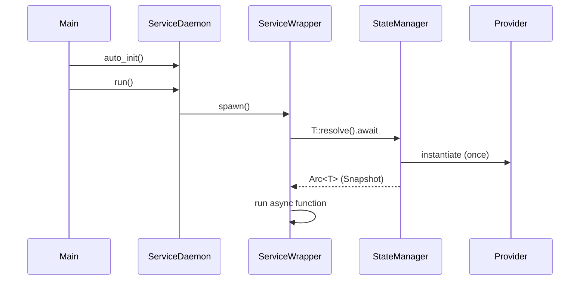
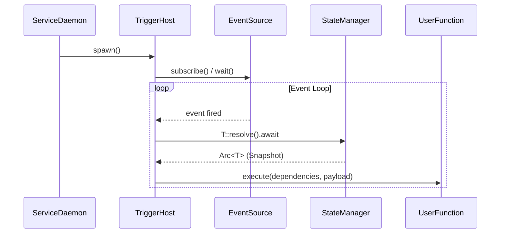

# Service Daemon

[](https://github.com/loft-games/service-daemon-rs/actions/workflows/rust.yml)

A Rust library for automatic service management with dependency injection, inspired by Python's decorator-based service registration.

## Table of Contents
- [Features](#features)
- [Quick Start](#quick-start)
- [How It Works](#how-it-works)
- [Resilience Features](#resilience-features)
- [Triggers](#triggers)
- [Intelligent State Management](#intelligent-state-management)
- [Common Patterns](#common-patterns)
- [Troubleshooting](#troubleshooting)
- [Testing](#testing)

- **`#[service]`** - Mark functions (sync or async) as managed services with custom priorities
- **`#[trigger]`** - Event-driven functions (Cron, Queue, Notify, Watch) with Typed Enum support
- **Managed Logging** - High-performance, non-blocking asynchronous log processing
- **Wave-Based Lifecycle**: Symmetric, priority-based startup (descending) and shutdown (ascending).
- **Automatic restart** - Failed services are restarted with exponential backoff
- **Unified Status Plane**: Single source of truth for service lifecycle (`Initializing`, `Healthy`, `Recovering`, etc.).
- **Zero-Copy State**: O(1) snapshots and CoW mutations for high-performance shared state.
- **Exception Handoff**: Previous errors are passed to the next service generation for custom recovery logic.
- **Type-safe DI** - Compile-time verified dependency resolution

> [!CAUTION]
> **Performance Warning: Synchronous Functions**
> While synchronous functions are supported for convenience, they run directly on the asynchronous executor's worker threads. **Blocking synchronous code will stall the entire daemon.**
> - For I/O or long-running tasks, always prefer `async fn`.
> - If you must use blocking code, consider wrapping it in `tokio::task::spawn_blocking` internally or converting the service to an `async fn`.

> [!TIP]
> **Suppressing Sync Warnings with `#[allow_sync]`**
> If your synchronous function is intentionally non-blocking (e.g., fast in-memory operations), you can suppress the runtime warning by adding `#[allow_sync]` before your `#[service]`, `#[trigger]`, or `#[provider]` macro:
> ```rust
> use service_daemon::{allow_sync, service};
>
> #[allow_sync]
> #[service]
> pub fn fast_sync_service() -> anyhow::Result<()> {
>     // This function is intentionally sync and safe.
>     Ok(())
> }
> ```

## Quick Start

### 1. Add dependencies

```toml
[dependencies]
service-daemon = { path = "service-daemon" }
tokio = { version = "1.40", features = ["full"] }
anyhow = "1.0"
tracing = "0.1"
tracing-subscriber = "0.3"
```

### 2. Create providers

```rust
// src/providers/typed_providers.rs
use service_daemon::provider;

#[provider(default = 8080)]
pub struct Port(pub i32);

#[provider(default = "mysql://localhost")]  // Auto-expands to .to_owned()
pub struct DbUrl(pub String);

// --- Environment Variable Provider ---
// Reads DATABASE_URL from environment, falls back to default if not set
#[provider(env_name = "DATABASE_URL", default = "postgres://localhost")]
pub struct DatabaseUrl(pub String);

// --- Async Function Provider (custom initialization) ---
pub struct AsyncConfig {
    pub connection_string: String,
}

#[provider]
pub async fn async_config() -> AsyncConfig {
    // Custom async initialization (e.g., fetching from remote)
    AsyncConfig { connection_string: "postgres://localhost".to_owned() }
}

// --- Synchronous Function Provider ---
#[provider]
pub fn sync_config() -> String {
    "some-static-value".to_owned()
}
```


### 3. Create services

```rust
// src/services/example.rs
use service_daemon::service;
use crate::providers::typed_providers::{Port, DbUrl};
use std::sync::Arc;

#[service]
pub async fn my_service(port: Arc<Port>, db_url: Arc<DbUrl>) -> anyhow::Result<()> {
    tracing::info!("Running on port {} with DB {}", **port, **db_url);
    while !service_daemon::is_shutdown() {
        // do work
        tokio::time::sleep(std::time::Duration::from_secs(60)).await;
    }
    Ok(())
}

// Synchronous services are also supported!
#[service]
pub fn my_sync_service(port: Arc<Port>) -> anyhow::Result<()> {
    tracing::info!("Sync service running on port {}", **port);
    Ok(())
}
```

### 4. Run the daemon

// examples/demo/src/main.rs
mod providers;
mod services;

use service_daemon::ServiceDaemon;

#[tokio::main]
async fn main() -> anyhow::Result<()> {
    // ... setup logging and config ...
    let daemon = ServiceDaemon::auto_init();
    daemon.run().await?
}
```

To run the demonstration:
```bash
cargo run -p service-daemon-demo
```

## How It Works

1.  **`#[provider]`** implements the `Provided` trait for a struct or function, using `OnceCell` for thread-safe asynchronous singleton resolution.
2.  **`#[service]`** generates an async wrapper that calls `T::resolve().await` for each `Arc<T>` dependency.
3.  **`#[trigger]`** registers a specialized service with an embedded async event loop (Cron, Queue, or Event).
4.  **`ServiceDaemon::auto_init()`** discovers all services (including triggers) via `linkme`.
5.  **`daemon.run()`** spawns all services/triggers and restarts them on failure with **exponential backoff**.

## Resilience Features

### Exponential Backoff & Jitter

Services that fail are automatically restarted with exponential backoff and **randomized jitter** to prevent thundering herd issues when multiple services fail simultaneously.

```rust
use service_daemon::{ServiceDaemon, RestartPolicy};
use std::time::Duration;

// Custom restart policy with jitter
let policy = RestartPolicy::builder()
    .initial_delay(Duration::from_secs(2))
    .max_delay(Duration::from_secs(300))
    .multiplier(1.5)
    .jitter_factor(0.1) // 10% randomization
    .build();

let daemon = ServiceDaemon::from_registry_with_policy(policy);
daemon.run().await?
```

Services and triggers use a unified signal to handle both **graceful shutdown** (SIGINT/SIGTERM) and **warm reloads** (dependency changes).

- **`is_shutdown()`**: Check if the service should stop (returns true for `NeedReload`, `ShuttingDown`, or `Terminated`).
- **`sleep(duration)`**: Interruptible sleep that returns early if shutdown is signaled.
- **`done()`**: Explicitly signal completion of current lifecycle phase (transitions `Initializing` → `Healthy`).

> [!TIP]
> **Implicit Handshake**: For minimalist services, you don't need to call `done()` explicitly. The framework automatically transitions to `Healthy` when you first call `is_shutdown()`, `sleep()`, or `wait_shutdown()`.

**Minimalist Service (Recommended for beginners):**
```rust
#[service]
async fn my_service() -> anyhow::Result<()> {
    while !service_daemon::is_shutdown() {  // Auto-transitions to Healthy here!
        // Perform work
        service_daemon::sleep(std::time::Duration::from_secs(60)).await;
    }
    Ok(())
}
```

**Advanced Service (Full lifecycle control):**
```rust
use service_daemon::{state, done, ServiceStatus};

#[service]
async fn advanced_service() -> anyhow::Result<()> {
    match state() {
        ServiceStatus::Recovering(err) => tracing::warn!("Recovering from: {}", err),
        ServiceStatus::Restoring => { /* retrieve shelved state */ },
        _ => {}
    }
    done();  // Explicit handshake for precise wave synchronization
    
    while !service_daemon::is_shutdown() {
        service_daemon::sleep(std::time::Duration::from_secs(1)).await;
    }
    Ok(())
}
```


### Graceful Shutdown (Signal-Based)

The daemon uses `CancellationToken` to signal services to stop. When a shutdown signal is received:
1. All services are notified via `is_shutdown()`.
2. The daemon waits for a grace period (default: 30s) for services to exit.
3. Services that don't exit within the grace period are forcefully aborted.

### Optimized Status Tracking

The `ServiceDaemon` uses `DashMap` for high-performance concurrent access to service health statuses, ensuring that health checks never block the main service loops.

### Service Status API

Monitor service health at runtime:

```rust
use service_daemon::ServiceStatus;

let daemon = ServiceDaemon::auto_init();
// ... after spawning services ...

// Query status
let status = daemon.get_service_status("my_service").await;
match status {
    ServiceStatus::Healthy => println!("Service is running normally"),
    ServiceStatus::Initializing => println!("Service is starting up"),
    ServiceStatus::Recovering(_) => println!("Service is recovering from a crash"),
    ServiceStatus::ShuttingDown => println!("Service is shutting down"),
    ServiceStatus::Terminated => println!("Service has stopped"),
    _ => {}
}
```

### Lifecycle Priorities

Services are assigned a `u8` priority (default 50).
- **Startup**: Descending (100 -> 80 -> 50 -> 0). Core systems start first.
- **Shutdown**: Ascending (0 -> 50 -> 80 -> 100). Core systems stop last.

```rust
use service_daemon::{service, models::ServicePriority};

#[service(priority = ServicePriority::SYSTEM)]   // (100)
pub async fn log_flush() { ... }

#[service(priority = ServicePriority::STORAGE)]  // (80)
pub async fn database() { ... }

#[service(priority = ServicePriority::EXTERNAL)] // (0)
pub async fn api_server() { ... }
```

| Level (u8) | Constant | Purpose |
| :--- | :--- | :--- |
| **100** | `SYSTEM` | Core systems (Logging, Metrics). |
| **80** | `STORAGE` | Data providers, database pools. |
| **50** | `DEFAULT` | Core business logic and triggers. |
| **0** | `EXTERNAL` | API Gateways, HTTP servers. |



## Compile-Time Dependency Verification

With Type-Based DI, missing dependencies are caught at **compile-time**:
```text
error[E0599]: no function or associated item named `resolve` found for struct `MissingType`
```

Triggers are specialized services with built-in event loops. They register normally as services but manage an internal "Call Host".

### Trigger Template Reference

| Template | Alias | Functionality |
| :--- | :--- | :--- |
| `Cron` | - | Time-based scheduling via `tokio-cron-scheduler` |
| `Queue` | `BQueue`, `BroadcastQueue` | Receives every message sent to the target queue |
| `LBQueue` | `LoadBalancingQueue` | Distributes messages to one available worker at a time |
| `Watch` | `State` | Zero-lock reactive handlers for shared state changes |
| `Notify` | `Event`, `Signal` | Simple signal-based triggers |

> [!TIP]
> **IDE Autocompletion**: Use `use service_daemon::prelude::*;` to get full candidate lists for short names like `Cron` and `Watch`. You can also use `TT::Cron` as a shorter alternative to the full path.



### 1. Cron Trigger

Executes a function based on a cron expression string.

```rust
#[provider(default = "*/30 * * * * *")]
pub struct CleanupSchedule(pub String);

#[trigger(template = Cron, target = CleanupSchedule)]
async fn hourly_cleanup() -> anyhow::Result<()> {
    tracing::info!("Cleaning up..."); // ID is in the tracing context!
    Ok(())
}
```

### 2. Broadcast Queue Trigger (Fanout)

All handlers receive every message pushed to a `BroadcastQueue`.

```rust
// Queue aliases: Queue, BQueue, BroadcastQueue
#[provider(default = Queue, item_type = "MyTask")]
pub struct TaskQueue;

// Multiple triggers can subscribe - all receive every message!
#[trigger(template = Queue, target = TaskQueue)]
async fn handler1(item: MyTask) -> anyhow::Result<()> { ... }

#[trigger(template = BQueue, target = TaskQueue)]
async fn handler2(item: MyTask) -> anyhow::Result<()> { ... }

// Push to the queue (async)
async fn trigger_handlers() {
    let _ = TaskQueue::push(MyTask { ... }).await;
}
```

### 3. Load-Balancing Queue Trigger

Messages are distributed to one handler at a time with `LoadBalancingQueue`.

```rust
// LBQueue aliases: LBQueue, LoadBalancingQueue
#[provider(default = LBQueue, item_type = "Task")]
pub struct WorkerQueue;

// Pattern 1: Implicit Payload (non-Arc parameter)
#[trigger(template = LBQueue, target = WorkerQueue)]
async fn worker(item: Task) -> anyhow::Result<()> { ... }

// Pattern 2: Explicit Arc Payload (using #[payload] marker)
#[trigger(template = LBQueue, target = WorkerQueue)]
async fn worker_arc(#[payload] item: Arc<Task>, port: Arc<Port>) -> anyhow::Result<()> {
    // Both are received as Arc! One is from event, one from DI.
    Ok(())
}

// Push to the queue (async)
async fn add_work() {
    let _ = WorkerQueue::push(Task { ... }).await;
}
```

### Parameter Mapping Rules

The `#[trigger]` macro uses a declarative approach to map parameters:
1. **Implicit Payload**: The first parameter that is *not* an `Arc<T>` is treated as the event payload.
2. **Explicit Payload**: Any parameter marked with `#[payload]` is treated as the event payload. This is required if you want to receive the payload wrapped in an `Arc<T>`.
3. **DI Resources**: All other `Arc<T>` parameters are automatically resolved via the DI system.
```


### 4. Signal Trigger (Event)

Executes a function when a `tokio::sync::Notify` is triggered.

```rust
// Provider aliases: Notify, Event, Custom
#[provider(default = Notify)]
pub struct EventNotifier;

// Trigger template aliases: Notify, Event, Custom
#[trigger(template = Event, target = EventNotifier)]
async fn on_notification() -> anyhow::Result<()> {
    tracing::info!("Event received!");
    Ok(())
}

// Trigger the signal from anywhere (async):
async fn unlock() {
    EventNotifier::notify().await;
}
```

### 5. Watch Trigger (State Change)

Executes automatically whenever shared state (`Arc<RwLock<T>>` or `Arc<Mutex<T>>`) is modified.

```rust
// 1. A service modifies the state
#[service]
pub async fn updater(data: Arc<RwLock<MyData>>) -> anyhow::Result<()> {
    let mut guard = data.write().await;
    guard.value += 1;
    Ok(()) // Trigger fires when guard is dropped!
}

// 2. A trigger watches for any modification to MyData
#[trigger(template = Watch, target = MyData)]
pub async fn on_data_changed(snapshot: Arc<MyData>) -> anyhow::Result<()> {
    tracing::info!("Data changed! New value: {}", snapshot.value);
    Ok(())
}
```


## Intelligent State Management

The framework automatically manages shared state synchronization based on how your services declare their dependencies.

### 1. The Snapshot Pattern (High Performance)
Declare a dependency as `Arc<T>` to get a consistent, read-only snapshot.
- **Zero Lockdown**: Even if other services are writing to the state, `Arc<T>` readers never block.
- **Efficient**: Uses a zero-lock path (OnceCell) by default unless mutation is requested elsewhere.

```rust
#[service]
pub async fn reader_service(stats: Arc<GlobalStats>) -> anyhow::Result<()> {
    // Zero-overhead reading!
    tracing::info!("Processed total: {}", stats.total_processed);
    Ok(())
}
```

### 2. The Mutability Pattern (Zero-Copy CoW)
Declare a dependency as `Arc<RwLock<T>>` or `Arc<Mutex<T>>` to gain write access.
- **Automatic Promotion**: If even one service asks for a lock, the framework promotes that provider to a **Managed State**.
- **Zero-Copy Publishing**: When a writer commits, a new `Arc<T>` is published. Existing readers keep their old snapshots (O(1) handover).
- **Atomic Notifications**: `Watch` triggers fire only when the state is actually modified.

```rust
#[service]
pub async fn writer_service(stats: Arc<RwLock<GlobalStats>>) -> anyhow::Result<()> {
    let mut guard = stats.write().await;
    guard.total_processed += 1;
    // Automatic CoW mutation and notification on Drop
    Ok(())
}
```

## Unified Status Plane

The Status Plane provides services with implicit context and lifecycle awareness via a single unified `ServiceStatus` enum.

### Status States

| Status | Description |
|--------|-------------|
| `Initializing` | Fresh start, first run |
| `Restoring` | Warm start with shelved data available |
| `Recovering(String)` | Crash recovery, error context available |
| `Healthy` | Steady state after `done()` is called |
| `NeedReload` | Dependency changed, preparing for warm restart |
| `ShuttingDown` | Graceful shutdown in progress |
| `Terminated` | Clean exit, ready for collection |

### Lifecycle Awareness
Services use `service_daemon::state()` to determine their current lifecycle phase:

```rust
use service_daemon::{state, done, shelve, unshelve, ServiceStatus};

#[service]
async fn my_service() -> anyhow::Result<()> {
    match state() {
        ServiceStatus::Initializing => {
            info!("First time setup");
        }
        ServiceStatus::Restoring => {
            info!("Warm restart, retrieving shelved state...");
            if let Some(data) = unshelve::<MyState>("my_key").await {
                // Restore previous state
            }
        }
        ServiceStatus::Recovering(last_err) => {
            warn!("Recovering from crash: {}", last_err);
        }
        ServiceStatus::NeedReload => {
            info!("Dependency changed, saving state for next generation...");
            shelve("my_key", my_state).await;
            done(); // Signal ready to exit
            return Ok(());
        }
        _ => {}
    }
    
    // Signal initialization complete (enables wave synchronization)
    done();
    
    // Main service loop
    while !service_daemon::is_shutdown() {
        // Use interruptible sleep
        service_daemon::sleep(std::time::Duration::from_secs(1)).await;
    }
    Ok(())
}
```

### State Handoff (Shelving)
Persist state across service restarts with named values that survive reloads:

```rust
use service_daemon::{shelve, unshelve};

#[service]
async fn persistence_service() -> anyhow::Result<()> {
    // 1. Try to retrieve state from previous generation
    let my_buffer: Option<Vec<u8>> = unshelve("buffer").await;
    
    // 2. Do work...
    
    // 3. Before exit/reload, shelve for the next generation
    shelve("buffer", vec![1, 2, 3]).await;
    Ok(())
}
```

### 3. Automatic "Watch" Notifications (The Macro Illusion)
The framework uses a **Macro Illusion** to detect modifications without specialized wrapper types.
- **Transparent Tracking**: The `#[service]` macro transparently redirects these to the framework's tracked versions.
- **Intelligent Spanning**: Uses `quote_spanned!` to preserve original source spans, ensuring that IDE documentation hints and "Jump to Definition" continue to work for your original types.
- **Qualified Path Support**: Supports both simple names (e.g., `Arc`, `RwLock`) and qualified paths (e.g., `std::sync::Arc`, `tokio::sync::RwLock`).
- **Efficient**: Uses atomic checks to ensure zero overhead when no `Watch` triggers are active for a type.

### 4. Promotion Logic
1. **The Fast Path (Immutable)**: If everyone only asks for `Arc<T>`, the state is initialized once and never locked. Performance is identical to a raw pointer.
2. **The Managed Path (Mutable)**: If `Arc<RwLock<T>>` or `Arc<Mutex<T>>` is detected anywhere at link-time, the framework upgrades the provider to support consistent snapshots and concurrent locking.

### Direct State Modification (External Bridging)
While `ServiceDaemon` encourages reactive programming via `Triggers`, you can also modify state directly from external contexts (e.g., HTTP callbacks, MQTT handlers).

`ServiceDaemon` automatically promotes state to a **Tracked/Managed** path the moment you request a lock.

```rust
// In your HTTP handler or external callback:
async fn on_web_request(new_status: String) {
    // 1. Obtain a tracked lock directly from the provider type.
    // This automatically "promotes" the state at runtime!
    let lock = ExternalStatus::rwlock().await;
    
    // 2. Modify the state. 
    // When the guard drops, all internal `Watch` triggers fire automatically.
    let mut guard = lock.write().await;
    guard.message = new_status;
}
```

#### Why use this?
*   **Symmetry**: Internal services and external bridges use the same `rwlock()` and `mutex()` API.
*   **Zero Lockdown**: Snapshot reads (`resolve().await`) are **guaranteed non-blocking** even if a writer holds the lock, thanks to an internal `watch` channel.
*   **Zero Overhead**: If you never call a lock method, the state remains a simple, high-performance immutable singleton.

## Common Patterns

### 1. Resource Pooling (e.g., Database)
Use `#[provider]` to manage resources that require complex initialization or pooling.

```rust
#[provider]
pub async fn db_pool() -> MyDbPool {
    MyDbPool::connect("...").await.unwrap()
}

#[service]
pub async fn data_service(db: Arc<MyDbPool>) -> anyhow::Result<()> {
    // db is shared across all services
    Ok(())
}
```

### 2. Cross-Service Communication
*   **Decoupled**: Use `BroadcastQueue` if multiple services need to react to the same event.
*   **State-Driven**: Use `Watch` triggers if services just need to know when shared state has changed.

## Troubleshooting

### Compile Error: `the trait Provided is not implemented for T`
**Cause**: You are attempting to inject `Arc<T>` but forgot to annotate `T` (or the function producing it) with `#[provider]`.
**Fix**: Add `#[provider]` to the dependency.

### Trigger Not Firing
*   **Module Inclusion**: Ensure the module containing your `#[trigger]` is included in your `main.rs` via `mod submodule;`. `linkme` cannot find services in modules that aren't compiled into the binary.
*   **Target Mismatch**: Double-check that the `target` in your trigger attribute matches the intended provider.

### Sync Warning in Logs
**Cause**: You are using `#[service]` on a `fn` instead of an `async fn`.
**Fix**: Convert to `async fn` or add `#[allow_sync]` if the function is guaranteed to be fast and non-blocking.


## Testing

The framework includes an integrated test suite in `src/integration_tests.rs` that verifies core functionality like:
- **Declarative Patterns**: Cron, Queues, and Signals.
- **Dynamic Promotion**: Verification that immutable singletons are correctly upgraded to managed state when locks are requested.
- **Zero Lockdown**: Proof that snapshot reads (`resolve().await`) are non-blocking even during write operations.
- **Sync Support**: Support for synchronous services and triggers using `is_shutdown()`.

To run the tests:
```bash
cargo test
```

---

## Project Structure

```
service-daemon-rs/
├── service-daemon/           # Core library
│   └── src/
│       ├── lib.rs            # Re-exports macros and core types
│       ├── models/           # Service, Provider, Trigger registry
│       └── utils/            # DI, ServiceDaemon, StateManager, Triggers
├── service-daemon-macro/     # Procedural macros
│   └── src/
│       ├── lib.rs            # Entry points and re-exports
│       ├── common.rs         # Shared macro utilities
│       ├── service.rs        # #[service] implementation
│       ├── provider.rs       # #[provider] implementation
│       ├── trigger.rs        # #[trigger] implementation
│       └── allow_sync.rs     # #[allow_sync] implementation
└── src/                      # Example application
    ├── main.rs
    ├── providers/            # Your providers go here
    ├── services/             # Your services go here
    └── triggers/             # Your triggers go here (optional)
```

## License

MIT
