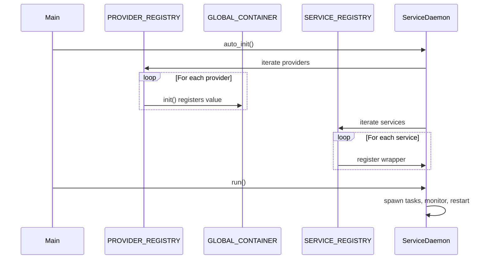

# Service Daemon

A Rust library for automatic service management with dependency injection, inspired by Python's decorator-based service registration.

## Features

- **`#[service]`** - Mark async functions as managed services
- **`#[provider]`** - Auto-register dependencies (no manual `register` calls!)
- **Automatic restart** - Failed services are restarted automatically
- **Dependency injection** - Services receive dependencies by parameter name
- **Zero boilerplate** - Just annotate and run

## Quick Start

### 1. Add dependencies

```toml
[dependencies]
service-daemon = { path = "service-daemon" }
tokio = { version = "1.40", features = ["full"] }
anyhow = "1.0"
tracing = "0.1"
tracing-subscriber = "0.3"
```

### 2. Create providers

```rust
// src/providers/config.rs
use service_daemon::provider;

#[provider(name = "port")]
const PORT: i32 = 8080;

#[provider(name = "db_url")]
fn get_db_url() -> String {
    std::env::var("DATABASE_URL").unwrap_or_else(|_| "sqlite::memory:".into())
}
```

### 3. Create services

```rust
// src/services/example.rs
use service_daemon::service;
use std::sync::Arc;

#[service]
pub async fn my_service(port: Arc<i32>, db_url: Arc<String>) -> anyhow::Result<()> {
    tracing::info!("Running on port {} with DB {}", port, db_url);
    loop {
        // do work
        tokio::time::sleep(std::time::Duration::from_secs(60)).await;
    }
}
```

### 4. Run the daemon

```rust
// src/main.rs
mod providers;
mod services;

use service_daemon::ServiceDaemon;

#[tokio::main]
async fn main() -> anyhow::Result<()> {
    tracing_subscriber::fmt::init();
    
    // auto_init() runs all providers, then registers all services
    let daemon = ServiceDaemon::auto_init();
    daemon.run().await
}
```

## How It Works

1. **`#[provider]`** generates a static entry that registers values into `GLOBAL_CONTAINER` at startup
2. **`#[service]`** generates a wrapper that resolves dependencies from `GLOBAL_CONTAINER` and a static entry for auto-discovery
3. **`ServiceDaemon::auto_init()`** runs all providers first, then registers all discovered services
4. **`daemon.run()`** spawns all services and restarts them on failure



## Features

### `macros` (Development Only)

The `macros` feature enables `verify_setup!()` which validates dependencies at startup.
Use `dev-dependencies` to automatically enable it during development only:

```toml
[features]
macros = ["service-daemon/macros"]

[dependencies]
service-daemon = { path = "service-daemon" }

[dev-dependencies]
service-daemon = { path = "service-daemon", features = ["macros"] }
```

Then add `verify_setup!()` inside your main function:

```rust
#[tokio::main]
async fn main() -> anyhow::Result<()> {
    tracing_subscriber::fmt::init();
    
    // Validates dependencies - only runs in dev builds
    service_daemon::verify_setup!();
    
    let daemon = ServiceDaemon::auto_init();
    daemon.run().await
}
```

**Behavior:**
- `cargo run` / `cargo test` → validation runs (dev profile)
- `cargo build --release` → no validation (zero cost)

If there's a missing dependency, you'll see:
```text
⚠️  Dependency 'api_key' is required by a service but no #[provider] found for it.
```

## Project Structure

```
service-daemon-rs/
├── service-daemon/           # Core library
│   └── src/
│       ├── lib.rs            # Re-exports macros and core types
│       ├── models/           # ServiceEntry, ProviderEntry
│       └── utils/            # DI Container, ServiceDaemon
├── service-daemon-macro/     # Procedural macros
│   └── src/lib.rs            # #[service], #[provider]
└── src/                      # Example application
    ├── main.rs
    ├── providers/            # Your providers go here
    └── services/             # Your services go here
```

## License

MIT
