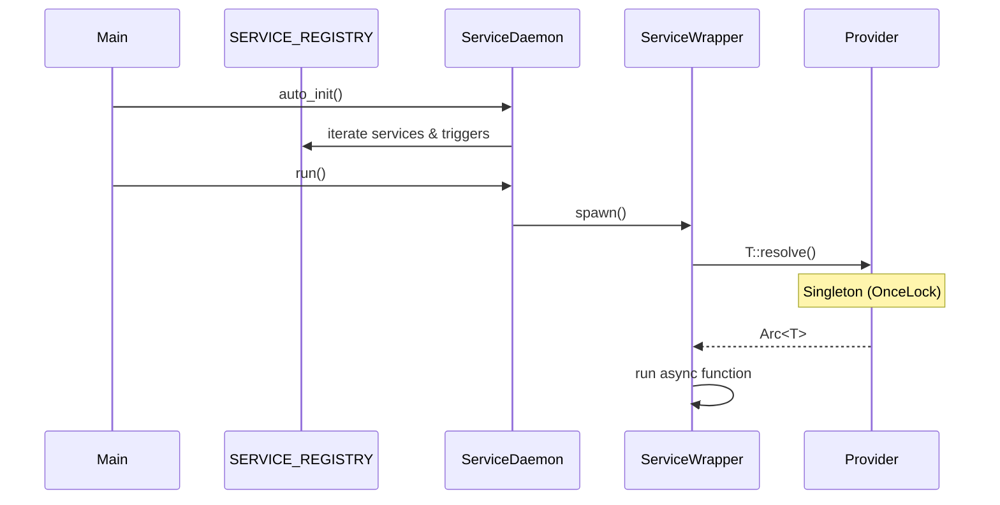

# Service Daemon

A Rust library for automatic service management with dependency injection, inspired by Python's decorator-based service registration.

## Features

- **`#[service]`** - Mark async functions as managed services
- **`#[trigger]`** - Event-driven functions (Cron, Queue, Custom)
- **`#[provider]`** - Auto-register dependencies (no manual `register` calls!)
- **Automatic restart** - Failed services are restarted automatically
- **Type-safe DI** - Services/Triggers receive dependencies by name with type verification
- **Zero boilerplate** - Just annotate and run

## Quick Start

### 1. Add dependencies

```toml
[dependencies]
service-daemon = { path = "service-daemon" }
tokio = { version = "1.40", features = ["full"] }
anyhow = "1.0"
tracing = "0.1"
tracing-subscriber = "0.3"
```

### 2. Create providers

```rust
// src/providers/typed_providers.rs
use service_daemon::provider;

#[provider(default = 8080)]
pub struct Port(pub i32);

#[provider(default = "mysql://localhost")]  // Auto-expands to .to_owned()
pub struct DbUrl(pub String);

// --- Environment Variable Provider ---
// Reads DATABASE_URL from environment, falls back to default if not set
#[provider(env_name = "DATABASE_URL", default = "postgres://localhost")]
pub struct DatabaseUrl(pub String);

// --- Async Function Provider (custom initialization) ---
pub struct AsyncConfig {
    pub connection_string: String,
}

#[provider]
pub async fn async_config() -> AsyncConfig {
    // Custom async initialization (e.g., fetching from remote)
    AsyncConfig { connection_string: "postgres://localhost".to_owned() }
}
```


### 3. Create services

```rust
// src/services/example.rs
use service_daemon::service;
use crate::providers::typed_providers::{Port, DbUrl};
use std::sync::Arc;

#[service]
pub async fn my_service(port: Arc<Port>, db_url: Arc<DbUrl>) -> anyhow::Result<()> {
    tracing::info!("Running on port {} with DB {}", **port, **db_url);
    loop {
        // do work
        tokio::time::sleep(std::time::Duration::from_secs(60)).await;
    }
}
```

### 4. Run the daemon

```rust
// src/main.rs
mod providers;
mod services;

use service_daemon::ServiceDaemon;

#[tokio::main]
async fn main() -> anyhow::Result<()> {
    tracing_subscriber::fmt::init();
    
    // Registers all services (providers are resolved lazily via OnceLock)
    let daemon = ServiceDaemon::auto_init();
    daemon.run().await
}
```

## How It Works

1. **`#[provider]`** implements the `Provided` trait for a struct, using `OnceLock` for thread-safe singleton resolution.
2. **`#[service]`** generates a wrapper that calls `T::resolve()` for each `Arc<T>` dependency.
3. **`#[trigger]`** registers a specialized service with an embedded event loop (Cron, Queue, or Custom).
4. **`ServiceDaemon::auto_init()`** discovers all services (including triggers) via `linkme`.
5. **`daemon.run()`** spawns all services/triggers and restarts them on failure with **exponential backoff**.

## Resilience Features

### Exponential Backoff & Restart Policy

Services that fail are automatically restarted with exponential backoff to prevent rapid crash loops:

```rust
use service_daemon::{ServiceDaemon, RestartPolicy};
use std::time::Duration;

// Custom restart policy with builder pattern
let policy = RestartPolicy::builder()
    .initial_delay(Duration::from_secs(2))
    .max_delay(Duration::from_secs(300))  // 5 minutes max
    .multiplier(1.5)                       // Backoff multiplier
    .reset_after(Duration::from_secs(60)) // Reset delay after stable run
    .build();

let daemon = ServiceDaemon::from_registry_with_policy(policy);
daemon.run().await?
```

Default policy: 1s initial → 2x multiplier → 5min max.

### Graceful Shutdown

The daemon handles `SIGINT` (Ctrl+C) and `SIGTERM` signals for graceful shutdown:

```rust
// Press Ctrl+C or send SIGTERM to stop gracefully
daemon.run().await?
// After receiving signal:
// INFO: Received SIGINT, shutting down...
// INFO: Stopping service: my_service
// INFO: ServiceDaemon stopped.
```

### Service Status API

Monitor service health at runtime:

```rust
use service_daemon::ServiceStatus;

let daemon = ServiceDaemon::auto_init();
// ... after spawning services ...

// Query status (Running, Restarting, or Stopped)
let status = daemon.get_service_status("my_service").await;
match status {
    ServiceStatus::Running => println!("Service is healthy"),
    ServiceStatus::Restarting => println!("Service is recovering"),
    ServiceStatus::Stopped => println!("Service has stopped"),
}
```



## Features

### `macros` (Development Only)

The `macros` feature enables `verify_setup!()` which provides diagnostic logging.
The real power is in **Type-Based DI**, which gives you **compile-time errors** if a dependency is missing!

```toml
[features]
macros = ["service-daemon/macros"]

[dependencies]
service-daemon = { path = "service-daemon" }

[dev-dependencies]
service-daemon = { path = "service-daemon", features = ["macros"] }
```

### Dependency Verification

With Type-Based DI, missing dependencies are caught at **compile-time**:
```text
error[E0599]: no function or associated item named `resolve` found for struct `MissingType`
```

## Triggers

Triggers are specialized services with built-in event loops. They register normally as services but manage an internal "Call Host".

### 1. Cron Trigger

Executes a function based on a cron expression string.

```rust
#[provider(default = "*/30 * * * * *")]
pub struct CleanupSchedule(pub String);

#[trigger(template = "cron", target = CleanupSchedule)]
async fn hourly_cleanup(_request: (), id: String) -> anyhow::Result<()> {
    tracing::info!("Cleaning up... (id: {})", id);
    Ok(())
}
```

### 2. Broadcast Queue Trigger (Fanout)

All handlers receive every message pushed to a `BroadcastQueue`.

```rust
// BroadcastQueue aliases: Queue, BQueue
#[provider(default = Queue, item_type = "MyTask")]
pub struct TaskQueue;

// Multiple triggers can subscribe - all receive every message!
#[trigger(template = "queue", target = TaskQueue)]
async fn handler1(item: MyTask, id: String) -> anyhow::Result<()> { ... }

#[trigger(template = "queue", target = TaskQueue)]
async fn handler2(item: MyTask, id: String) -> anyhow::Result<()> { ... }

// Push to the queue (synchronous, not async)
fn trigger_handlers() {
    let _ = TaskQueue::push(MyTask { ... });
}
```

### 3. Load-Balancing Queue Trigger

Messages are distributed to one handler at a time with `LoadBalancingQueue`.

```rust
// LoadBalancingQueue alias: LBQueue
#[provider(default = LBQueue, item_type = "Task")]
pub struct WorkerQueue;

#[trigger(template = "lb_queue", target = WorkerQueue)]
async fn worker(item: Task, id: String) -> anyhow::Result<()> { ... }

// Push to the queue (async)
async fn add_work() {
    let _ = WorkerQueue::push(Task { ... }).await;
}
```


### 4. Signal Trigger (Event)

Executes a function when a `tokio::sync::Notify` is triggered.

```rust
// Provider aliases: Notify, Event
#[provider(default = Notify)]
pub struct EventNotifier;

// Trigger template aliases: custom, notify, event
#[trigger(template = "event", target = EventNotifier)]
async fn on_notification(_request: (), id: String) -> anyhow::Result<()> {
    tracing::info!("Event received! (id: {})", id);
    Ok(())
}

// Trigger the signal from anywhere:
fn unlock() {
    EventNotifier::notify();
}
```


## Project Structure

```
service-daemon-rs/
├── service-daemon/           # Core library
│   └── src/
│       ├── lib.rs            # Re-exports macros and core types
│       ├── models/           # Service, Provider, Trigger registry
│       └── utils/            # DI Container, ServiceDaemon
├── service-daemon-macro/     # Procedural macros
│   └── src/lib.rs            # #[service], #[provider], #[trigger]
└── src/                      # Example application
    ├── main.rs
    ├── providers/            # Your providers go here
    ├── services/             # Your services go here
    └── triggers/             # Your triggers go here (optional)
```

## License

MIT
