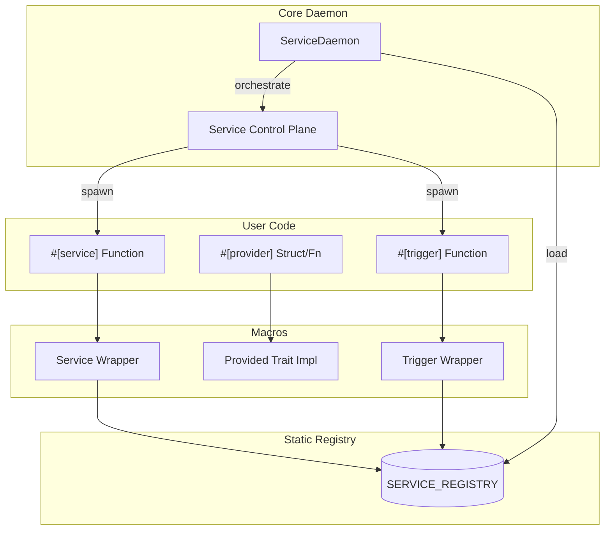

# Architecture Overview

`service-daemon-rs` is designed as a high-level framework for building resilient, modular applications using **Type-Based Decentralized Dependency Injection** and a **Unified Registry**.

## 1. Unified Registry (Linkme)

Both standard services and event-driven triggers are collected into a single `SERVICE_REGISTRY` at link time using the `linkme` crate. 

This enables "distributed registration":
- **Zero Configuration**: No central list of services is needed.
- **Automatic Discovery**: `ServiceDaemon::auto_init()` automatically finds all annotated functions across the entire workspace.

## 2. Decentralized Dependency Injection

Unlike traditional DI containers that hold all instances in a central map, `service-daemon-rs` uses decentralized resolution:

- **Type-Local Ownership**: Each type provides its own resolution logic via the `Provided` trait (typically generated by `#[provider]`).
- **Lazy Singletons**: Resolution usually involves a `OnceCell` or `StateManager` ensuring thread-safe, single-instance sharing via `Arc<T>`.
- **Recursive Resolution**: When a service starts, its dependencies are resolved recursively. Errors are caught at compile-time.

### 2.1. Status Plane & Reactive Orchestration
The daemon maintains a **Unified Status Plane** to track service health. To eliminate inefficient polling, the framework uses a global `STATUS_CHANGED` notification mechanism. When any service changes its status (e.g. transitioning from `Initializing` to `Healthy`), the daemon is notified immediately, enabling responsive wave-based startup and proactive dependency management.

## 3. High-Level System Flow

[Back to README](../../README.md)
