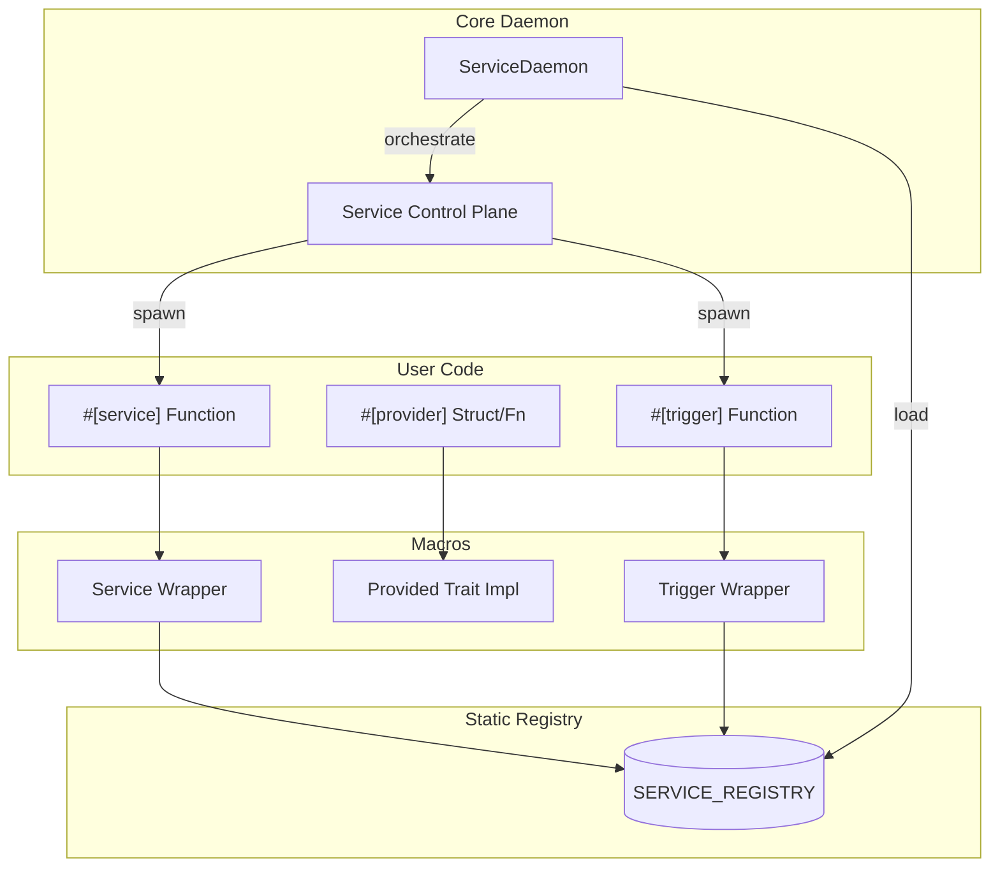
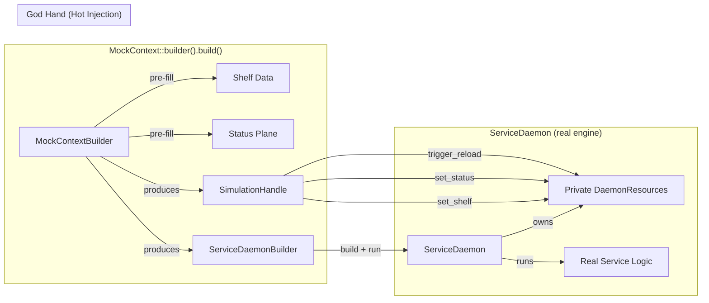

# Architecture Overview

`service-daemon-rs` is designed as a high-level framework for building resilient, modular applications using **Type-Based Decentralized Dependency Injection** and a **Unified Registry**.

## 1. Unified Registry (Linkme)

Both standard services and event-driven triggers are collected into a single `SERVICE_REGISTRY` at link time using the `linkme` crate. 

This enables "distributed registration":
- **Zero Configuration**: No central list of services is needed.
- **Automatic Discovery**: `ServiceDaemon::builder().build()` automatically finds all annotated functions across the entire workspace via the `Registry`.

## 2. Decentralized Dependency Injection

Unlike traditional DI containers that hold all instances in a central map, `service-daemon-rs` uses decentralized resolution:

- **Type-Local Ownership**: Each type provides its own resolution logic via the `Provided` trait (typically generated by `#[provider]`).
- **Lazy Singletons**: Resolution usually involves a `OnceCell` or `StateManager` ensuring thread-safe, single-instance sharing via `Arc<T>`.
- **Recursive Resolution**: When a service starts, its dependencies are resolved recursively. Errors are caught at compile-time.

### 2.1. Status Plane & Reactive Orchestration
The daemon maintains a **Unified Status Plane** to track service health. To eliminate inefficient polling, the framework uses a global `STATUS_CHANGED` notification mechanism. When any service changes its status (e.g. transitioning from `Initializing` to `Healthy`), the daemon is notified immediately, enabling responsive wave-based startup and proactive dependency management.

## 3. High-Level System Flow

## 4. Project Structure

The framework is organized into specialized submodules to ensure maintainability as the codebase grows:

### `service-daemon-macro`
- **`trigger/`**: Handles attribute parsing and code generation for event-driven logic (Cron, Queues, Watchers).
- **`service/`**: Core logic for wrapping functions as managed tasks and registering them with `linkme`.
- **`provider/`**: Managed state and dependency injection logic, including special templates like `Notify` and `Queue`.

### `service-daemon`
- **`core/service_daemon/`**: The core orchestrator.
  - `policy.rs`: Resilience configuration (backoff, jitter).
  - `runner.rs`: Lifecycle management (startup waves, supervision, graceful shutdown, and error suppression during teardown).
- **`core/logging.rs`**: The high-performance logging system (`DaemonLayer` and `LogService`).
- **`core/triggers.rs`**: Built-in trigger host implementations. Each host implements the `TriggerHost` trait with `setup` (one-time initialization) and `handle_step` (per-event policy).
- **`core/trigger_runner.rs`**: The `TriggerRunner` event loop driver and `TriggerInterceptor` pipeline. Uses an onion-model interceptor chain (stored as `Arc<dyn>` for safe cross-task sharing) where each layer (tracing, retry, user-defined) has full control over the dispatch lifecycle. Dispatch is **asynchronous** -- each event is spawned into a `tokio::spawn` task gated by a `Semaphore`. A background `scale_monitor` dynamically adjusts the concurrency limit based on pressure ratio.
- **`core/context/`**: Task-local storage, status plane interactions, and **simulation overlay** (`MockContext`).
- **`core/managed_state.rs`**: The reactive state engine with change tracking.

## 5. Simulation Layer (Feature-Gated)

All testing/simulation code lives behind the `simulation` Cargo feature. It only controls **whether the toolbox is compiled** -- it does NOT inject any runtime logic into the production `resolve()` path.

### Architecture: Interactive Simulation Sandbox

- **`MockContext`**: A sandbox factory that produces a pre-configured `ServiceDaemonBuilder` and a `SimulationHandle`. No direct execution.
- **`SimulationHandle`**: The "God Hand" -- allows dynamic mutation of `DaemonResources` during a running simulation (shelf, status, reload signals).
- **Service Registration**: How `#[service]` works internal machinery.
- **Strict Feature Gating**: All simulation types (`MockContext`, `SimulationHandle`, `with_resources()`, `resources()`) are `#[cfg(feature = "simulation")]` -- physically absent from production builds.

## 6. Avoiding Service Interference

Because of the automatic service discovery, testing a subsystem in a large project can lead to "Service Interference" where production services are unintentionally started during tests.

**Best Practices:**
1. **Use Tags**: Group services logically using `#[service(tags = ["core", "api"])]`.
2. **Isolated Registry**: In integration tests, use `Registry::builder().with_tag("__isolation__").build()` to create an empty environment, then inject only the services under test via `.with_services()`.
3. **ServiceId Safety**: The `ServiceDaemonBuilder` automatically detects `ServiceId` collisions at startup, preventing two services from competing for the same status plane slot.

## 7. Event Traceability Architecture

The system uses a unified messaging layer for all cross-service events:

- **TriggerMessage**: Encapsulates the payload with a `TriggerContext` (Source ID, Instance ID, Message ID).
- **Publish API**: Services use `publish()` to inject these messages into providers.
- **TriggerRunner**: Ensures that every trigger execution is wrapped in a tracing span that preserves the original event's context.
- **Interceptor Pipeline**: `TriggerInterceptor
` layers execute in an onion model -- each interceptor wraps the next and decides if, when, and how many times to call it. Built-in interceptors handle tracing spans (`TracingInterceptor`) and exponential-backoff retry (`RetryInterceptor`). User-defined interceptors can be added for rate limiting, authentication, metrics, etc.

[Back to README](../../README.md)

