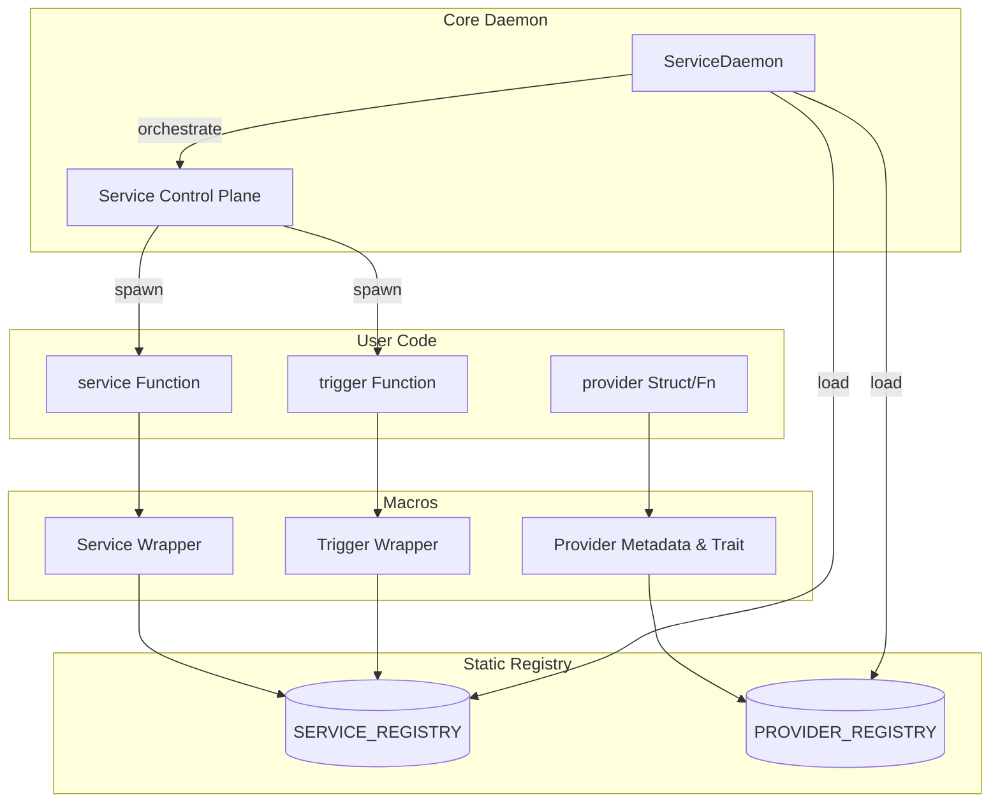
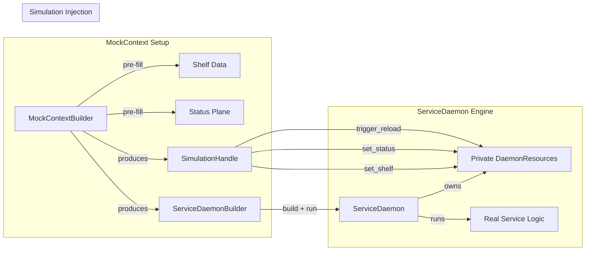

# Architecture Overview

`service-daemon-rs` is designed as a high-level framework for building resilient, modular applications using **Type-Based Decentralized Dependency Injection** and a **Unified Registry**.

## 1. Unified Registry (Linkme)

Both standard services and event-driven triggers are collected into a `SERVICE_REGISTRY`, while dependency providers are collected into a `PROVIDER_REGISTRY`. Both are managed at link time using the `linkme` crate. 

### How it works: Linker-Level Discovery
1. **Metadata Segments**: The framework macros generate `#[distributed_slice]` entries. At compile time, the Rust compiler (and the linker) places these pointers into specialized data segments (`SERVICE_REGISTRY` and `PROVIDER_REGISTRY`).
2. **Zero-Scan Loading**: Unlike frameworks that scan the filesystem or use heavy reflection at runtime, `ServiceDaemon` simply reads these contiguous memory segments. This results in **O(1) discovery** regardless of the project size.
3. **Implicit Activation**: Any module included in the compilation tree via `mod` will have its services and providers automatically registered. No manual list maintenance is required.

### Registry Identity
Each entry in the registry contains a `ServiceId`. This ID is used as the primary key in the **Status Plane** and for routing events in the **Ripple Model**.

## 2. Decentralized Dependency Injection

Unlike traditional DI containers that hold all instances in a central map, `service-daemon-rs` uses decentralized resolution:

- **Type-Local Ownership**: Each type provides its own resolution logic via `Provided` (typically generated by `#[provider]`). Managed state (`Arc<RwLock<T>>` / `Arc<Mutex<T>>`) requires `ManagedProvided`, and watch triggers (`Watch(T)`) require `WatchableProvided`.
- **Lazy Singletons**: Resolution usually involves a `OnceCell` or `StateManager` ensuring thread-safe, single-instance sharing via `Arc<T>`.
- **Recursive Resolution**: When a service starts, its dependencies are resolved recursively. Errors are caught at compile-time.

### 2.1. Status Plane & Reactive Orchestration
The daemon maintains a **Unified Status Plane** to track service health. To eliminate inefficient polling, the framework uses a global `STATUS_CHANGED` notification mechanism. When any service changes its status (e.g. transitioning from `Initializing` to `Healthy`), the daemon is notified immediately, enabling responsive wave-based startup and proactive dependency management.

## 3. High-Level System Flow

## 4. Project Structure

The framework is organized into specialized submodules to ensure maintainability as the codebase grows:

### `service-daemon-macro`
- **`common.rs`**: Shared infrastructure for parameter extraction (`ExtractedParams`) and unified code generation for function wrappers and watchers.
- **`trigger/`**: Handles specialized attribute parsing and host-specific event loop generation for triggers (Cron, Queues, Watchers).
- **`service/`**: Core logic for wrapping standard functions and creating registry entries.
- **`provider/`**: Managed state and dependency injection logic.

### `service-daemon`
- **`core/service_daemon/`**: The core orchestrator.
  - `policy.rs`: Resilience configuration (backoff, jitter).
  - `runner.rs`: Lifecycle management (startup waves, supervision, graceful shutdown, and error suppression during teardown).
- **`core/logging.rs`**: The high-performance logging pipeline. `DaemonLayer` (with `LookupSpan`) captures all tracing events, extracts `service_id`/`message_id`/`source_id` from Span context, and pushes `LogEvent` instances to a broadcast queue (capacity: 65,536). `LogEvent` uses `LogLevel` (1-byte enum) and `Cow<'static, str>` for zero-allocation field capture. Two independent SYSTEM-priority consumers process this queue: `log_service` (ANSI-colored stderr via `render_to_buf` with reusable buffer, tag: `__log__`) and `file_log_service` (JSON file persistence with configurable rotation/retention via `RollingFileAppender::builder()`, tag: `__file_log__`, feature-gated: `file-logging`). Both use a fill-the-valley batch strategy (safety cap: 1,024). The `init_logging()` convenience function provides one-line setup.
- **`core/triggers.rs`**: Built-in trigger host implementations. Each host implements the `TriggerHost` trait with `setup` (one-time initialization) and `handle_step` (per-event policy).
- **`core/trigger_runner.rs`**: The `TriggerRunner` event loop driver and `TriggerInterceptor` pipeline.
  - **Instance Reuse**: Reuses a single `TriggerHost` instance via `&mut self` across all iterations in a service lifecycle, allowing hosts to maintain internal state (counters, buffers) without global shelving. A fresh instance is only created via `setup` during service reloads or restarts.
  - **Onion Interceptors**: Uses an onion-model interceptor chain (stored as `Arc<dyn>` for safe cross-task sharing) where each layer (tracing, retry, user-defined) has full control over the dispatch lifecycle.
  - **Elastic Scaling & Backpressure**: Dispatch is **asynchronous** -- each event is spawned into a `tokio::spawn` task. Scaling is **conditionally enabled**: only trigger templates that declare a `ScalingPolicy` (via `TriggerHost::scaling_policy()`) activate the semaphore-based flow control and background `scale_monitor` task. Templates without scaling declarations dispatch serially with zero overhead.
- **`core/context/`**: Task-local storage, status plane interactions, and **simulation overlay** (`MockContext`).
- **`core/managed_state.rs`**: The reactive state engine with change tracking.

## 5. Simulation Layer (Feature-Gated)

All testing/simulation code lives behind the `simulation` Cargo feature. It only controls **whether the toolbox is compiled** -- it does NOT inject any runtime logic into the production `resolve()` path.

### Architecture: Interactive Simulation Sandbox

- **`MockContext`**: A sandbox factory that produces a pre-configured `ServiceDaemonBuilder` and a `SimulationHandle`. No direct execution.
- **`SimulationHandle`**: Allows dynamic mutation of `DaemonResources` during a running simulation (shelf, status, reload signals).
- **Infra Tag Injection**: `MockContextBuilder` auto-includes `log_service` (tag: `__log__`) via `ServiceDaemonBuilder::with_infra_tags()`. Users can disable this with `.with_logging(false)` for lightweight tests.
- **Service Registration**: How `#[service]` works internal machinery.
- **Strict Feature Gating**: All simulation types (`MockContext`, `SimulationHandle`, `with_resources()`, `resources()`) are `#[cfg(feature = "simulation")]` -- physically absent from production builds.

## 6. Avoiding Service Interference

Because of the automatic service discovery, testing a subsystem in a large project can lead to "Service Interference" where production services are unintentionally started during tests.

**Best Practices:**
1. **Use Tags**: Group services logically using `#[service(tags = ["core", "api"])]`.
2. **Isolated Registry**: In integration tests, use `Registry::builder().with_tag("__isolation__").build()` to create an empty environment. Register test services with unique tags via `#[service(tags = ["__my_test__"])]` and select them with `Registry::builder().with_tag("__my_test__").build()`.
3. **ServiceId Safety**: The `ServiceDaemonBuilder` automatically detects `ServiceId` collisions at startup, preventing two services from competing for the same status plane slot.

## 7. Event Traceability Architecture

The system uses a unified messaging layer for all cross-service events:

- **TriggerMessage**: Encapsulates the payload with a `TriggerContext` (Source ID, Instance ID, Message ID).
- **Provider Methods**: Services emit events by calling provider instance methods directly (e.g. `notifier.notify()`, `queue.push(...)`) after resolving the provider via DI injection.
- **TriggerRunner**: Ensures that every trigger execution is wrapped in a tracing span that preserves the original event's context.
- **Interceptor Pipeline**: `TriggerInterceptor
` layers execute in an onion model -- each interceptor wraps the next and decides if, when, and how many times to call it. Built-in interceptors handle tracing spans (`TracingInterceptor`) and exponential-backoff retry (`RetryInterceptor`). User-defined interceptors can be added for rate limiting, authentication, metrics, etc.

[Back to README](../../README.md)

