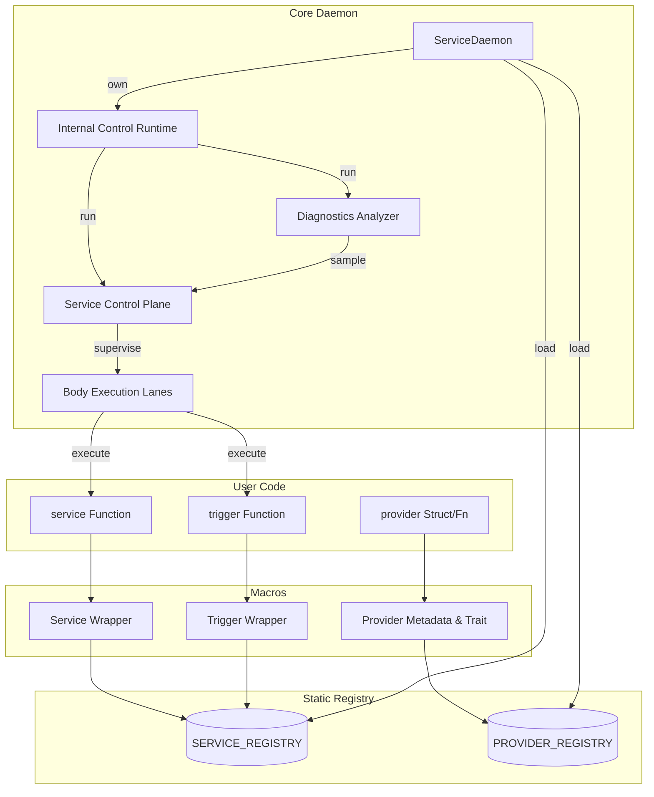
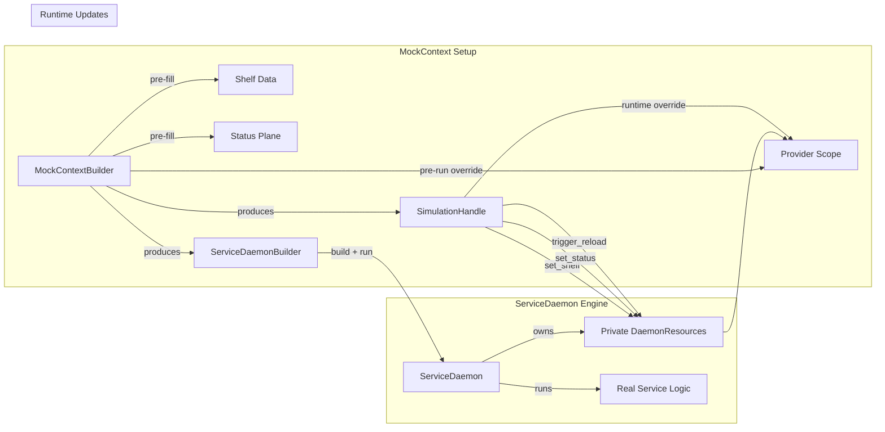

# Architecture Overview

`service-daemon-rs` is a Rust framework for long-running Tokio applications. It combines type-based dependency injection with link-time registration for services, triggers, and providers.

## Runtime Component Map

At a high level, the macros wire user code into five runtime surfaces:

- **Registry**: the lazy blueprint of service, trigger, and provider entries discovered from link-time slices. It does not start work by itself; it describes what the daemon can create.
- **Runner / control plane**: the daemon-owned orchestration layer that starts priority waves, supervises generations, bridges bodies onto their declared execution lanes, applies restart policy, and handles graceful shutdown.
- **Status Plane**: the shared observation map for service lifecycle state. User helpers such as `state()` read from this plane, while reload delivery also uses a companion token/watch path.
- **Provider Scope**: the daemon-local provider binding layer. Daemons inherit root provider slots by default and can shadow individual provider types with local forks or simulation overrides.
- **Shelf**: daemon-scoped typed storage for data that should survive a service generation restart or reload, but not the lifetime of the whole daemon process.

The sections below expand each surface into its implementation model and public boundary.

## 1. Unified Registry (Linkme)

Both standard services and event-driven triggers are collected into a `SERVICE_REGISTRY`, while dependency providers are collected into a `PROVIDER_REGISTRY`. Both are managed at link time using the `linkme` crate. 

### How link-time discovery works
1. **Registry entries**: The framework macros generate `#[distributed_slice]` entries. At compile time, the Rust compiler and linker place these pointers into the `SERVICE_REGISTRY` and `PROVIDER_REGISTRY` slices.
2. **Registry loading**: `ServiceDaemon` reads those slices directly. There is no filesystem scan or runtime reflection step.
3. **Module reachability**: Any module included in the compilation tree via `mod` has its services and providers registered. No manual list maintenance is required.

### Registry identity
Each selected entry receives a `ServiceEntryId` from its original `SERVICE_REGISTRY` index. The daemon then materializes an auto-start singleton with a fresh UUIDv7-backed `ServiceInstanceId`, and that runtime instance ID is used as the primary key in the Status Plane, Shelf, reload signals, runtime facts, diagnostics, and trigger routing. `ServiceEntryId` identifies the static registry entry; it cannot be converted into a `ServiceInstanceId`.

## 2. Decentralized Dependency Injection

`service-daemon-rs` separates provider discovery from provider ownership. `PROVIDER_REGISTRY` tells the daemon which provider definitions exist, while provider scopes decide which cached instance a daemon generation actually receives.

- **Root compatibility slot**: each generated provider still owns a root `StateManager<T>` slot. Helper calls such as `T::resolve()` made outside a daemon context use this root fallback.
- **Daemon effective scope**: service bodies, trigger bodies, dependency watch construction, and reachable eager initialization resolve through the current daemon's `DaemonResources` provider scope.
- **Inherited by default**: a daemon scope normally inherits the root slot, preserving the simple "one shared provider" behavior for ordinary applications.
- **Local shadowing**: internal forks and simulation overrides install a daemon-local slot for a single provider type. That slot has its own cache, managed locks, watch notification, and binding epoch.
- **Recursive Resolution**: provider dependencies resolve through the same effective scope, so a provider initialized for a daemon sees the same ownership boundary as the service or trigger that requested it.

### 2.1. Status plane and reload signaling
The daemon maintains a shared Status Plane for service-observable lifecycle state. A global `STATUS_CHANGED` notification wakes waiters when a service writes a new status, such as the transition from `Initializing` to `Healthy`.

Reloads use a companion control path in addition to the Status Plane. Provider dependency watch sets are captured per generation before the service or trigger body becomes externally observable; a value or binding change cancels that generation's reload token directly. Inside the service, `state()` then resolves to `NeedReload` from that token-driven control path, even before or without a separate `status_plane` write.

## 3. High-Level System Flow

```mermaid
graph TD
    subgraph User_Code ["User Code"]
        S["service Function"]
        P["provider Struct/Fn"]
        T["trigger Function"]
    end

    subgraph Macro_Gen ["Macros"]
        M_S[Service Wrapper]
        M_P[Provider Metadata & Trait]
        M_T[Trigger Wrapper]
    end

    subgraph Static_Registry ["Static Registry"]
        SR[("SERVICE_REGISTRY")]
        PR[("PROVIDER_REGISTRY")]
    end

    subgraph Core_Daemon ["Core Daemon"]
        SD[ServiceDaemon]
        CR[Internal Control Runtime]
        SCP[Service Control Plane]
        AD[Diagnostics Analyzer]
        BL[Body Execution Lanes]
    end

    S --> M_S --> SR
    P --> M_P --> PR
    T --> M_T --> SR

    SD -->|load| SR & PR
    SD -->|own| CR
    CR -->|run| SCP
    CR -->|run| AD
    AD -->|sample| SCP
    SCP -->|supervise| BL
    BL -->|execute| S
    BL -->|execute| T
```

The control plane runs supervisors, watchers, startup waves, reload, restart/backoff, shutdown, control diagnostics, and the advisory analyzer on the daemon-owned control runtime. User service and trigger bodies execute on their statically declared mode (`Standard`, `HighPriority`, or `Isolated`) and report outcomes back through the supervisor bridge.

During daemon construction, the final selected service list is also the source for HighPriority worker-count selection. The daemon counts declared `HighPriority` services and triggers as equal registry entries, derives a capped worker count, and applies the result only when the shared high-priority runtime is lazily created.

Internally, `core/service_daemon/` keeps the public daemon facade separate from the startup control plane. The facade owns `ServiceDaemon`, `ServiceDaemonHandle`, `run()`, `wait()`, and `shutdown()`, while sibling modules handle builder assembly, provider graph validation/eager initialization, runtime preparation, and startup orchestration.

The diagnostics analyzer is internal and recommendation-first. It reads windowed lane/service/generation observations and logs advisory recommendations, but it does not change public scheduling semantics or move a running future. Public diagnostics use distilled `DaemonDiagnosticsSnapshot` read models with stable observation facts such as lifecycle exit kind, restart decision kind, restart/backoff delays, and runtime lane pressure. Interpretation labels, confidence, and hints remain read-only metadata for Standard runtime symptoms, while the store, windows, evaluator, recommendation model, thresholds, sampler, and lane resolver stay crate-private. Mode-internal placement changes, such as HighPriority runtime epoch rollover, are outside the current runtime contract and must happen through a cooperative generation boundary.

Runtime facts are a separate read-only operational plane. `core::runtime_facts`
is owned by `DaemonResources` and combines service metadata from the final
registry, lifecycle facts from the supervisor/context handshake, and trigger
pressure counters from `TriggerRunner`. `ServiceDaemonHandle` exposes owned
snapshots for daemon facts, readiness grouping, service facts, and trigger facts.
The snapshots copy facts out of the runtime; they do not expose status-plane
guards, semaphores, diagnostics stores, or policy handles.

The first runtime-facts surface is keyed by `ServiceInstanceId`. Trigger host and target
labels are omitted because stable host/target metadata would require a separate
registry contract. Status subscription is also separate from this surface: the
current `status_changed` signal is a lossy `Notify`, not a sequenced status
stream.

Trigger policy overlays live beside runtime facts but use a different contract.
`TriggerContext::request_policy_overlay(...)` records a generation-scoped desired
overlay; runner scheduling boundaries reconcile concurrency, timeout, and retry
policy for later dispatches. Generation cleanup and TTL expiry remove the overlay
without changing the trigger's base policy.

### 3.1. Public Boundary

| Surface | Boundary |
| :--- | :--- |
| `ServiceScheduling::{Standard, HighPriority, Isolated}` | Public static execution contract generated into the registry; runtime and public APIs do not override it across modes. |
| Macro `scheduling = ...` | Accepts only `Standard`, `HighPriority`, or `Isolated`; there is no `Auto` or `Control` user-facing mode. |
| `ServiceEntry` | Public metadata surface. It does not carry experimental restart policy or scheduling hint fields. |
| `DaemonDiagnosticsSnapshot` and handle read methods | Public read-only diagnostics summaries; snapshot reads do not drive reload, restart, advisory evaluation, or lane remap. |
| `DaemonRuntimeSnapshot`, `ReadinessSnapshot`, service runtime snapshots, and trigger runtime snapshots | Public read-only operational facts copied out of runtime state. |
| `TriggerContext::pressure()` | Self-scoped read-only trigger pressure facts for the current trigger service. |
| `TriggerContext::request_policy_overlay(...)` / `clear_policy_overlay(...)` | Temporary trigger policy overlay scoped by the current service generation; overlays require TTL, reason, bounds validation, and generation cleanup. |
| Provider root fallback | Public helper behavior for `T::resolve()` outside daemon context; it is a convenience path, not the owner of every daemon's effective provider binding. |
| Daemon provider scope / slot ids / binding epochs | Internal ownership model used for cache scope and reload propagation. IDs are not exposed as stable public API. |
| Simulation provider override | Feature-gated testing surface that installs daemon-local provider bindings; no production override API is exposed. |
| `DiagnosticLifecycleStats::last_restart_decision` | Public read-only restart-path fact; not a restart command and not a policy override. |
| `DiagnosticInterpretation` labels, confidence, and hints | Public read-only interpretation metadata for Standard diagnostics facts; not a command surface and not a public evaluator/threshold API. |
| `SchedulingAdvisoryProfile` | Public advisory emission control only; it does not change lifecycle, body placement, or declared scheduling. |
| HighPriority capacity plan | Internal runtime topology decision derived from the final declared HighPriority entries; no production public worker-count override is exposed. |
| Isolated startup concurrency limit | Public builder knob for isolated startup allocation admission only, not a limit on running isolated body lifetime. |
| Per-service restart override and scheduling hints | Not exposed; any such API needs a separate design and must stay within the declared mode. |
| Diagnostics store, windows, evaluator, recommendation model, sampler, and lane resolver | Internal-only implementation details, not exported as public schema or command surfaces. |
| Snapshot-to-export adapters | External integration boundary; adapters own vendor metric names, units, labels, cardinality, and transport. Core does not bind Prometheus/OpenTelemetry schema here. |
| Generation-boundary resolver regression hook | Crate-private test-only hook for proving running futures are not moved between Tokio runtimes; not a public testing API and not compiled into production builds. |

## 4. Project Structure

The main internal modules are:

### `service-daemon-macro`
- **`common.rs`**: Shared infrastructure for parameter extraction (`ExtractedParams`) and unified code generation for function wrappers and watchers.
- **`trigger/`**: Handles specialized attribute parsing and host-specific event loop generation for triggers (Cron, Queues, Watchers).
- **`service/`**: Core logic for wrapping standard functions and creating registry entries.
- **`provider/`**: Managed state and dependency injection logic.

### `service-daemon`
- **`core/service_daemon/`**: The core orchestrator.
  - `mod.rs`: Public daemon facade and lifecycle entry points.
  - `builder.rs`: `ServiceDaemonBuilder`, registry assembly, infra tag merge, trigger config injection, and simulation resource injection.
  - `provider_graph.rs`: Provider dependency graph validation and reachable eager provider initialization.
  - `runtime.rs`: Control/high-priority runtime preparation, runtime probes, adaptive recommendation task, and runtime shutdown helpers.
  - `startup_pipeline.rs`: Startup validation, provider startup, runtime preparation, and wave orchestration handoff.
  - `policy.rs`: Resilience configuration (backoff, jitter).
  - `runner/mod.rs`: Runtime entry points for spawning and stopping services.
  - `runner/supervisor.rs`: Per-service supervisor FSM, restart/backoff decisions, and generation outcome classification.
  - `runner/generation.rs`: Standard/high-priority body lane execution and isolated runtime bridge handling.
  - `runner/wave.rs`: Priority startup/shutdown wave orchestration.
- **`core/logging/`**: Logging and diagnostic event pipeline.
  - `mod.rs`: Public logging facade, subscriber initialization, and re-exports.
  - `model.rs`: Log event model, broadcast queue, and batch-size configuration.
  - `layer.rs`: `DaemonLayer` and span field extraction. It captures causal context (UUIDv7 message IDs, UUID-backed service instance IDs, and trigger instance IDs) for asynchronous tracing.
  - `render.rs`: Console and feature-gated JSON rendering.
  - `services.rs`: Console log drain service.
  - `file.rs`: Feature-gated file logging configuration and drain service.
  - **Allocation behavior**: Uses 1-byte enums for levels and `Cow<'static, str>` for metadata. Tracing IDs use UUID-backed service instance fields and numeric sequence fields instead of heap-allocated composite strings.
- **`core/triggers.rs`**: Built-in trigger hosts (Cron, Queues, Watchers). Each host manages its own resource lifecycle via `setup` and `handle_step`.
- **`core/diagnostics.rs`**: Internal observation store for generation, service, and lane aggregates. Public APIs receive only distilled read-only snapshots.
- **`core/trigger_runner/`**: Event loop driver and interceptor pipeline.
  - `mod.rs`: `TriggerRunner` construction and module boundary.
  - `event_loop.rs`: host polling, transition handling, shutdown/reload event loop.
  - `dispatch.rs`: dispatch context, interceptor trait, in-flight task observation, and chain builder.
  - `failure.rs`: typed trigger dispatch failure taxonomy.
  - `interceptors.rs`: built-in tracing and retry interceptors.
  - `scaling.rs`: elastic scale monitor and pressure calculations.
  - `drain.rs`: shutdown drain timeout/outcome recording.
  - `message_id.rs`: UUID v7 trigger message id generation.
  - **Instance Reuse**: Hosts maintain internal state across iterations.
  - **Backpressure and concurrency**: Asynchronous dispatch with semaphore-based limits.
  - **Dispatch Ownership**: In-flight dispatch tasks are owned by the runner, so retry exhaustion, task errors, panics, and unexpected helper-task exits report back through the normal supervisor path instead of becoming detached log-only failures.
  - **Advanced ScalingPolicy boundary**: normal examples use `ScalingPolicy::builder()`. `ScalingPolicy::try_new(...)` exists for config parsers and integrations that must reject invalid input instead of accepting builder clamping.
- **`core/context/`**: Task-local storage and status plane interactions.
  - **Simulation helpers**: `MockContext` test utilities are compiled only when the simulation feature is enabled.
- **`core/provider_scope.rs`**: Internal provider ownership layer for root slots, daemon effective scopes, local forks, simulation overrides, and slot-aware reload propagation.
- **`core/managed_state.rs`**: Managed state and change tracking.

## 5. Lifecycle & Status Plane

The daemon maintains a shared **Status Plane** for lifecycle observation, while reload delivery is driven by a companion reactive signal path. Together they provide wave-based consistency without requiring every reload transition to be pre-written into the status map.

Detailed state machine transitions and signal propagation logic can be found in **[Lifecycle & Status Plane](lifecycle-management.md)**.

## 6. Simulation Layer (Feature-Gated)

All testing/simulation code is removed from production builds via the `simulation` Cargo feature. It provides a sandbox for verifying service logic without external side effects.

### Simulation sandbox structure

```mermaid
graph LR
    subgraph MockContext_Setup ["MockContext Setup"]
        MC["MockContextBuilder"] -->|pre-fill| Shelf["Shelf Data"]
        MC -->|pre-fill| Status["Status Plane"]
        MC -->|pre-run override| ProviderScope["Provider Scope"]
        MC -->|produces| Builder["ServiceDaemonBuilder"]
        MC -->|produces| Handle["SimulationHandle"]
    end

    subgraph Daemon_Execution ["ServiceDaemon Engine"]
        Builder -->|build + run| SD["ServiceDaemon"]
        SD -->|owns| Resources["Private DaemonResources"]
        Resources --> ProviderScope
        SD -->|runs| RealSvc["Real Service Logic"]
    end

    subgraph Runtime_Updates ["Runtime Updates"]
        Handle -->|set_shelf| Resources
        Handle -->|set_status| Resources
        Handle -->|trigger_reload| Resources
        Handle -->|runtime override| ProviderScope
    end
```

Simulation provider overrides install daemon-local provider bindings. They affect only the sandbox daemon that owns those `DaemonResources`; root helper resolution and other daemon instances continue to use their own effective provider slots.

For practical usage and sandbox setup, see **[Testing & Troubleshooting](../guide/testing-troubleshooting.md#unit-testing-with-mockcontext)**.

## 7. Avoiding Service Interference

Because of the automatic service discovery, testing a subsystem in a large project can lead to "Service Interference" where production services are unintentionally started during tests.

**Test Setup:**
1. **Use Tags**: Group services logically using `#[service(tags = ["core", "api"])]`.
2. **Isolated Registry**: In integration tests, use `Registry::builder().with_tag("__isolation__").build()` to create an empty environment. Register test services with unique tags via `#[service(tags = ["__my_test__"])]` and select them with `Registry::builder().with_tag("__my_test__").build()`.
3. **ServiceInstanceId Safety**: Runtime state is keyed by `ServiceInstanceId`, preventing two service instances from competing for the same status plane slot.

## 8. Event Traceability Architecture

The system uses a unified messaging layer for all cross-service events:

- **TriggerMessage**: Encapsulates the payload with a **UUID v7** `message_id` and a `source_service_instance_id` (the publishing service instance).
- **TriggerContext**: Provides execution-specific identity, including the current `service_instance_id`, generation, and a monotonic `instance_seq`, while wrapping the incoming `TriggerMessage`. Custom trigger engines that construct contexts manually must preserve that identity.
- **Provider Methods**: Services emit events by calling provider instance methods directly (e.g. `notifier.notify()`, `queue.push(...)`) after resolving the provider via DI resolution.
- **TriggerRunner**: Ensures that every trigger execution is wrapped in a tracing span that preserves the original event's context (Source, Message, and Instance). The runner also owns in-flight dispatch observation so completed failures and panics return to the service supervisor.
- **Interceptor Pipeline**: `TriggerInterceptor
` layers execute in an onion model -- each interceptor wraps the next and decides if, when, and how many times to call it. Built-in interceptors handle tracing spans (`TracingInterceptor`) and exponential-backoff retry (`RetryInterceptor`). Public user-defined interceptor registration is not exposed yet.

[Back to README](../../README.md)
