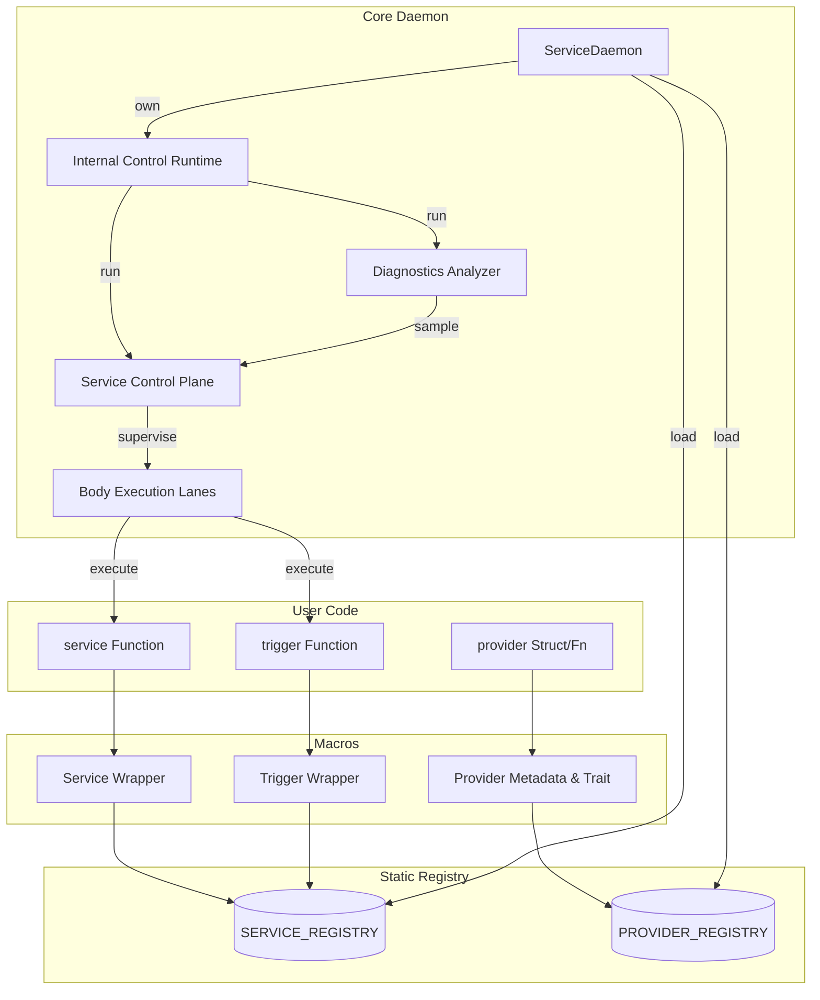
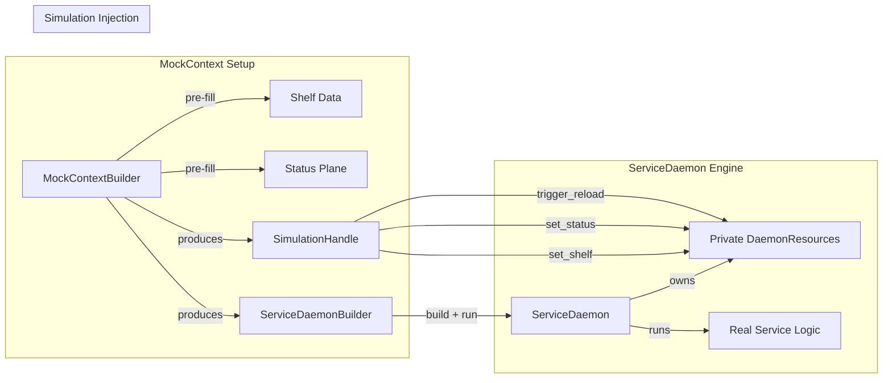

# Architecture Overview

`service-daemon-rs` is designed as a high-level framework for building resilient, modular applications using **Type-Based Decentralized Dependency Injection** and a **Unified Registry**.

## 1. Unified Registry (Linkme)

Both standard services and event-driven triggers are collected into a `SERVICE_REGISTRY`, while dependency providers are collected into a `PROVIDER_REGISTRY`. Both are managed at link time using the `linkme` crate. 

### How it works: Linker-Level Discovery
1. **Metadata Segments**: The framework macros generate `#[distributed_slice]` entries. At compile time, the Rust compiler (and the linker) places these pointers into specialized data segments (`SERVICE_REGISTRY` and `PROVIDER_REGISTRY`).
2. **Zero-Scan Loading**: Unlike frameworks that scan the filesystem or use heavy reflection at runtime, `ServiceDaemon` simply reads these contiguous memory segments. This results in **O(1) discovery** regardless of the project size.
3. **Implicit Activation**: Any module included in the compilation tree via `mod` will have its services and providers automatically registered. No manual list maintenance is required.

### Registry Identity
Each entry in the registry contains a `ServiceId`. This ID is used as the primary key in the **Status Plane** and for routing events in the **Ripple Model**.

## 2. Decentralized Dependency Injection

Unlike traditional DI containers that hold all instances in a central map, `service-daemon-rs` uses decentralized resolution:

- **Type-Local Ownership**: Each type provides its own resolution logic via `Provided` (typically generated by `#[provider]`). Managed state (`Arc<RwLock<T>>` / `Arc<Mutex<T>>`) requires `ManagedProvided`, and watch triggers (`Watch(T)`) require `WatchableProvided`.
- **Lazy Singletons**: Resolution usually involves a `OnceCell` or `StateManager` ensuring thread-safe, single-instance sharing via `Arc<T>`.
- **Recursive Resolution**: When a service starts, its dependencies are resolved recursively. Errors are caught at compile-time.

### 2.1. Status Plane & Reactive Orchestration
The daemon maintains a shared **Status Plane** to track service-observable lifecycle state. To eliminate inefficient polling, the framework uses a global `STATUS_CHANGED` notification mechanism. When a service writes a new status (for example, transitioning from `Initializing` to `Healthy`), the daemon is notified immediately, enabling responsive wave-based startup and lifecycle observation.

Reloads use a companion control path in addition to the Status Plane. Dependency watchers notify the supervisor through per-service reload signals, which cancel the current generation's reload token immediately. Inside the service, `state()` then resolves to `NeedReload` from that token-driven control path, even before or without a separate `status_plane` write.

## 3. High-Level System Flow

```mermaid
graph TD
    subgraph User_Code ["User Code"]
        S["service Function"]
        P["provider Struct/Fn"]
        T["trigger Function"]
    end

    subgraph Macro_Gen ["Macros"]
        M_S[Service Wrapper]
        M_P[Provider Metadata & Trait]
        M_T[Trigger Wrapper]
    end

    subgraph Static_Registry ["Static Registry"]
        SR[("SERVICE_REGISTRY")]
        PR[("PROVIDER_REGISTRY")]
    end

    subgraph Core_Daemon ["Core Daemon"]
        SD[ServiceDaemon]
        CR[Internal Control Runtime]
        SCP[Service Control Plane]
        AD[Diagnostics Analyzer]
        BL[Body Execution Lanes]
    end

    S --> M_S --> SR
    P --> M_P --> PR
    T --> M_T --> SR

    SD -->|load| SR & PR
    SD -->|own| CR
    CR -->|run| SCP
    CR -->|run| AD
    AD -->|sample| SCP
    SCP -->|supervise| BL
    BL -->|execute| S
    BL -->|execute| T
```

The control plane runs supervisors, watchers, startup waves, reload, restart/backoff, shutdown, control diagnostics, and the advisory analyzer on the daemon-owned control runtime. User service and trigger bodies execute on their statically declared mode (`Standard`, `HighPriority`, or `Isolated`) and report outcomes back through the supervisor bridge.

During daemon construction, the final selected service list is also the source for HighPriority capacity planning. The planner counts declared `HighPriority` services and triggers as equal registry entries, derives a capped worker count, and uses that plan only when the shared high-priority runtime is lazily created.

The diagnostics analyzer is internal and recommendation-first. It reads windowed lane/service/generation observations and logs advisory recommendations, but it does not change public scheduling semantics or move a running future. Public diagnostics use distilled `DaemonDiagnosticsSnapshot` read models; the store, windows, evaluator, recommendation model, and lane resolver stay crate-private. Future mode-internal placement changes, such as HighPriority runtime epoch rollover, are deferred to Phase 9 research and would need to happen through a cooperative generation boundary.

### 3.1. Phase 6/7 Public Boundary

| Surface | Boundary |
| :--- | :--- |
| `ServiceScheduling::{Standard, HighPriority, Isolated}` | Public static execution contract generated into the registry; runtime and public APIs do not override it across modes. |
| Macro `scheduling = ...` | Accepts only `Standard`, `HighPriority`, or `Isolated`; there is no `Auto` or `Control` user-facing mode. |
| `ServiceEntry` | Public metadata surface, but Phase 6 does not add experimental restart policy or scheduling hint fields. |
| `DaemonDiagnosticsSnapshot` and handle read methods | Public read-only diagnostics summaries; snapshot reads do not drive reload, restart, advisory evaluation, or lane remap. |
| `SchedulingAdvisoryProfile` | Public advisory emission control only; it does not change lifecycle, body placement, or declared scheduling. |
| HighPriority capacity plan | Internal runtime topology decision derived from the final declared HighPriority entries; no production public worker-count override is exposed. |
| Isolated startup concurrency limit | Public builder knob for isolated startup allocation admission only, not a limit on running isolated body lifetime. |
| Per-service restart override and scheduling hints | Deferred; future hints must stay within the declared mode and require a separate design. |
| Diagnostics store, windows, evaluator, recommendation model, sampler, and lane resolver | Internal-only implementation details, not exported as public schema or command surfaces. |

## 4. Project Structure

The framework is organized into specialized submodules to ensure maintainability as the codebase grows:

### `service-daemon-macro`
- **`common.rs`**: Shared infrastructure for parameter extraction (`ExtractedParams`) and unified code generation for function wrappers and watchers.
- **`trigger/`**: Handles specialized attribute parsing and host-specific event loop generation for triggers (Cron, Queues, Watchers).
- **`service/`**: Core logic for wrapping standard functions and creating registry entries.
- **`provider/`**: Managed state and dependency injection logic.

### `service-daemon`
- **`core/service_daemon/`**: The core orchestrator.
  - `policy.rs`: Resilience configuration (backoff, jitter).
  - `runner.rs`: Lifecycle management (startup waves, supervision, graceful shutdown).
- **`core/logging.rs`**: High-performance, zero-allocation logging infrastructure.
  - **DaemonLayer**: Captured via a non-blocking broadcast pipeline. It extracts multi-level causal context (UUID v7 Message ID, numeric Service ID, and Instance ID) to facilitate asynchronous tracing.
  - **Zero-Allocation Design**: Uses 1-byte enums for levels and `Cow<'static, str>` for metadata. Tracing IDs (UUIDs and numeric IDs) are handled via stack-allocated types to eliminate per-event heap overhead.
- **`core/triggers.rs`**: Built-in trigger hosts (Cron, Queues, Watchers). Each host manages its own resource lifecycle via `setup` and `handle_step`.
- **`core/trigger_runner.rs`**: Event loop driver and interceptor pipeline.
  - **Instance Reuse**: Hosts maintain internal state across iterations.
  - **Elastic Scaling**: Asynchronous dispatch with semaphore-based backpressure.
- **`core/context/`**: Task-local storage and status plane interactions.
  - **Simulation Overlay**: `MockContext` for unit testing with zero production cost.
- **`core/managed_state.rs`**: Reactive state engine with change tracking.

## 5. Lifecycle & Status Plane

The daemon maintains a shared **Status Plane** for lifecycle observation, while reload delivery is driven by a companion reactive signal path. Together they provide wave-based consistency without requiring every reload transition to be pre-written into the status map.

Detailed state machine transitions and signal propagation logic can be found in **[Lifecycle & Status Plane](lifecycle-management.md)**.

## 6. Simulation Layer (Feature-Gated)

All testing/simulation code is physically removed from production builds via the `simulation` Cargo feature. It provides an interactive sandbox for verifying complex service logic without real-world side effects.

### Architecture: Interactive Simulation Sandbox

```mermaid
graph LR
    subgraph MockContext_Setup ["MockContext Setup"]
        MC["MockContextBuilder"] -->|pre-fill| Shelf["Shelf Data"]
        MC -->|pre-fill| Status["Status Plane"]
        MC -->|produces| Builder["ServiceDaemonBuilder"]
        MC -->|produces| Handle["SimulationHandle"]
    end

    subgraph Daemon_Execution ["ServiceDaemon Engine"]
        Builder -->|build + run| SD["ServiceDaemon"]
        SD -->|owns| Resources["Private DaemonResources"]
        SD -->|runs| RealSvc["Real Service Logic"]
    end

    subgraph God_Hand ["Simulation Injection"]
        Handle -->|set_shelf| Resources
        Handle -->|set_status| Resources
        Handle -->|trigger_reload| Resources
    end
```

For practical usage and sandbox setup, see the **[Simulation Tutorial](../guide/tutorial/unit-testing.md)**.

## 7. Avoiding Service Interference

Because of the automatic service discovery, testing a subsystem in a large project can lead to "Service Interference" where production services are unintentionally started during tests.

**Best Practices:**
1. **Use Tags**: Group services logically using `#[service(tags = ["core", "api"])]`.
2. **Isolated Registry**: In integration tests, use `Registry::builder().with_tag("__isolation__").build()` to create an empty environment. Register test services with unique tags via `#[service(tags = ["__my_test__"])]` and select them with `Registry::builder().with_tag("__my_test__").build()`.
3. **ServiceId Safety**: The `ServiceDaemonBuilder` automatically detects `ServiceId` collisions at startup, preventing two services from competing for the same status plane slot.

## 7. Event Traceability Architecture

The system uses a unified messaging layer for all cross-service events:

- **TriggerMessage**: Encapsulates the payload with a **UUID v7** `message_id` and a `source_id` (the publishing service).
- **TriggerContext**: Provides execution-specific identity, including the current `service_id` and a monotonic `instance_seq`, while wrapping the incoming `TriggerMessage`.
- **Provider Methods**: Services emit events by calling provider instance methods directly (e.g. `notifier.notify()`, `queue.push(...)`) after resolving the provider via DI resolution.
- **TriggerRunner**: Ensures that every trigger execution is wrapped in a tracing span that preserves the original event's context (Source, Message, and Instance).
- **Interceptor Pipeline**: `TriggerInterceptor
` layers execute in an onion model -- each interceptor wraps the next and decides if, when, and how many times to call it. Built-in interceptors handle tracing spans (`TracingInterceptor`) and exponential-backoff retry (`RetryInterceptor`). User-defined interceptors can be added for rate limiting, authentication, metrics, etc.

[Back to README](../../README.md)

