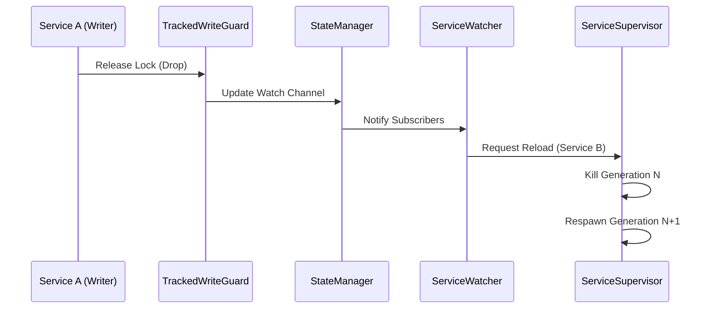

# Lifecycle Management & Status Plane

The `ServiceDaemon` uses a sophisticated orchestration system to manage service generations, crashes, and reloads.

## 1. Unified Status Plane

All services share a central **Status Plane** (`DashMap<ServiceId, ServiceStatus>`) managed by `DaemonResources`.

| Level | Transitions to | Triggered by |
|--------|----------------|--------------|
| `Initializing` | `Healthy` | `done()` or implicit handshake |
| `Restoring` | `Healthy` | Successful warm start or implicit handshake |
| `Recovering(err)`| `Healthy` | Custom recovery logic + `done()` or implicit handshake |
| `Healthy` | `NeedReload` | Dependency mutation detected |
| `NeedReload` | `Terminated` | Service cleanup + exit |
| `ShuttingDown` | `Terminated` | Daemon shutdown signal |
| (Any) | `Terminated` | `ServiceError::Fatal` encountered |

> [!NOTE]
> **Integrated Signal Handling**: The `ServiceSupervisor` uses a high-performance `tokio::select!` loop that integrates service execution with signal bridging. This eliminates the need for auxiliary tasks, reducing memory overhead and task switching latency while maintaining perfect responsiveness to reload and shutdown signals.

### 1.1. The Signal Path (Reactive Update Flow)
How a state change is propagated through the system to trigger a reload:

- **Propagation**: Every write lock release triggers a signal on a `tokio::sync::watch` channel. The `ServiceWatcher` listens to these channels and identifies which services in the Registry depend on the modified type.
- **Minimal Perturbation**: Only services that directly or indirectly depend on the mutated type are reloaded. The rest of the system remains untouched.
- **Race Safety**: The `ServiceSupervisor` ensures that a reload only proceeds after the preceding generation has cleanly released its resources (e.g., ports, file handles).

### 1.2. Immediate Reloads
Even if a service is in a restart backoff delay (due to a failure), the `ServiceDaemon` remains reactive. If a **Reload Signal** is received (typically due to a dependency update), the daemon will interrupt the delay and restart the service immediately with the new configuration.

### 1.3. Fatal Errors
(Fatal error handling details...)

### 1.4. `BackoffController` Internals
The `BackoffController` is a stateful abstraction shared by both `ServiceSupervisor` and `TriggerRunner` (via `RetryInterceptor`). 

#### State Management
- **Delay Tracking**: Calculates `min(max_delay, initial_delay * multiplier^power)`.
- **Failure Count**: Incremented on every `Err` return; used as the `power` for calculation.
- **Signal Integration**: Integrates a `tokio::time::sleep` with the local `CancellationToken` or `watch::Receiver`, allowing immediate wake-up upon reload/shutdown.

#### Self-Healing Reset
The controller tracks the uptime of the current service generation. When a service remains in the `Healthy` state for longer than `reset_after` (default 60s), the failure counter is reset to 0. This prevents "historical baggage" from affecting the restart speed of stable systems.

## 2. Wave-Based Orchestration

Services are started and stopped synchronized by waves of `priority`.

- **Startup (High to Low)**: Core services start first. A wave waits until all services in it report `Healthy` (via a handshake) before starting the next wave.
- **Shutdown (Low to High)**: External APIs stop first, followed by storage and then core systems.

## 3. The Handshake Protocol

A service indicates it is "ready" via a handshake. This prevents dependent services from starting before their prerequisites are fully initialized.

### Explicit Handshake
Calling `service_daemon::done()` manually. Recommended for complex initialization.

### Implicit Handshake
For minimalist services, any call to `is_shutdown()`, `sleep()`, or `wait_shutdown()` counts as a transition to `Healthy` if the service is still in an introductory phase (`Initializing`, `Restoring`, `Recovering`).

> [!TIP]
> **Performance Optimization**: The implicit handshake is internally optimized using a task-local flag. Only the first call to these functions per service generation will interact with the central Status Plane. Subsequent calls are near-zero overhead atomic checks.

## 4. State Persistence (The Shelf)

The "Shelf" is a global store where services can deposit data before a reload or after a crash.
- **Isolation**: Buckets are isolated by `service_name` (`&'static str`), not by `ServiceId`. This is intentional -- Shelf data persists across restarts, while `ServiceId` may change when the Registry is rebuilt.
- **Survival**: Unlike standard singletons, Shelf data survives the task termination and is inherited by the next "generation" of the same service.

[Back to README](../../README.md)
