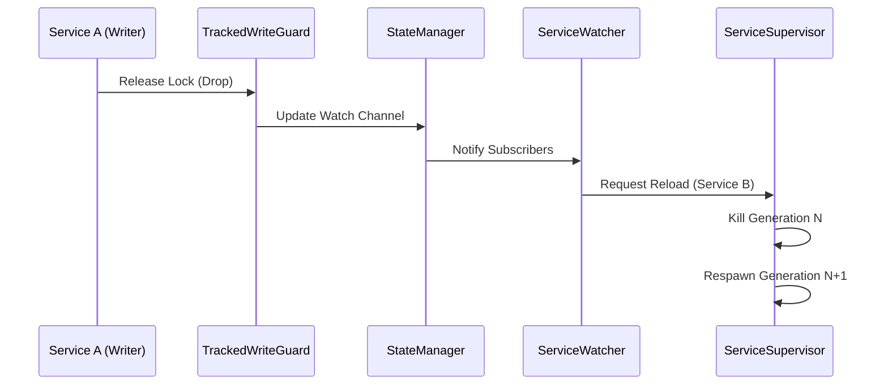

# Lifecycle Management & Status Plane

The `ServiceDaemon` uses a structured orchestration system to manage service generations, crashes, and reloads.

## 1. Unified Status Plane

All services share a central **Status Plane** (`DashMap<ServiceId, ServiceStatus>`) managed by `DaemonResources`.

| Level | Transitions to | Triggered by |
|--------|----------------|--------------|
| `Initializing` | `Healthy` | `done()` or implicit handshake |
| `Restoring` | `Healthy` | Successful warm start or implicit handshake |
| `Recovering(err)`| `Healthy` | Custom recovery logic + `done()` or implicit handshake |
| `NeedReload` | `Terminated` | Service observes reload, performs cleanup, then calls `done()` |
| `ShuttingDown` | `Terminated` | Daemon shutdown signal + service cleanup |
| (Any) | `Terminated` | `ServiceError::Fatal` or daemon teardown |

`NeedReload` is primarily a **service-observed lifecycle state** exposed by `state()`. In the runtime, dependency watchers notify the supervisor through reload signals, which cancel the current generation's reload token. Once that token is cancelled, `state()` resolves to `NeedReload` immediately for the running service. The shared Status Plane remains the durable observation surface, but reload intent is delivered first through the token/signal control path rather than requiring a separate `Healthy -> NeedReload` map write.

> [!NOTE]
> **Integrated Signal Handling**: The `ServiceSupervisor` uses a high-performance `tokio::select!` loop that integrates service execution with signal bridging. This eliminates the need for auxiliary tasks, reducing memory overhead and task switching latency while maintaining consistent responsiveness to reload and shutdown signals.

### 1.1. The Signal Path (Reactive Update Flow)
How a state change is propagated through the system to trigger a reload:

- **Propagation**: Every write lock release triggers a signal on a `tokio::sync::watch` channel. The `ServiceWatcher` listens to these channels and identifies which services in the Registry depend on the modified type.
- **Minimal Perturbation**: Only services that directly or indirectly depend on the mutated type are reloaded. The rest of the system remains untouched.
- **Race Safety**: The `ServiceSupervisor` ensures that a reload only proceeds after the preceding generation has cleanly released its resources (e.g., ports, file handles).

### 1.2. Immediate Reloads
Even if a service is in a restart backoff delay (due to a failure), the `ServiceDaemon` remains reactive. If a **Reload Signal** is received (typically due to a dependency update), the daemon will interrupt the delay and restart the service immediately with the new configuration.

### 1.3. Fatal Errors
Fatal outcomes stop the current service generation without entering the retry/backoff loop.

- `ServiceError::Fatal(...)`: the supervisor marks that service as `Terminated` and does not restart it.
- `ProviderInitError` during lazy service startup: the supervisor treats this as a daemon-wide startup/runtime boundary failure, requests daemon shutdown, and terminates the affected service.
- Ordinary `Err(...)` and panics are different: they transition the service into `Recovering(...)` and restart with backoff.

A normal `Ok(())` return is also distinct from failure recovery. The supervisor still starts a fresh generation, but it does so immediately and records success on the backoff controller instead of counting the exit as another failure.

### 1.4. `BackoffController` Internals
The `BackoffController` is a stateful abstraction shared by both `ServiceSupervisor` and `TriggerRunner` (via `RetryInterceptor`). 

#### State Management
- **Delay Tracking**: Calculates `min(max_delay, initial_delay * multiplier^power)`.
- **Failure Count**: Incremented on every `Err` return; used as the `power` for calculation.
- **Signal Integration**: Integrates a `tokio::time::sleep` with the local `CancellationToken` or `watch::Receiver`, allowing immediate wake-up upon reload/shutdown.

#### Self-Healing Reset
The controller tracks the uptime of the current service generation. When a service remains in the `Healthy` state for longer than `reset_after` (default 60s), the failure counter is reset to 0. This prevents "historical baggage" from affecting the restart speed of stable systems.

## 2. Wave-Based Orchestration

Services are started and stopped synchronized by waves of `priority`.

- **Startup (High to Low)**: Core services start first. A wave waits until services in it report `Healthy` (via a handshake), but only up to `wave_spawn_timeout`; once the timeout expires, the daemon logs a warning and continues with the next wave.
- **Shutdown (Low to High)**: External APIs stop first, followed by storage and then core systems.

## 3. The Handshake Protocol

A service indicates it is "ready" via a handshake. This prevents dependent services from starting before their prerequisites are fully initialized.

### Explicit Handshake
Calling `service_daemon::done()` manually. Recommended for complex initialization.

### Implicit Handshake
For minimalist services, any call to `is_shutdown()`, `sleep()`, or `wait_shutdown()` counts as a transition to `Healthy` if the service is still in an introductory phase (`Initializing`, `Restoring`, `Recovering`).

> [!TIP]
> **Performance Optimization**: The implicit handshake is internally optimized using a task-local flag. Only the first call to these functions per service generation will interact with the central Status Plane. Subsequent calls are near-zero overhead atomic checks.

## 4. State Persistence (The Shelf)

The "Shelf" is a global store where services can deposit data before a reload or after a crash.
- **Isolation**: Buckets are isolated by `service_name` (`&'static str`), not by `ServiceId`. This is intentional -- Shelf data persists across restarts, while `ServiceId` may change when the Registry is rebuilt.
- **Survival**: Unlike standard singletons, Shelf data survives the task termination and is inherited by the next "generation" of the same service.

## 5. Provider Initialization Errors

This section describes the error model for Providers whose initialization may fail (e.g., network binding, external configuration, credentials).

### 5.1. Fallible Providers

A Provider is considered **fallible** if its definition explicitly returns:

- `Result<T, ProviderError>`

> Important: Providers return the **plain** `T` value. The framework remains responsible for wrapping it in `Arc<T>` internally, consistent with the current provider design.

### 5.2. `ProviderError` Semantics

`ProviderError` is intended to be a public, extensible enum and must be marked `#[non_exhaustive]`.

The initial semantic surface area is intentionally small:

- `ProviderError::Fatal(...)`
  - **Immediate process exit** (strong fail-fast).
  - No retries.
- `ProviderError::Retryable(...)`
  - Retry with backoff according to `RestartPolicy`.
  - If retries exceed `provider_init_timeout`, exit the process.

#### FUTURE: Degraded providers

Future versions may extend `ProviderError` with additional semantics (e.g. a `Degraded` outcome), but this is **not implemented yet**.

If/when introduced, the following questions must be answered in the framework contract before enabling it:

- Does the daemon continue startup, and what is the readiness/health behaviour?
- How do services observe (and react to) the degraded state without pushing complexity into business code?

### 5.3. Lazy vs. Eager Provider Initialization

The default behavior is **lazy** for all providers (including `Listen`).

A provider may opt into **eager** initialization via an explicit macro parameter:

- `#[provider(..., eager = true)]`

Eager initialization applies only to **reachable** providers (those referenced by the selected `Registry` services and their dependency graph), to avoid unnecessary work.

### 5.4. RestartPolicy reuse

Provider initialization retries reuse the existing `RestartPolicy` model.

- `provider_init_timeout` is implemented today.
- By default, it matches `wave_spawn_timeout` to keep startup timing consistent unless explicitly configured.
- `ProviderError::Retryable(...)` keeps retrying until that timeout is reached.
- `ProviderError::Fatal(...)` skips retries and fails startup immediately.

[Back to README](../../README.md)
