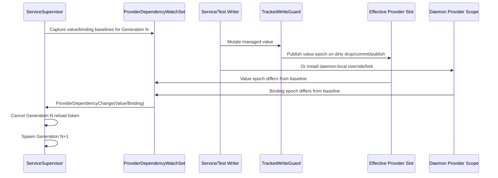

# Lifecycle Management & Status Plane

The `ServiceDaemon` uses a structured orchestration system to manage service generations, crashes, and reloads.

## 1. Unified Status Plane

All services share a central **Status Plane** (`DashMap<ServiceInstanceId, ServiceStatus>`) managed by `DaemonResources`.

| Level | Transitions to | Triggered by |
|--------|----------------|--------------|
| `Initializing` | `Healthy` | `done()` or implicit handshake |
| `Restoring` | `Healthy` | Successful warm start or implicit handshake |
| `Recovering(err)`| `Healthy` | Custom recovery logic + `done()` or implicit handshake |
| `NeedReload` | `Terminated` | Service observes reload, performs cleanup, then calls `done()` |
| `ShuttingDown` | `Terminated` | Daemon shutdown signal + service cleanup |
| (Any) | `Terminated` | `ServiceError::Fatal` or daemon teardown |

`NeedReload` is primarily a **service-observed lifecycle state** exposed by `state()`. In the runtime, provider dependency watches are captured per generation before the service body becomes externally observable. When the generation watch set observes a provider value or binding change, the supervisor cancels the current generation's reload token directly. Once that token is cancelled, `state()` resolves to `NeedReload` immediately for the running service. The shared Status Plane remains the durable observation surface, but reload intent is delivered first through the generation token path rather than requiring a separate `Healthy -> NeedReload` map write.

> [!NOTE]
> **Signal handling**: The `ServiceSupervisor` uses one `tokio::select!` loop for service execution and signal bridging, so reload and shutdown signals do not need separate helper tasks.

### Control Plane Runtime and Declared Body Modes

Service supervisors, dependency watch construction, startup wave orchestration, restart/backoff waits, shutdown coordination, and control diagnostics run on a daemon-owned control runtime. Service and trigger bodies execute through their statically declared scheduling mode:

- `Standard`: host Tokio runtime integration through the runtime that called the daemon handle's `run()`.
- `HighPriority`: daemon-owned low-contention high-priority runtime shard pool, created lazily from the final declared HighPriority entries and then managed by the HighPriority runtime policy.
- `Isolated`: a private OS thread and private Tokio runtime for each generation body.

The supervisor awaits body outcomes through the body-lane bridge, so reload, restart/backoff, fatal/provider-init handling, and shutdown coordination stay in the control plane even when the body runs elsewhere.

Startup control-plane code is split under `core/service_daemon/`: `provider_graph.rs` validates provider dependency cycles and runs reachable eager providers, `runtime.rs` prepares the control runtime with optional HighPriority extension hooks, and `startup_pipeline.rs` sequences those steps before handing service startup to `runner/wave.rs`.

HighPriority requires the opt-in `high-priority` feature. Startup capacity reads the final daemon service list; declared HighPriority triggers and services contribute equally. The optional controller in `high_priority/runtime.rs` requires fresh instance-level ServiceSleep drift and supporting shard pressure before intervening. It evaluates the same metric after actual new-generation placement and pauses repeated low-benefit interventions. See [HighPriority feedback control](high-priority-feedback.md) for the observation, placement, and convergence boundaries.

### Scheduling Advisory and Generation Boundaries

When `high-priority` is enabled, scheduling advisory analysis is limited to internal recommendations. The advisory analyzer runs on the control runtime, reads windowed diagnostics, and logs advisory actions; it does not mutate the declared scheduling mode or drive the HighPriority runtime policy. `SchedulingAdvisoryProfile` can disable advisory emission without changing lifecycle or resource intervention. The separate `diagnostics` feature controls topology collection.

The framework does not migrate running futures between runtimes. Placement changes happen at generation boundaries through the existing reload path. A valid requested target is consumed by the next generation before ordinary least-loaded placement. All services are reloadable under the lifecycle contract; business continuity and in-flight work handling remain the service author's responsibility. Rollover is not a service failure and does not enter failure backoff or restart-storm rate limiting.

### 1.1. Provider Dependency Watch Path
Provider reload propagation distinguishes value mutation from binding mutation:

```mermaid
sequenceDiagram
    participant Super as ServiceSupervisor
    participant WatchSet as ProviderDependencyWatchSet
    participant Writer as Service/Test Writer
    participant Guard as TrackedWriteGuard
    participant Slot as Effective Provider Slot
    participant Scope as Daemon Provider Scope

    Super->>WatchSet: Capture value/binding baselines for Generation N
    Writer->>Guard: Mutate managed value
    Guard->>Slot: Publish value epoch on dirty drop/commit/publish
    Writer->>Scope: Or install daemon-local override/fork
    Slot->>WatchSet: Value epoch differs from baseline
    Scope->>WatchSet: Binding epoch differs from baseline
    WatchSet->>Super: ProviderDependencyChange(Value/Binding)
    Super->>Super: Cancel Generation N reload token
    Super->>Super: Spawn Generation N+1
```

- **Value mutation**: Managed providers publish through the effective slot's `StateManager` and advance its value epoch. Root slot changes reload daemons that still inherit root; daemon-local slot changes stay inside that daemon.
- **Binding mutation**: A daemon-local fork or simulation override changes which slot a provider type resolves to for that daemon. The binding epoch changes and dependent generations reload so the next generation resolves the new slot.
- **Baseline capture**: Each generation constructs its `ProviderDependencyWatchSet` before the service or trigger body can become externally observable. This makes already-published changes level-triggered instead of relying on a retained notification edge.
- **Dirty tracking**: Acquiring and releasing a write lock without mutating the value does not publish a value change.
- **Race Safety**: Provider value watches use epoch check / notification arm / re-check loops, and the supervisor races the generation body directly against the dependency watch set. A change published between startup and the first async poll is still observed.

### 1.2. Immediate Reloads
Even if a service is in a restart backoff delay (due to a failure), the `ServiceDaemon` remains reactive. If a **Reload Signal** is received (typically due to a dependency update), the daemon will interrupt the delay and restart the service immediately with the new configuration.

### 1.3. Fatal Errors
Fatal outcomes stop the current service generation without entering the retry/backoff loop.

- `ServiceError::Fatal(...)`: the supervisor marks that service as `Terminated` and does not restart it.
- `ProviderInitError` during lazy service startup: the supervisor treats this as a daemon-wide startup/runtime boundary failure, requests daemon shutdown, and terminates the affected service.
- Ordinary `Err(...)` and panics are different: they transition the service into `Recovering(...)` and restart with backoff.

A service generation that returns `Ok(())` without a shutdown or reload control signal is distinct from failure recovery at the Rust result level, but it is still an unexpected service lifecycle termination. The supervisor starts a fresh generation through `RestartPolicy` backoff and records the exit kind as `NormalExit`. Shutdown-driven `Ok(())` remains terminal, and reload-driven `Ok(())` remains an immediate generation replacement.

Trigger handlers run inside trigger service generations. A single handler `Err` is retried by the trigger runner; retry exhaustion and dispatch infrastructure errors are bridged back to the supervisor as recoverable generation failures. Dispatch task panics keep their panic classification, so panic lifecycle counters and backoff behavior remain consistent with ordinary service panics.

Isolated startup failures are intentionally not fatal. If an isolated OS thread, private Tokio runtime, or startup bridge cannot be created, the generation is classified as an isolated startup failure and restarted through the recoverable backoff path.

### 1.4. Generation Diagnostics

Each service generation is registered in an internal diagnostics store when the supervisor enters `Starting`. The generation records:

- statically declared body scheduling mode (`Standard`, `HighPriority`, or `Isolated`);
- actual body runtime lane and, for HighPriority generations, the selected shard and placement decision;
- lifecycle outcome classification (`NormalExit`, recoverable error, panic, fatal service error, provider init error, reload, shutdown, or isolated startup failure);
- reload requests, restart decisions, last restart decision kind, policy/effective restart delay, rate-limited restart flags, and termination;
- service-level `service_daemon::sleep()` completed/interrupted counts and wakeup drift;
- runtime heartbeat probe observations for the control plane, body execution lanes, and HighPriority shards.

The supervisor includes a compact per-generation summary in the outcome tracing event. The public `DaemonDiagnosticsSnapshot` exposes distilled service, generation, and lane summaries through read-only daemon/handle methods. Generation-detail snapshot retention is bounded to the most recent 1024 generations per service so crash loops do not make snapshot collection and sorting unbounded; service and lane aggregates still accumulate across evicted generation details. Standard service and Standard lane summaries can include interpretation labels, confidence, and investigation hints, but those labels are derived from snapshot facts and do not change generation lifecycle, restart/backoff, reload, shutdown, or body placement. The store, windows, evaluator, recommendation fingerprints, thresholds, and mutation paths remain internal. In particular, isolated thread/runtime/bridge startup failures are classified separately, with a private startup failure kind, but still use the recoverable backoff path.

`last_exit_kind` and `last_restart_decision` are intentionally separate lifecycle facts. Service generations that return `Ok(())` without a shutdown or reload control signal record `NormalExit` plus normal-exit backoff; reloads record an immediate restart decision; recoverable service errors and trigger retry exhaustion record recoverable backoff; service or trigger dispatch panics record panic backoff; isolated startup failures record isolated-startup backoff. Fatal service errors, provider-init terminal errors, and shutdown exits do not synthesize a restart decision because they bypass the restart loop.

### 1.5. `BackoffController` Internals
The `BackoffController` is a stateful abstraction shared by both `ServiceSupervisor` and `TriggerRunner` (via `RetryInterceptor`). 

#### State Management
- **Delay Tracking**: Calculates `min(max_delay, initial_delay * multiplier^power)`.
- **Failure Count**: Incremented on every `Err` return; used as the `power` for calculation.
- **Signal Integration**: Integrates a `tokio::time::sleep` with the local `CancellationToken` or `watch::Receiver`, allowing immediate wake-up upon reload/shutdown.

#### Self-Healing Reset
The controller tracks the uptime of the current service generation. When a service remains in the `Healthy` state for longer than `reset_after` (default 60s), the failure counter is reset to 0. This prevents "historical baggage" from affecting the restart speed of stable systems.

#### Restart Storm Guard
Service supervisors layer an internal restart-storm guard on top of the policy backoff. Recoverable service errors, panics, and isolated startup failures are counted in a short sliding window; once the threshold is reached, the effective restart delay becomes `max(policy_delay, storm_guard_delay)`.

This guard is deliberately not a public `RestartPolicy` knob yet. Reloads reset both the backoff controller and the storm guard; service generations that return `Ok(())` without a shutdown or reload control signal advance the normal `RestartPolicy` backoff path; fatal/provider-init outcomes bypass the guard, and shutdown still interrupts any restart wait immediately.

## 2. Wave-Based Orchestration

Services are started and stopped synchronized by waves of `priority`.

- **Startup (High to Low)**: Core services start first. A wave waits until services in it report `Healthy` (via a handshake), but only up to `wave_spawn_timeout`; once the timeout expires, the daemon logs a warning and continues with the next wave.
- **Shutdown (Low to High)**: External APIs stop first, followed by storage and then core systems.

## 3. The Handshake Protocol

A service indicates it is "ready" via a handshake. This prevents dependent services from starting before their prerequisites are fully initialized.

### Explicit Handshake
Calling `service_daemon::done()` manually. Recommended for complex initialization.

### Implicit Handshake
For minimalist services, any call to `is_shutdown()`, `sleep()`, or `wait_shutdown()` counts as a transition to `Healthy` if the service is still in an introductory phase (`Initializing`, `Restoring`, `Recovering`).

> [!TIP]
> **Implementation note**: The implicit handshake uses a task-local flag. Only the first lifecycle utility call per generation writes to the Status Plane; later calls use the cached flag and token checks.

## 4. State Persistence (The Shelf)

The "Shelf" is a daemon-scoped store where services can deposit data before a reload or after a crash.
- **Isolation**: Buckets are isolated by `ServiceInstanceId`, so two selected services with the same Rust function name cannot share shelf state accidentally.
- **Survival**: Unlike ordinary in-memory state, Shelf data survives generation termination and is inherited by the next generation of the same selected service.

## 5. Provider Initialization Errors

This section describes the error model for Providers whose initialization may fail (e.g., network binding, external configuration, credentials).

### 5.1. Fallible Providers

A Provider is considered **fallible** if its definition explicitly returns:

- `Result<T, ProviderError>`

> Important: Providers return the **plain** `T` value. The framework remains responsible for wrapping it in `Arc<T>` internally, consistent with the current provider design.

### 5.2. `ProviderError` / `ProviderInitError` boundary

`ProviderError` is the public contract for user provider functions. It is intentionally small and marked `#[non_exhaustive]`:

- `ProviderError::Fatal(...)`
  - The provider knows initialization cannot recover, usually because configuration is invalid or a required local resource is unavailable.
  - The framework maps it to `ProviderInitError::Fatal` and requests daemon shutdown at the provider-init boundary.
- `ProviderError::Retryable(...)`
  - The provider reports a transient initialization failure.
  - The framework retries with backoff until `RestartPolicy::provider_init_timeout` elapses, then maps the terminal result to `ProviderInitError::Timeout`.

`ProviderInitError` is the framework orchestration boundary. It also covers framework-owned sources that user providers do not construct directly: required environment variable failures, environment parse failures, provider dependency failures, initialization timeout, cancellation, panic translation, and dependency-graph defense errors. Lazy provider-init failures are handled by the supervisor as daemon-wide boundary failures; eager failures stop startup before dependent services become externally observable.

#### Unsupported: degraded providers

`ProviderError` currently has no degraded-service outcome. If such a mode is added later, the framework contract must first answer:

- Does the daemon continue startup, and what is the readiness/health behaviour?
- How do services observe (and react to) the degraded state without pushing complexity into business code?

### 5.3. Provider-init source classes

Provider-init failures retain the public `ProviderInitError::{Fatal, Timeout, Cancelled}` shape, while the runtime keeps a hidden `ProviderInitFailure` carrier long enough to attach typed source classification to tracing and tests before returning the public error:

| Source | Public boundary | Internal source kind | Notes |
| :--- | :--- | :--- | :--- |
| User provider returns `ProviderError::Fatal` | `ProviderInitError::Fatal` | `user_provider_fatal` | No retry; treated as daemon-wide provider-init failure. |
| User provider returns `ProviderError::Retryable` until timeout | `ProviderInitError::Timeout` | `user_provider_retryable_timeout` | Retry/backoff remains bounded by `provider_init_timeout`. |
| Required `env` missing | `ProviderInitError::Fatal` | `environment_missing` | Framework-owned configuration failure generated by the macro. |
| Required `env` parse failure | `ProviderInitError::Fatal` | `environment_parse` | Framework-owned configuration failure generated by the macro. |
| Dependency provider failure | Propagated `ProviderInitError` | `dependency_provider` at the consuming provider boundary | The downstream provider still owns the terminal message; service identity is recorded by the supervisor. |
| Initialization cancellation | `ProviderInitError::Cancelled` | `cancelled` | Cancellation stays distinct from fatal failure. |
| Provider init panic | `ProviderInitError::Fatal` | `panic` | `catch_init_panic` converts string and non-string panic payloads, then the generated match tags the source. |
| Eager dependency graph defense error | `ProviderInitError::Fatal` | `framework_graph_validation` / `framework_eager_init` | Defensive startup path for impossible graph inconsistencies. |
| Listen/Unix socket template I/O failure | `ProviderInitError::Fatal` or `ProviderInitError::Timeout` | `system_io_fatal` / `system_io_retryable` | Template retryability still maps through `ProviderError` and provider-init timeout semantics. |

The generated wrapper path (`snapshot_resolve`, `rwlock_resolve`, `mutex_resolve`, `eager_init`, or `framework_validation`) is diagnostic context, not a public control surface. Public diagnostics remain coarse at `ProviderInitError` lifecycle exit kind.

### 5.4. Lazy vs. Eager Provider Initialization

The default behavior is **lazy** for all providers (including `Listen`). Lazy initialization happens the first time a selected service, trigger, provider dependency, or helper call resolves that provider in its current effective scope.

A provider may opt into **eager** initialization via an explicit macro parameter:

- `#[provider(..., eager = true)]`

Eager initialization applies only to **reachable** providers (those referenced by the selected `Registry` services and their dependency graph), to avoid unnecessary work. During daemon startup, reachable eager providers resolve through that daemon's provider scope, not by bypassing the scoped bridge. By default the daemon inherits the root provider slot; simulation overrides or internal forks can install a daemon-local slot before eager initialization, so startup seeds the local slot without polluting root state.

### 5.5. RestartPolicy reuse

Provider initialization retries reuse the existing `RestartPolicy` model.

- `provider_init_timeout` is implemented today.
- By default, it matches `wave_spawn_timeout` to keep startup timing consistent unless explicitly configured.
- `ProviderError::Retryable(...)` keeps retrying until that timeout is reached.
- `ProviderError::Fatal(...)` skips retries and fails startup immediately.

### 5.6. Advanced provider helper and state preconditions

Generated provider helpers expose a low-level `resolve_managed()` path for tests, diagnostics, and framework integrations that need the raw `Result<Arc<T>, ProviderError>` before it is mapped into convenience initialization semantics. Normal services should prefer dependency injection and let the daemon own retries, fatal shutdown, and cancellation.

`StateManager::snapshot()` is a convenience API for already-initialized state. It panics if called before the corresponding provider has been initialized through the daemon/provider resolution path. That panic is intentional: pre-init snapshot probing is caller misuse, not a recoverable provider-init error.

### 5.7. Provider ownership boundary

Generated provider resolution uses a root scope plus daemon effective scopes. Calls made outside framework context fall back to the root scope, which preserves convenient helper usage in tests and setup code. Calls made while a daemon is starting or while a service, trigger, or watcher is running use that daemon's effective provider scope.

The effective binding is generation-sensitive: if a daemon-local binding changes, dependent services and triggers reload at a generation boundary. Existing generations are not silently mutated in place; the next generation resolves the new provider slot.

[Back to README](../../README.md)
