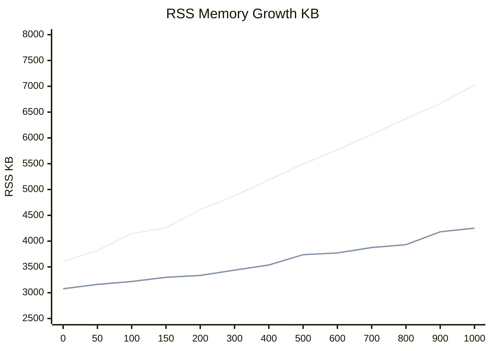
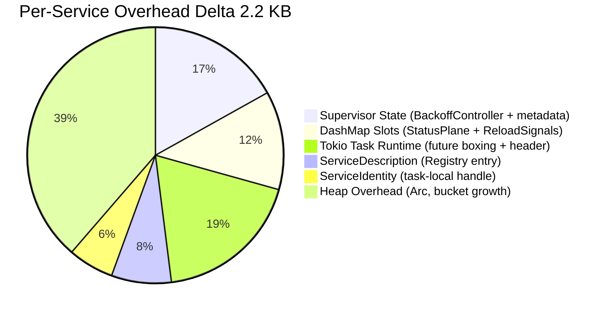

# Performance Benchmarks

This document records the official performance measurements and resource consumption
characteristics of the service-daemon-rs framework. All tests were conducted in a
controlled environment to ensure reproducibility.

## Executive Summary

- **Predictable Scalability**: Uses a fixed-cost model with near-perfect linear memory growth, ensuring the system remains stable even when managing over 1,000 active services.
- **Resource Efficiency**: Each service adds only ~3.4 KB of memory overhead—a negligible cost even for memory-constrained edge devices.
- **Ready-to-Use Features**: This tiny memory cost gives you a professional-grade toolkit out of the box: automatic dependency injection, unified logging, and reliable graceful shutdown.
- **Grows with You**: Start with a simple **`is_shutdown()` polling loop** (just like a standard thread), and seamlessly migrate to **event-driven triggers and causal tracing** as your requirements grow—all within the same unified architecture.

## Test Environment

- **Operating System**: Linux x64
- **CPU**: (Test host physical CPU)
- **Rust Version**: 1.93+ (Stable)
- **Profile**: Release
- **Measurement Metric**: RSS (Resident Set Size) sampled at 3 seconds post-initialization.
- **Statistical Method**: Each data point is the arithmetic mean of 6 independent runs.

---

## 1. Framework Overhead

The framework overhead consists of the static binary size and the runtime baseline (RSS) with zero business services active.

- **Binary Size**: ~2.0 MB (Release profile, stripped)
- **Baseline RSS**: 3,608 KB (~3.5 MB)

---

## 2. Scalability and Memory Growth

The following data was collected using the `example-stress` crate, where each service
is registered via the standard `#[service]` macro and exercises the full framework
pipeline: linkme static registration, Registry discovery, wave-based startup,
StatusPlane tracking, and reload signal allocation.

As a baseline reference, [task-supervisor](https://github.com/akhercha/task-supervisor)
is included in the comparison. task-supervisor is a thin, transparent wrapper around
raw `tokio::spawn` with minimal bookkeeping (a `HashMap` and simple health checks).
It does not include dependency injection, lifecycle orchestration, or telemetry.
This makes it an effective proxy for the **inherent cost of Tokio task scheduling
itself**, serving as the ideal lower bound for any framework comparison.

Upper line = service-daemon-rs, Lower line = [task-supervisor](https://github.com/akhercha/task-supervisor):



| Services | service-daemon-rs | [task-supervisor](https://github.com/akhercha/task-supervisor) | Delta |
| :--- | ---: | ---: | ---: |
| 0 | 3,608 KB (3.5 MB) | 3,077 KB (3.0 MB) | 531 KB (0.5 MB) |
| 50 | 3,815 KB (3.7 MB) | 3,162 KB (3.1 MB) | 653 KB (0.6 MB) |
| 100 | 4,149 KB (4.1 MB) | 3,218 KB (3.1 MB) | 931 KB (0.9 MB) |
| 150 | 4,256 KB (4.2 MB) | 3,299 KB (3.2 MB) | 957 KB (0.9 MB) |
| 200 | 4,611 KB (4.5 MB) | 3,335 KB (3.3 MB) | 1,276 KB (1.2 MB) |
| 300 | 4,878 KB (4.8 MB) | 3,438 KB (3.4 MB) | 1,440 KB (1.4 MB) |
| 400 | 5,185 KB (5.1 MB) | 3,537 KB (3.5 MB) | 1,648 KB (1.6 MB) |
| 500 | 5,493 KB (5.4 MB) | 3,737 KB (3.7 MB) | 1,756 KB (1.7 MB) |
| 600 | 5,769 KB (5.6 MB) | 3,771 KB (3.7 MB) | 1,998 KB (2.0 MB) |
| 700 | 6,064 KB (5.9 MB) | 3,876 KB (3.8 MB) | 2,188 KB (2.1 MB) |
| 800 | 6,373 KB (6.2 MB) | 3,931 KB (3.8 MB) | 2,442 KB (2.4 MB) |
| 900 | 6,666 KB (6.5 MB) | 4,181 KB (4.1 MB) | 2,485 KB (2.4 MB) |
| 1,000 | 7,025 KB (6.9 MB) | 4,252 KB (4.2 MB) | 2,773 KB (2.7 MB) |

### Growth Slope Analysis

| Metric | service-daemon-rs | [task-supervisor](https://github.com/akhercha/task-supervisor) |
| :--- | ---: | ---: |
| Marginal cost per entity | ~3.4 KB | ~1.2 KB |
| Baseline RSS (0 entities) | 3,608 KB (3.5 MB) | 3,077 KB (3.0 MB) |
| RSS at 1,000 entities | 7,025 KB (6.9 MB) | 4,252 KB (4.2 MB) |

- Both curves are strictly linear (R² ≈ 0.998), confirming zero detectable memory leaks.
- The delta between the two frameworks grows at approximately **2.2 KB per entity**.

### Where Does the Extra ~2.2 KB Go?

The overhead was measured using `std::mem::size_of` on core framework types
and validated against RSS deltas from
[`example-memory-analysis`](../../examples/memory-analysis):

| Component | Stack Size | Description |
| :--- | ---: | :--- |
| `BackoffController` | 120 B | Retry state: policy (96 B) + current delay + attempt counter |
| `ServiceDescription` | 24 B | Registry entry: `ServiceId` + `&'static ServiceEntry` ref + `CancellationToken` |
| `ServiceIdentity` | 48 B | Task-local handle: ID, `&'static str` name, 2× cancel token, handshake flag |
| `ServiceStatus` | 24 B | Lifecycle enum (Initializing, Healthy, Recovering, etc.) |
| `CancellationToken` | 8 B | Lightweight pointer to shared cancellation state |

> [!NOTE]
> Stack sizes only capture **pointer-sized handles**. The remaining budget
> is consumed by heap-allocated backing stores (Tokio task futures, DashMap
> buckets, and Arc control blocks). Since `v0.1.x`, service names use
> `&'static str` (zero heap allocation), reducing per-service overhead.

The full ~2.2 KB per-service delta breaks down as follows:



In plain terms: roughly **20%** goes to the Tokio task runtime itself (which
any spawned task would pay), **30%** goes to the framework's core value-adds
(lifecycle tracking, backoff, reload signals), and the remaining **50%** is
shared infrastructure (heap allocations, DashMap amortization).

#### Deep Dive: Why is Shared Infrastructure so high?

Users often ask why "Shared Infrastructure" / "Heap Overhead" accounts for
a significant portion of the delta. This is due to factors inherent in
high-performance Rust systems:

1.  **DashMap Concurrency Tax**: To enable lock-free reads across 1,000+ services,
    `StatusPlane` uses `DashMap`. Each entry pays for hash bucket metadata,
    control bits, and amortized empty slots.
2.  **Arc Control Blocks**: We use `Arc` for shared signals and state. Each
    unique `Arc` allocation carries a **24-32 B** control block (Strong/Weak
    counters) on the heap, which adds up across multiple shared resources.

> [!TIP]
> Since `v0.1.x`, service names are `&'static str` references into the static
> `ServiceEntry` registry, eliminating the per-service `String` heap allocation
> that previously added **40-64 B** per service. Similarly, `ServiceFn` changed
> from `Arc<dyn Fn>` (vtable + heap) to a plain `fn` pointer (8 B on stack).

---

## 4. Selection Guide

Selecting between these two frameworks depends on the specific requirements of the target system and project scale.

### Choose [task-supervisor](https://github.com/akhercha/task-supervisor) if:
- **Minimalist Task Model**: Managing simple, fully decoupled background tasks where Dependency Injection and complex event-driven triggers are overkill.
- **Zero-Dependency Policy**: Developing a library where minimal transitive dependencies are a strict requirement.
- **Maximum Simplicity**: Preferring a thin wrapper around raw `tokio::spawn` with zero learning curve and near-instant compilation (no proc-macro or linker overhead).

### Choose service-daemon-rs if:
- **Scalable Orchestration**: Managing numerous services that require **strict startup/shutdown ordering** and reliable dependency resolution.
- **Rich Event Handling**: Your system needs to frequently interact with **Signals, Queues, Cron Tasks**, or other event sources.
- **Progressive Productivity**: You want a **smooth learning curve** that starts with simple macros but scales to advanced diagnostics as your system grows.
- **Reliability by Design**: You value **built-in safety** like cancellation-aware `sleep`, automated logging, and synchronous-block detection.
- **Maintainability & Testing**: The project requires strong-typed Dependency Injection and advanced **Simulation/Mocking** (using `MockContext`) to verify complex logic in isolation.
- **Deep Observability**: Causal tracing (Ripple Model) is needed to trace the "why" behind complex asynchronous event chains.

---

## 5. Credits and Acknowledgments

The development of service-daemon-rs grew out of concrete requirements in large-scale
production projects, where it was gradually abstracted into this standalone framework.
However, its architectural maturity and benchmark methodology have been refined through
the shared knowledge of the Rust open-source community. Special gratitude is extended to:

- **[task-supervisor](https://github.com/akhercha/task-supervisor)**: For providing a 
  highly transparent, robust, and lightweight reference implementation. Watching its 
  elegant handling of Tokio tasks set the benchmark for our own scalability goals. 
  It remains the gold standard for "minimalist task supervision" in the ecosystem.
- **The Tokio Team**: For building the asynchronous runtime that makes such linear 
  scalability possible in Rust.

This comparison is intended as a technical analysis of different architectural trade-offs 
and is a tribute to the diversity of solutions solving the unique challenges of 
embedded and edge computing.

---

## 6. Reproducing Results

The performance data can be reproduced using the following stress test implementations.

### service-daemon-rs Stress Test
Located at `examples/stress/`. Run with varied scale features:
```bash
# Baseline: framework overhead with zero services
cargo run --release -p example-stress --no-default-features --features s0

# Example: test with 500 services
cargo run --release -p example-stress --no-default-features --features s500
```

### task-supervisor Stress Test
Save the following as `examples/stress.rs` in the task-supervisor project:

```rust
use std::error::Error;
use task_supervisor::{SupervisedTask, SupervisorBuilder, TaskError};

#[derive(Clone)]
struct DummyTask;

impl SupervisedTask for DummyTask {
    async fn run(&mut self) -> Result<(), TaskError> {
        loop {
            tokio::time::sleep(std::time::Duration::from_secs(3600)).await;
        }
    }
}

#[tokio::main]
async fn main() -> Result<(), Box<dyn Error>> {
    let count = std::env::var("TASK_COUNT")
        .unwrap_or_else(|_| "100".to_string())
        .parse::<u32>()
        .unwrap();

    let mut builder = SupervisorBuilder::default();
    for i in 0..count {
        let name = format!("task_{}", i);
        builder = builder.with_task(&name, DummyTask);
    }

    let supervisor = builder.build();
    let handle = supervisor.run();
    handle.wait().await?;
    Ok(())
}
```
Run with:

```bash
TASK_COUNT=1000 cargo run --release --example stress
```
