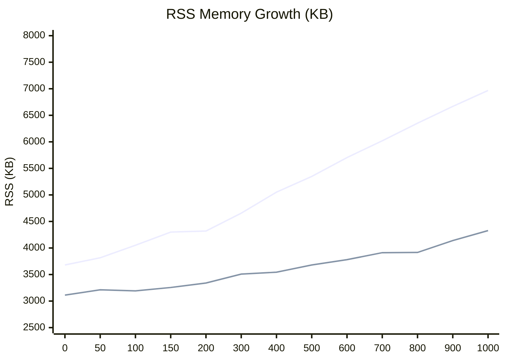

# Performance Benchmarks

This document records the official performance measurements and resource consumption
characteristics of the service-daemon-rs framework. All tests were conducted in a
controlled environment to ensure reproducibility.

## Executive Summary

- **Scalability**: Both frameworks exhibit near-perfect linear memory growth, confirming the resilience of the underlying Tokio-based architecture.
- **Efficiency**: service-daemon-rs incurs a marginal cost of ~3.2 KB per service, while task-supervisor maintains a baseline of ~1.3 KB per task.
- **Trade-off**: The 2.0 KB delta represents the cost of engineering productivity—Dependency Injection, Event-based Triggers, and Causal Diagnostics—which are essential for complex system maintainability.

## Test Environment

- **Operating System**: Linux x64
- **CPU**: (Test host physical CPU)
- **Rust Version**: 1.75+ (Stable)
- **Profile**: Release
- **Measurement Metric**: RSS (Resident Set Size) sampled at 3 seconds post-initialization.

---

## 1. Framework Overhead

The framework overhead consists of the static binary size and the runtime baseline (RSS) with zero business services active.

- **Binary Size**: ~2.0 MB (Release profile, stripped)
- **Baseline RSS**: 3,680 KB (~3.6 MB)

---

## 2. Scalability and Memory Growth

The following data was collected using the `example-stress` crate, where each service
is registered via the standard `#[service]` macro and exercises the full framework
pipeline: linkme static registration, Registry discovery, wave-based startup,
StatusPlane tracking, and reload signal allocation.

As a baseline reference, [task-supervisor](https://github.com/akhercha/task-supervisor)
is included in the comparison. task-supervisor is a thin, transparent wrapper around
raw `tokio::spawn` with minimal bookkeeping (a `HashMap` and simple health checks).
It does not include dependency injection, lifecycle orchestration, or telemetry.
This makes it an effective proxy for the **inherent cost of Tokio task scheduling
itself**, serving as the ideal lower bound for any framework comparison.

Upper line = service-daemon-rs, Lower line = [task-supervisor](https://github.com/akhercha/task-supervisor):



| Services | service-daemon-rs | [task-supervisor](https://github.com/akhercha/task-supervisor) | Delta |
| :--- | ---: | ---: | ---: |
| 0 | 3,680 KB (3.6 MB) | 3,112 KB (3.0 MB) | 568 KB (0.6 MB) |
| 50 | 3,816 KB (3.7 MB) | 3,212 KB (3.1 MB) | 604 KB (0.6 MB) |
| 100 | 4,052 KB (4.0 MB) | 3,192 KB (3.1 MB) | 860 KB (0.8 MB) |
| 150 | 4,300 KB (4.2 MB) | 3,256 KB (3.2 MB) | 1,044 KB (1.0 MB) |
| 200 | 4,320 KB (4.2 MB) | 3,340 KB (3.3 MB) | 980 KB (1.0 MB) |
| 300 | 4,656 KB (4.5 MB) | 3,508 KB (3.4 MB) | 1,148 KB (1.1 MB) |
| 400 | 5,052 KB (4.9 MB) | 3,544 KB (3.5 MB) | 1,508 KB (1.5 MB) |
| 500 | 5,348 KB (5.2 MB) | 3,680 KB (3.6 MB) | 1,668 KB (1.6 MB) |
| 600 | 5,704 KB (5.6 MB) | 3,780 KB (3.7 MB) | 1,924 KB (1.9 MB) |
| 700 | 6,020 KB (5.9 MB) | 3,912 KB (3.8 MB) | 2,108 KB (2.1 MB) |
| 800 | 6,352 KB (6.2 MB) | 3,916 KB (3.8 MB) | 2,436 KB (2.4 MB) |
| 900 | 6,668 KB (6.5 MB) | 4,140 KB (4.0 MB) | 2,528 KB (2.5 MB) |
| 1,000 | 6,968 KB (6.8 MB) | 4,328 KB (4.2 MB) | 2,640 KB (2.6 MB) |

### Growth Slope Analysis

| Metric | service-daemon-rs | [task-supervisor](https://github.com/akhercha/task-supervisor) |
| :--- | ---: | ---: |
| Marginal cost per entity | ~3.2 KB | ~1.3 KB |
| Baseline RSS (0 entities) | 3,680 KB (3.6 MB) | 3,112 KB (3.0 MB) |
| RSS at 1,000 entities | 6,968 KB (6.8 MB) | 4,328 KB (4.2 MB) |

- Both curves are strictly linear, confirming zero detectable memory leaks.
- The delta between the two frameworks grows at approximately **2.0 KB per entity**,
  which directly corresponds to the cost of the following framework features:
    - StatusPlane slot allocation per service.
    - Wave-based lifecycle metadata and backoff controller state.
    - DI resolution and linkme registry overhead.

---

## 4. Selection Guide

Selecting between these two frameworks depends on the specific requirements of the target system and project scale.

### Choose [task-supervisor](https://github.com/akhercha/task-supervisor) if:
- **Extreme Constraints**: Running on systems with less than 16MB of available RAM.
- **Minimalist Task Model**: Managing massive numbers of simple, completely decoupled background tasks where Dependency Injection and complex lifecycle state are not required.
- **Zero-Dependency Policy**: Developing a library where minimal transitive dependencies are required.

### Choose service-daemon-rs if:
- **High-Scale Orchestration**: Managing hundreds or thousands of services that require reliable dependency resolution, wave-based synchronization, and causal tracing.
- **Event-Driven Architecture**: The system relies on **Triggers** for elastic scaling, message dispatching, and complex middleware (Retry/Tracing interceptors).
- **Maintainability Focus**: The project requires strong-typed Dependency Injection and clear service boundaries.
- **Deep Observability**: Causal tracing (Ripple Model) is needed to debug asynchronous event cascades.
- **Modern Edge Computing**: Running on Linux-based Single Board Computers where productivity gains far outweigh the linear ~3.2 KB per-service memory cost.

---

## 5. Credits and Acknowledgments

The development of service-daemon-rs grew out of concrete requirements in large-scale
production projects, where it was gradually abstracted into this standalone framework.
However, its architectural maturity and benchmark methodology have been refined through
the shared knowledge of the Rust open-source community. Special gratitude is extended to:

- **[task-supervisor](https://github.com/akhercha/task-supervisor)**: For providing a 
  highly transparent, robust, and lightweight reference implementation. Watching its 
  elegant handling of Tokio tasks set the benchmark for our own scalability goals. 
  It remains the gold standard for "minimalist task supervision" in the ecosystem.
- **The Tokio Team**: For building the asynchronous runtime that makes such linear 
  scalability possible in Rust.

This comparison is intended as a technical analysis of different architectural trade-offs 
and is a tribute to the diversity of solutions solving the unique challenges of 
embedded and edge computing.

---

## 6. Reproducing Results

The performance data can be reproduced using the following stress test implementations.

### service-daemon-rs Stress Test
Located at `examples/stress/`. Run with varied scale features:
```bash
# Example: test with 500 services
cargo run --release -p example-stress --no-default-features --features s500
```

### task-supervisor Stress Test
Save the following as `examples/stress.rs` in the task-supervisor project:

```rust
use std::error::Error;
use task_supervisor::{SupervisedTask, SupervisorBuilder, TaskError};

#[derive(Clone)]
struct DummyTask;

impl SupervisedTask for DummyTask {
    async fn run(&mut self) -> Result<(), TaskError> {
        loop {
            tokio::time::sleep(std::time::Duration::from_secs(3600)).await;
        }
    }
}

#[tokio::main]
async fn main() -> Result<(), Box<dyn Error>> {
    let count = std::env::var("TASK_COUNT")
        .unwrap_or_else(|_| "100".to_string())
        .parse::<u32>()
        .unwrap();

    let mut builder = SupervisorBuilder::default();
    for i in 0..count {
        let name = format!("task_{}", i);
        builder = builder.with_task(&name, DummyTask);
    }

    let supervisor = builder.build();
    let handle = supervisor.run();
    handle.wait().await?;
    Ok(())
}
```
Run with:

```bash
TASK_COUNT=1000 cargo run --release --example stress
```
