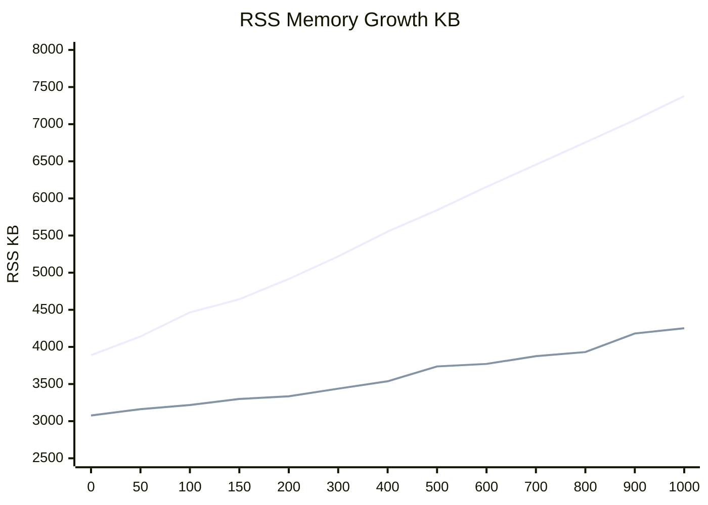
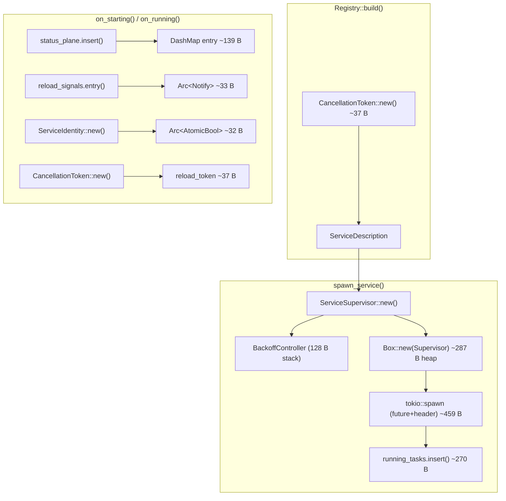
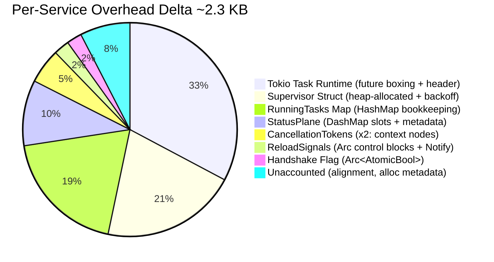

# Performance Benchmarks

This document records the official performance measurements and resource consumption
characteristics of the service-daemon-rs framework. All tests were conducted in a
controlled environment to ensure reproducibility.

## Executive Summary

- **Predictable Scalability**: Uses a fixed-cost model with consistent linear memory growth, ensuring the system remains stable even when managing over 1,000 active services.
- **Resource Efficiency**: Each service adds only ~3.5 KB of memory overhead -- a negligible cost even for memory-constrained edge devices.
- **Ready-to-Use Features**: This tiny memory cost gives you a professional-grade toolkit out of the box: automatic dependency injection, unified logging, and reliable graceful shutdown.
- **Grows with You**: Start with a simple **`is_shutdown()` polling loop** (just like a standard thread), and efficiently migrate to **event-driven triggers and causal tracing** as your requirements grow -- all within the same unified architecture.

## Test Environment

- **Operating System**: Linux x64
- **CPU**: (Test host physical CPU)
- **Rust Version**: 1.93+ (Stable)
- **Profile**: Release
- **Measurement Metric**: RSS (Resident Set Size) sampled at 3 seconds post-initialization.
- **Statistical Method**: Each data point is the arithmetic mean of 6 independent runs.
- **Methodology**: Build and run are strictly separated to exclude compile-time memory; `cargo clean -p` is called before each build to avoid stale cache artifacts.

---

## 1. Framework Overhead

The framework overhead consists of the static binary size and the runtime baseline (RSS) with zero business services active.

- **Binary Size**: ~2.0 MB (Release profile, stripped)
- **Baseline RSS**: 3,889 KB (~3.8 MB)

---

## 2. Scalability and Memory Growth

The following data was collected using the `example-stress` crate, where each service
is registered via the standard `#[service]` macro and exercises the full framework
pipeline: linkme static registration, Registry discovery, wave-based startup,
StatusPlane tracking, and reload signal allocation.

As a baseline reference, [task-supervisor](https://github.com/akhercha/task-supervisor)
is included in the comparison. task-supervisor is a thin, transparent wrapper around
raw `tokio::spawn` with minimal bookkeeping (a `HashMap` and simple health checks).
It does not include dependency injection, lifecycle orchestration, or telemetry.
This makes it an effective proxy for the **inherent cost of Tokio task scheduling
itself**, serving as the ideal lower bound for any framework comparison.

Upper line = service-daemon-rs, Lower line = [task-supervisor](https://github.com/akhercha/task-supervisor):



| Services | service-daemon-rs | [task-supervisor](https://github.com/akhercha/task-supervisor) | Delta |
| :--- | ---: | ---: | ---: |
| 0 | 3,889 KB (3.8 MB) | 3,077 KB (3.0 MB) | 812 KB (0.8 MB) |
| 50 | 4,141 KB (4.0 MB) | 3,162 KB (3.1 MB) | 979 KB (1.0 MB) |
| 100 | 4,465 KB (4.4 MB) | 3,218 KB (3.1 MB) | 1,247 KB (1.2 MB) |
| 150 | 4,642 KB (4.5 MB) | 3,299 KB (3.2 MB) | 1,343 KB (1.3 MB) |
| 200 | 4,915 KB (4.8 MB) | 3,335 KB (3.3 MB) | 1,580 KB (1.5 MB) |
| 300 | 5,219 KB (5.1 MB) | 3,438 KB (3.4 MB) | 1,781 KB (1.7 MB) |
| 400 | 5,553 KB (5.4 MB) | 3,537 KB (3.5 MB) | 2,016 KB (2.0 MB) |
| 500 | 5,842 KB (5.7 MB) | 3,737 KB (3.7 MB) | 2,105 KB (2.1 MB) |
| 600 | 6,156 KB (6.0 MB) | 3,771 KB (3.7 MB) | 2,385 KB (2.3 MB) |
| 700 | 6,454 KB (6.3 MB) | 3,876 KB (3.8 MB) | 2,578 KB (2.5 MB) |
| 800 | 6,754 KB (6.6 MB) | 3,931 KB (3.8 MB) | 2,823 KB (2.8 MB) |
| 900 | 7,056 KB (6.9 MB) | 4,181 KB (4.1 MB) | 2,875 KB (2.8 MB) |
| 1,000 | 7,378 KB (7.2 MB) | 4,252 KB (4.2 MB) | 3,126 KB (3.1 MB) |

### Growth Slope Analysis

| Metric | service-daemon-rs | [task-supervisor](https://github.com/akhercha/task-supervisor) |
| :--- | ---: | ---: |
| Marginal cost per service | ~3.5 KB | ~1.2 KB |
| Baseline RSS (0 services) | 3,889 KB (3.8 MB) | 3,077 KB (3.0 MB) |
| RSS at 1,000 services | 7,378 KB (7.2 MB) | 4,252 KB (4.2 MB) |

- Both curves are strictly linear ($R^2$ ~ 0.998), confirming zero detectable memory leaks.
- The delta between the two frameworks grows at approximately **2.3 KB per service**.

### Where Does the Extra ~2.3 KB Go?

The overhead was measured through two complementary techniques and validated
against RSS deltas from [`example-memory-analysis`](../../examples/memory-analysis):

#### Layer 1: Static Analysis (`std::mem::size_of`)

These are compile-time constants -- the stack footprint of each type.
They represent the **lower bound** because they do not include heap-backing
stores behind pointers (`Arc`, `DashMap` buckets, etc.).

| Type | Stack Size | Role |
| :--- | ---: | :--- |
| `BackoffController` | 128 B | Stateful retry engine: `RestartPolicy` (104 B) + current delay + attempt counter |
| `ServiceIdentity` | 48 B | Task-local handle: `ServiceId`, `&'static str` name, 2x `CancellationToken`, `Arc<AtomicBool>` handshake flag |
| `ServiceDescription` | 24 B | Registry entry: `ServiceId` + `&'static ServiceEntry` ref + `CancellationToken` |
| `ServiceStatus` | 24 B | Lifecycle enum (Initializing, Healthy, Recovering, etc.) |
| `RestartPolicy` | 104 B | Stateless backoff configuration (7 fields: delays, multiplier, jitter, timeouts) |
| `DaemonResources` | 192 B | Shared daemon state: 3x `DashMap` + `Notify` + `DashMap<TypeId, Box<dyn Any>>` |
| `CancellationToken` | 8 B | Lightweight pointer to shared cancellation state |
| `Arc<Notify>` | 8 B | Pointer to heap-allocated `Notify` instance (reload signal) |
| `JoinHandle<()>` | 8 B | Pointer to Tokio task slot |

#### Layer 2: Dynamic Isolation Tests (RSS delta measurement)

Each component was allocated **1,000 times in isolation** and the RSS delta
measured via `/proc/self/statm`. This captures the **true heap cost** including
allocator metadata, hash bucket overhead, and Arc control blocks.

| Component | Per-Entry Cost | What It Measures |
| :--- | ---: | :--- |
| `DashMap<ServiceId, ServiceStatus>` | ~139 B | StatusPlane: hash bucket metadata + amortized empty slots + `ServiceStatus` value |
| `DashMap<ServiceId, Arc<Notify>>` | ~33 B | ReloadSignals: bucket + `Arc` control block (16 B) + `Notify` inner state |
| `CancellationToken::new()` | ~37 B | Shared cancellation state node (x2 per service: description + reload) |
| `Arc<AtomicBool>::new()` | ~32 B | Handshake flag: `Arc` control block + 1 B payload (below page granularity, estimated) |
| `tokio::spawn` (idle future) | ~459 B | Future boxing + task header + waker allocation |
| `HashMap<ServiceId, JoinHandle>` entry | ~270 B | `running_tasks` map entry (includes JoinHandle bookkeeping) |

> [!NOTE]
> The `HashMap<ServiceId, JoinHandle>` measurement includes JoinHandle
> tracking overhead. The `tokio::spawn` measurement captures the raw task
> cost without map bookkeeping. In the real framework these are combined,
> so their individual contributions should not be summed directly.

#### Per-Service Allocation Flow



#### Component Attribution

The per-service overhead delta (~2.3 KB) between service-daemon-rs and
task-supervisor breaks down into three categories based on **who pays the
cost**, validated by isolation measurements:



| Category | Budget | Components |
| :--- | ---: | :--- |
| **Tokio Runtime** (any spawned task pays this) | ~459 B (33%) | Future boxing, task header, waker |
| **Framework Core** (lifecycle, backoff, signals) | ~565 B (40%) | ServiceSupervisor heap struct, StatusPlane, ReloadSignals, Tokens |
| **Infrastructure** (maps, padding, alignment) | ~376 B (27%) | RunningTasks HashMap, allocation metadata, alignment padding |

In plain terms: roughly **33%** goes to the Tokio task runtime itself (which
any spawned task would pay), **40%** goes to the framework's core value-adds
(lifecycle tracking, backoff, reload signals), and the remaining **27%** is
generic infrastructure overhead (HashMap bookkeeping and memory alignment).

#### Clarifying the "Unaccounted" Portion

Previously, a large "Unaccounted" slice (~40%) existed because isolation tests
omitted the **ServiceSupervisor** heap box and **Tracing Span** metadata.
Deep-dive measurements using `example-memory-analysis` confirmed:

1.  **ServiceSupervisor heap box**: Adding **~287 B** per service.
2.  **Allocation Metadata**: Small individual allocations (`Arc`, `Notify`, `CancellationToken`) each carry an allocation header (typically 8-16 B) used by the memory allocator (e.g., jemalloc/libc).
3.  **Future Size**: The supervisor task's async future size depends on the local variables held across `.await` points, which is captured in the **Tokio Task Runtime** cost.

#### Deep Dive: Why is DashMap Overhead ~139 B per Entry?

`DashMap` provides lock-free concurrent reads across 1,000+ services by
sharding the map into multiple independent segments. Each entry pays for:

1.  **Hash bucket metadata**: Key hash, occupancy bits, and pointer to the value
2.  **Amortized empty slots**: DashMap pre-allocates capacity in power-of-2
    chunks, so at any given time ~30-50% of allocated slots may be empty
3.  **Segment overhead**: Per-shard `RwLock` control state, distributed across entries

By contrast, a plain `HashMap` would cost only ~40-60 B per entry, but would
require a global lock for every read -- unacceptable for a framework that must
support concurrent status queries from multiple services.

> [!TIP]
> Service names use `&'static str` references into the static
> `ServiceEntry` registry, eliminating the per-service `String` heap allocation
> that would otherwise add **40-64 B** per service. Similarly, `ServiceFn` is
> a plain `fn` pointer (8 B on stack) rather than `Arc<dyn Fn>` (vtable + heap).

---

## 4. Selection Guide

Selecting between these two frameworks depends on the specific requirements of the target system and project scale.

### Choose [task-supervisor](https://github.com/akhercha/task-supervisor) if:
- **Minimalist Task Model**: Managing simple, fully decoupled background tasks where Dependency Injection and complex event-driven triggers are overkill.
- **Zero-Dependency Policy**: Developing a library where minimal transitive dependencies are a strict requirement.
- **Maximum Simplicity**: Preferring a thin wrapper around raw `tokio::spawn` with zero learning curve and near-instant compilation (no proc-macro or linker overhead).

### Choose service-daemon-rs if:
- **Scalable Orchestration**: Managing numerous services that require **strict startup/shutdown ordering** and reliable dependency resolution.
- **Rich Event Handling**: Your system needs to frequently interact with **Signals, Queues, Cron Tasks**, or other event sources.
- **Progressive Productivity**: You want a **smooth learning curve** that starts with simple macros but scales to advanced diagnostics as your system grows.
- **Reliability by Design**: You value **built-in safety** like cancellation-aware `sleep`, automated logging, and synchronous-block detection.
- **Maintainability & Testing**: The project requires strong-typed Dependency Injection and advanced **Simulation/Mocking** (using `MockContext`) to verify complex logic in isolation.
- **Deep Observability**: Causal tracing (Ripple Model) is needed to trace the "why" behind complex asynchronous event chains.

---

## 5. Credits and Acknowledgments

The development of service-daemon-rs grew out of concrete requirements in large-scale
production projects, where it was gradually abstracted into this standalone framework.
However, its architectural maturity and benchmark methodology have been refined through
the shared knowledge of the Rust open-source community. Special gratitude is extended to:

- **[task-supervisor](https://github.com/akhercha/task-supervisor)**: For providing a 
  highly transparent, robust, and lightweight reference implementation. Watching its 
  efficient handling of Tokio tasks set the benchmark for our own scalability goals. 
  It remains the gold standard for "minimalist task supervision" in the ecosystem.
- **The Tokio Team**: For building the asynchronous runtime that makes such linear 
  scalability possible in Rust.

This comparison is intended as a technical analysis of different architectural trade-offs 
and is a tribute to the diversity of solutions solving the unique challenges of 
embedded and edge computing.

---

## 6. Reproducing Results

The performance data can be reproduced using the following test implementations.

### Component-Level Memory Analysis
Located at [`examples/memory-analysis/`](../../examples/memory-analysis/). Measures
static sizes, dynamic heap costs, and end-to-end per-service overhead:
```bash
cargo run --release -p example-memory-analysis
```
This tool produces the data points used in the **"Where Does the Extra ~2.3 KB Go?"**
section above. See the [example README](../../examples/memory-analysis/README.md)
for output interpretation.

### service-daemon-rs Stress Test
Located at `examples/stress/`. Run with varied scale features:
```bash
# Baseline: framework overhead with zero services
cargo run --release -p example-stress --no-default-features --features s0

# Example: test with 500 services
cargo run --release -p example-stress --no-default-features --features s500
```

### task-supervisor Stress Test
Save the following as `examples/stress.rs` in the task-supervisor project:

```rust
use std::error::Error;
use task_supervisor::{SupervisedTask, SupervisorBuilder, TaskError};

#[derive(Clone)]
struct DummyTask;

impl SupervisedTask for DummyTask {
    async fn run(&mut self) -> Result<(), TaskError> {
        loop {
            tokio::time::sleep(std::time::Duration::from_secs(3600)).await;
        }
    }
}

#[tokio::main]
async fn main() -> Result<(), Box<dyn Error>> {
    let count = std::env::var("TASK_COUNT")
        .unwrap_or_else(|_| "100".to_string())
        .parse::<u32>()
        .unwrap();

    let mut builder = SupervisorBuilder::default();
    for i in 0..count {
        let name = format!("task_{}", i);
        builder = builder.with_task(&name, DummyTask);
    }

    let supervisor = builder.build();
    let handle = supervisor.run();
    handle.wait().await?;
    Ok(())
}
```
Run with:

```bash
TASK_COUNT=1000 cargo run --release --example stress
```
