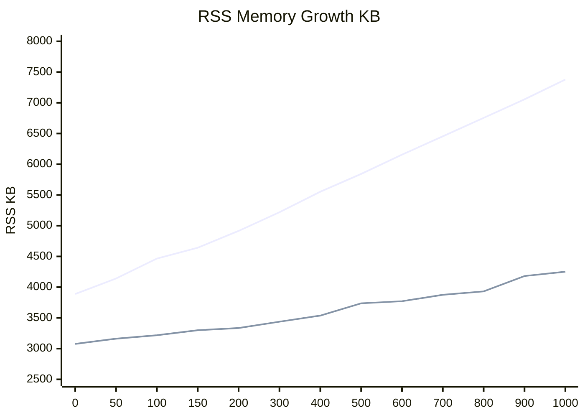
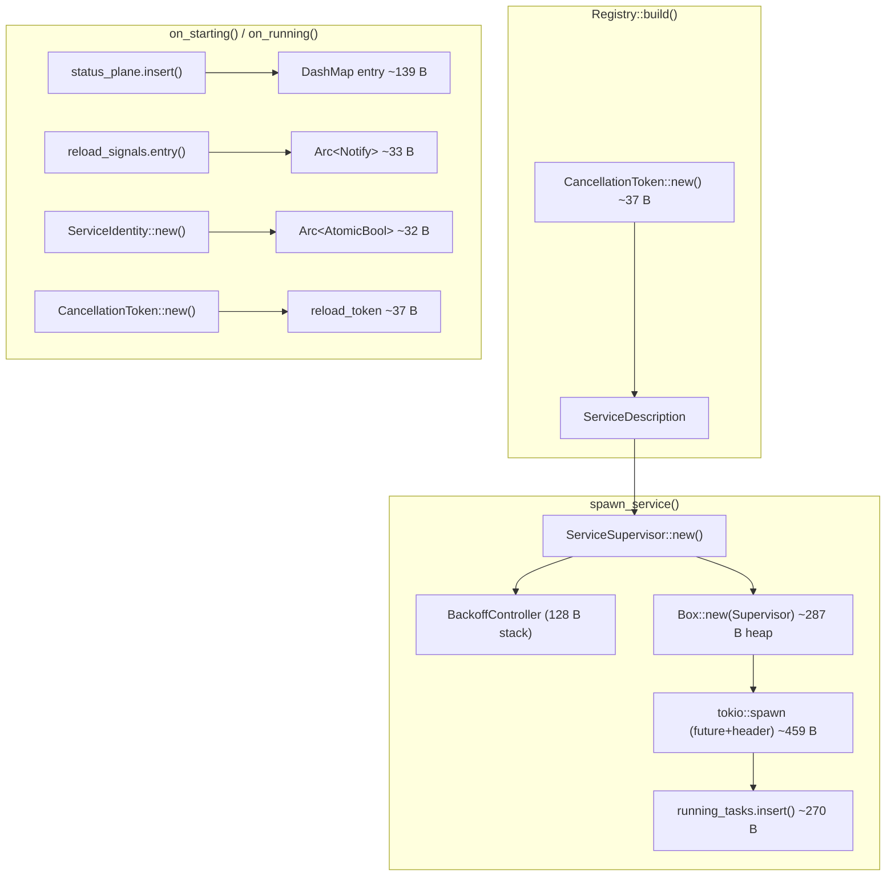
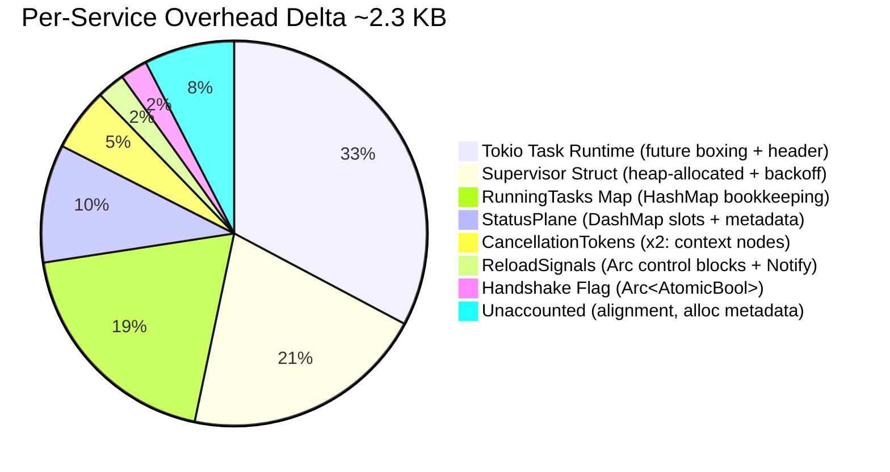

# Performance Benchmarks

This document records workload-specific performance measurements and resource
consumption characteristics of service-daemon-rs. Results belong to their stated
environment and measurement population, not a universal performance guarantee.
The service-count measurements below and the HighPriority resource-retention
experiments use different methods and must not be combined into one cost model.

## Service-count Measurement Summary

- **Memory cost is linear in service count**: each additional service adds roughly **~3.5 KB** RSS overhead. Up to 1,000 services were measured stable in the test environment.
- **Per-service cost includes**: DI resolution, logging plumbing, graceful-shutdown wiring. These are paid once at registration; runtime overhead per event is dominated by the user code, not framework bookkeeping.
- **Two control-flow styles, same supervisor**: `is_shutdown()` polling loops and event-driven triggers run under the same restart/lifecycle machinery. Migrating from one to the other does not change the orchestration layer.

## Service-count Test Environment

- **Operating System**: Linux x64
- **CPU**: (Test host physical CPU)
- **Rust Version**: 1.93+ (Stable)
- **Profile**: Release
- **Measurement Metric**: RSS (Resident Set Size) sampled at 3 seconds post-initialization.
- **Statistical Method**: Each data point is the arithmetic mean of 6 independent runs.
- **Methodology**: Build and run are strictly separated to exclude compile-time memory; `cargo clean -p` is called before each build to avoid stale cache artifacts.

---

## 1. Framework Overhead

The framework overhead consists of the static binary size and the runtime baseline (RSS) with zero business services active.

- **Binary Size**: ~2.0 MB (Release profile, stripped)
- **Baseline RSS**: 3,889 KB (~3.8 MB)

---

## 2. Scalability and Memory Growth

The following data was collected using the `example-stress` crate, where each service
is registered via the standard `#[service]` macro and exercises the full framework
pipeline: linkme static registration, Registry discovery, wave-based startup,
StatusPlane tracking, and reload signal allocation.

As a baseline reference, [task-supervisor](https://github.com/akhercha/task-supervisor)
is included in the comparison. task-supervisor is a thin, transparent wrapper around
raw `tokio::spawn` with minimal bookkeeping (a `HashMap` and simple health checks).
It does not include dependency injection, lifecycle orchestration, or telemetry.
This makes it an effective proxy for the **inherent cost of Tokio task scheduling
itself**, serving as the ideal lower bound for any framework comparison.

Upper line = service-daemon-rs, Lower line = [task-supervisor](https://github.com/akhercha/task-supervisor):


```mermaid
xychart-beta
title "RSS Memory Growth KB"
x-axis [0, 50, 100, 150, 200, 300, 400, 500, 600, 700, 800, 900, 1000]
y-axis "RSS KB" 2500 --> 8000
line [3889, 4141, 4465, 4642, 4915, 5219, 5553, 5842, 6156, 6454, 6754, 7056, 7378]
line [3077, 3162, 3218, 3299, 3335, 3438, 3537, 3737, 3771, 3876, 3931, 4181, 4252]
```

| Services | service-daemon-rs | [task-supervisor](https://github.com/akhercha/task-supervisor) | Delta |
| :--- | ---: | ---: | ---: |
| 0 | 3,889 KB (3.8 MB) | 3,077 KB (3.0 MB) | 812 KB (0.8 MB) |
| 50 | 4,141 KB (4.0 MB) | 3,162 KB (3.1 MB) | 979 KB (1.0 MB) |
| 100 | 4,465 KB (4.4 MB) | 3,218 KB (3.1 MB) | 1,247 KB (1.2 MB) |
| 150 | 4,642 KB (4.5 MB) | 3,299 KB (3.2 MB) | 1,343 KB (1.3 MB) |
| 200 | 4,915 KB (4.8 MB) | 3,335 KB (3.3 MB) | 1,580 KB (1.5 MB) |
| 300 | 5,219 KB (5.1 MB) | 3,438 KB (3.4 MB) | 1,781 KB (1.7 MB) |
| 400 | 5,553 KB (5.4 MB) | 3,537 KB (3.5 MB) | 2,016 KB (2.0 MB) |
| 500 | 5,842 KB (5.7 MB) | 3,737 KB (3.7 MB) | 2,105 KB (2.1 MB) |
| 600 | 6,156 KB (6.0 MB) | 3,771 KB (3.7 MB) | 2,385 KB (2.3 MB) |
| 700 | 6,454 KB (6.3 MB) | 3,876 KB (3.8 MB) | 2,578 KB (2.5 MB) |
| 800 | 6,754 KB (6.6 MB) | 3,931 KB (3.8 MB) | 2,823 KB (2.8 MB) |
| 900 | 7,056 KB (6.9 MB) | 4,181 KB (4.1 MB) | 2,875 KB (2.8 MB) |
| 1,000 | 7,378 KB (7.2 MB) | 4,252 KB (4.2 MB) | 3,126 KB (3.1 MB) |

### Growth Slope Analysis

| Metric | service-daemon-rs | [task-supervisor](https://github.com/akhercha/task-supervisor) |
| :--- | ---: | ---: |
| Marginal cost per service | ~3.5 KB | ~1.2 KB |
| Baseline RSS (0 services) | 3,889 KB (3.8 MB) | 3,077 KB (3.0 MB) |
| RSS at 1,000 services | 7,378 KB (7.2 MB) | 4,252 KB (4.2 MB) |

- Both curves are strictly linear ($R^2$ ~ 0.998), confirming zero detectable memory leaks.
- The delta between the two frameworks grows at approximately **2.3 KB per service**.

### Where Does the Extra ~2.3 KB Go?

The overhead was measured through two complementary techniques and validated
against RSS deltas from [`example-memory-analysis`](../../examples/memory-analysis):

#### Layer 1: Static Analysis (`std::mem::size_of`)

These are compile-time constants -- the stack footprint of each type.
They represent the **lower bound** because they do not include heap-backing
stores behind pointers (`Arc`, `DashMap` buckets, etc.).

| Type | Stack Size | Role |
| :--- | ---: | :--- |
| `BackoffController` | 144 B | Stateful retry engine: `RestartPolicy` (120 B) + current delay + attempt counter |
| `ServiceIdentity` | 80 B | Task-local handle: `ServiceInstanceId`, `&'static str` name, 2x `CancellationToken`, `Arc<AtomicBool>` handshake flag |
| `ServiceDescription` | 24 B | Entry-scoped description: `ServiceEntryId` + `&'static ServiceEntry` ref + shared instance registry pointer |
| `ServiceStatus` | 24 B | Lifecycle enum (Initializing, Healthy, Recovering, etc.) |
| `RestartPolicy` | 120 B | Stateless backoff configuration (7 fields: delays, multiplier, jitter, timeouts) |
| `DaemonResources` | 192 B | Shared daemon state: 3x `DashMap` + `Notify` + `DashMap<TypeId, Box<dyn Any>>` |
| `CancellationToken` | 8 B | Lightweight pointer to shared cancellation state |
| `Arc<Notify>` | 8 B | Pointer to heap-allocated `Notify` instance (reload signal) |
| `JoinHandle<()>` | 8 B | Pointer to Tokio task slot |

#### Layer 2: Dynamic Isolation Tests (RSS delta measurement)

Each component was allocated **1,000 times in isolation** and the RSS delta
measured via `/proc/self/statm`. This captures the **true heap cost** including
allocator metadata, hash bucket overhead, and Arc control blocks.

| Component | Per-Entry Cost | What It Measures |
| :--- | ---: | :--- |
| `DashMap<ServiceInstanceId, ServiceStatus>` | ~213 B | StatusPlane: hash bucket metadata + amortized empty slots + `ServiceStatus` value |
| `DashMap<ServiceInstanceId, Arc<Notify>>` | ~45 B | ReloadSignals: bucket + `Arc` control block (16 B) + `Notify` inner state |
| `CancellationToken::new()` | ~37 B | Shared cancellation state node (x2 per service: description + reload) |
| `Arc<AtomicBool>::new()` | ~32 B | Handshake flag: `Arc` control block + 1 B payload (below page granularity, estimated) |
| `tokio::spawn` (idle future) | ~483 B | Future boxing + task header + waker allocation |
| `HashMap<ServiceInstanceId, JoinHandle>` entry | ~483 B | `running_tasks` map entry (includes JoinHandle bookkeeping) |

> [!NOTE]
> The `HashMap<ServiceInstanceId, JoinHandle>` measurement includes JoinHandle
> tracking overhead. The `tokio::spawn` measurement captures the raw task
> cost without map bookkeeping. In the real framework these are combined,
> so their individual contributions should not be summed directly.

#### Per-Service Allocation Flow


```mermaid
flowchart TD
    subgraph Registry["Registry::build()"]
        A["CancellationToken::new() ~37 B"] --> B["ServiceDescription"]
    end
    subgraph Spawn["spawn_service()"]
        B --> C["ServiceSupervisor::new()"]
        C --> D["BackoffController (128 B stack)"]
        C --> E["Box::new(Supervisor) ~287 B heap"]
        E --> F["tokio::spawn (future+header) ~459 B"]
        F --> G["running_tasks.insert() ~270 B"]
    end
    subgraph Runtime["on_starting() / on_running()"]
        H["status_plane.insert()"] --> I["DashMap entry ~139 B"]
        J["reload_signals.entry()"] --> K["Arc&lt;Notify&gt; ~33 B"]
        L["ServiceIdentity::new()"] --> M["Arc&lt;AtomicBool&gt; ~32 B"]
        N["CancellationToken::new()"] --> O["reload_token ~37 B"]
    end
```

#### Component Attribution

The per-service overhead delta (~2.3 KB) between service-daemon-rs and
task-supervisor breaks down into three categories based on **who pays the
cost**, validated by isolation measurements:


```mermaid
pie title Per-Service Overhead Delta ~2.3 KB
"Tokio Task Runtime (future boxing + header)" : 459
"Supervisor Struct (heap-allocated + backoff)" : 287
"RunningTasks Map (HashMap bookkeeping)" : 270
"StatusPlane (DashMap slots + metadata)" : 139
"CancellationTokens (x2: context nodes)" : 74
"ReloadSignals (Arc control blocks + Notify)" : 33
"Handshake Flag (Arc<AtomicBool>)" : 32
"Unaccounted (alignment, alloc metadata)" : 106
```

| Category | Budget | Components |
| :--- | ---: | :--- |
| **Tokio Runtime** (any spawned task pays this) | ~459 B (33%) | Future boxing, task header, waker |
| **Framework Core** (lifecycle, backoff, signals) | ~565 B (40%) | ServiceSupervisor heap struct, StatusPlane, ReloadSignals, Tokens |
| **Infrastructure** (maps, padding, alignment) | ~376 B (27%) | RunningTasks HashMap, allocation metadata, alignment padding |

In plain terms: roughly **33%** goes to the Tokio task runtime itself (which
any spawned task would pay), **40%** goes to the framework's core value-adds
(lifecycle tracking, backoff, reload signals), and the remaining **27%** is
generic infrastructure overhead (HashMap bookkeeping and memory alignment).

#### Clarifying the "Unaccounted" Portion

Previously, a large "Unaccounted" slice (~40%) existed because isolation tests
omitted the **ServiceSupervisor** heap box and **Tracing Span** metadata.
Deep-dive measurements using `example-memory-analysis` confirmed:

1.  **ServiceSupervisor heap box**: Adding **~287 B** per service.
2.  **Allocation Metadata**: Small individual allocations (`Arc`, `Notify`, `CancellationToken`) each carry an allocation header (typically 8-16 B) used by the memory allocator (e.g., jemalloc/libc).
3.  **Future Size**: The supervisor task's async future size depends on the local variables held across `.await` points, which is captured in the **Tokio Task Runtime** cost.

#### Detail: Why is DashMap Overhead ~139 B per Entry?

`DashMap` provides lock-free concurrent reads across 1,000+ services by
sharding the map into multiple independent segments. Each entry pays for:

1.  **Hash bucket metadata**: Key hash, occupancy bits, and pointer to the value
2.  **Amortized empty slots**: DashMap pre-allocates capacity in power-of-2
    chunks, so at any given time ~30-50% of allocated slots may be empty
3.  **Segment overhead**: Per-shard `RwLock` control state, distributed across entries

By contrast, a plain `HashMap` would cost only ~40-60 B per entry, but would
require a global lock for every read -- unacceptable for a framework that must
support concurrent status queries from multiple services.

> [!TIP]
> Service names use `&'static str` references into the static
> `ServiceEntry` registry, eliminating the per-service `String` heap allocation
> that would otherwise add **40-64 B** per service. Similarly, `ServiceFn` is
> a plain `fn` pointer (8 B on stack) rather than `Arc<dyn Fn>` (vtable + heap).

---

## 4. Selection Guide

Selecting between these two frameworks depends on the specific requirements of the target system and project scale.

### Choose [task-supervisor](https://github.com/akhercha/task-supervisor) if:
- **Minimalist Task Model**: Managing simple, fully decoupled background tasks where Dependency Injection and complex event-driven triggers are overkill.
- **Zero-Dependency Policy**: Developing a library where minimal transitive dependencies are a strict requirement.
- **Maximum Simplicity**: Preferring a thin wrapper around raw `tokio::spawn` with zero learning curve and near-instant compilation (no proc-macro or linker overhead).

### Choose service-daemon-rs if:
- **Multiple services with ordering**: you have several long-running concerns whose startup and shutdown order matters, and you'd otherwise hand-roll a supervisor.
- **Event-driven by composition**: signals, queues, cron, watch triggers as first-class, with the same restart/backoff machinery applied uniformly.
- **DI by Rust types**: you want compile-time-checked dependency wiring without a runtime container or string keys.
- **Testability**: `MockContext` (`simulation` feature) lets you instantiate parts of the daemon in a sandbox for unit testing without the full lifecycle.
- **Causal tracing across event chains**: when "why did this run?" matters, the built-in UUID v7 propagation makes trigger-to-trigger chains traceable without manual span linking.

---

## 5. Credits and Acknowledgments

service-daemon-rs grew out of concrete requirements in production projects and
was gradually abstracted into a standalone framework. The benchmark methodology
borrows from prior work in the Rust ecosystem:

- **[task-supervisor](https://github.com/akhercha/task-supervisor)** -- a small,
  focused supervisor crate. Its scope and clarity informed our minimum viable
  baseline for "supervise N tokio tasks" measurements.
- **The Tokio team** -- for the runtime everything here is built on.

The comparison above is meant as analysis of architectural trade-offs, not a
ranking. The two projects target different scopes.

---

## HighPriority Resource Retention and Reclamation Evidence

HighPriority currently retains a bounded runtime pool rather than automatically
reclaiming empty shards. Low pressure is not, by itself, evidence that isolation
is unnecessary. Resource retention, placement order, and reclamation are separate
decisions. Experiment commands and acceptance checks live in the
[maintainer validation map](../development/release-validation.md#linux-empty-shard-reuse-experiment).

### What the available observations establish

The Linux idle-cost experiment used release builds, three independent processes,
and thirty-second windows after real services had run and been removed. On its
twelve-CPU host, retaining twelve single-worker shards with HP probes enabled
had low measured process CPU cost and a small paired RSS increase relative to
one shard. With HP probes disabled, the observed HP-worker CPU and context-switch
increments were zero. This supports waiting rather than busy-spinning in those
windows, not a promise that idle workers never wake. Probe disabling is an
experimental control, not a production recommendation.

Retention still costs threads, file descriptors and virtual address space.
Virtual address space is not resident memory; process RSS includes framework,
sampler and allocator state. Whole-daemon shutdown is not a measurement of
single-shard reclamation, and RSS remaining elevated after shutdown establishes
neither a leak nor the amount reclamation would return. Power was not measured.

The reported two-episode reuse experiment exercised production policy with an
empty, Nominal shard remaining after the first subject was removed and a
sixty-five-second quiet valley. Across three independent repetitions per
condition, a full two-worker budget reused the empty shard without growth;
a three-worker budget with spare capacity allocated another shard instead.
Both conditions reported actual generation relocation and improved evaluation
samples while source contention continued. These reuse observations are recorded
from the experiment report; they are not a new independent replay by this document.

Thus an empty shard can be useful reserve capacity rather than necessarily
stranded worker budget. The conditions used different CPU affinities to infer
their budgets, so they do not rank reuse versus allocation performance.
Evaluation-window means are not whole-run or post-generation tail percentiles.
Preserve raw records, source/executable manifests and interpretation notes;
the documentation is not a substitute for the experiment archive.

The fixed-budget repeated-cycle experiment extends that evidence to six pressure
episodes in each of three independent processes. With the production-inferred
budget fixed at three workers, the first two episodes grew the pool from one to
two and then three workers. The remaining four reused hp#1 without further
growth. Each episode established actual relocation and PressureCleared from
comparable evaluation samples while the source competitor remained active.
After removal, target active/assigned counts returned to zero, and round
boundaries had no pending placement or rollover. This establishes useful control
at the budget ceiling, not merely a resource count constrained by the cap.

Resource stability is not balanced utilization or proof that every retained
shard is necessary: hp#2 stayed empty after the second subject was removed,
while subsequent episodes selected hp#1. This motivates an equal-condition
allocation-first versus idle-first comparison; it does not establish that
omitting hp#2 would preserve recovery performance. Each subject was removed
after its episode, so concurrent instance count decreased across rounds. The
experiment validates each episode's own intervention, not a fixed-concurrency
throughput comparison. Evaluation-window means and post-generation percentiles
must not be substituted for whole-run tail latency.

The original measurement archive and corrected replay verifier have separate
source/executable identities. Independent hash checks and corrected replay
validated the preserved reports. The correction regenerates the report and
compares its serialized bytes rather than comparing reparsed floating-point
means; it introduces neither numeric tolerance nor new measurements. Success
of the corrected verifier does not retroactively establish that the original
executable's replay succeeded. Earlier experiment archives unavailable at their
original paths were not revalidated by this check or replaced by these results.

### Same-budget placement preference evidence

The placement A/B experiment used four fresh-process pairs, alternating arm
order, with the same archived release binary, three-CPU affinity, inferred
budget and initial topology. Only the test-only placement preference differed
after the common first intervention and empty-shard valley. Independent archive
hash verification and raw-data replay supported the preserved comparison.

Idle-first reused hp#1 and kept peak HP workers at two, while allocation-first
created hp#2 and peaked at three. Both arms completed actual generation relocation
and benefit evaluation, with source contention continuing. This is repeatable
avoidance of one worker/shard allocation in this workload, not evidence that
process CPU or RSS fell proportionally; neither was measured here.

In the paired observations, idle-first generation and evaluation completion
were not later. That does not isolate runtime construction cost: the workload's
blocking cadence and policy observation timing also affect recovery delay.
Post-generation P99 differences had both signs, and idle-first included a larger
single maximum drift. Four pairs do not establish statistical non-inferiority
or that every tail metric is unchanged or better.

The comparison uses a fixed fifty-second second-pressure phase and a separate
thirty-second post-generation window beginning after two seconds of settling.
Phase P99.9 retains the initial long waits and must not be replaced by the much
lower post-generation P99. Each Post window has roughly five thousand completed
samples; P99.9 remains exploratory under this experiment's ten-thousand-sample
guidance. Neither population is the entire process lifetime.

### Controlled reclamation and rebuild evidence

The long-valley experiment compared retaining and preferentially reusing hp#1
with reclaiming it and rebuilding on demand. Four fresh-process pairs used the
same archived release binary, three-CPU budget, workload and five-minute valley,
with alternating arm order. Both arms used the experimental idle-first preference;
this isolates reclamation from the preceding allocation-first comparison.
Independent hash checks and same-binary raw-data replay supported the archive.

In the stable valley, reclamation reduced HP workers from two to one, process
threads from six to five, and file descriptors from twenty-two to eighteen.
The target worker TID disappeared, its probe and runtime shutdown completed,
and the initial worker survived. This demonstrates actual release, not merely
accounting changes. Both arms still peaked at two HP workers over the full case:
the benefit was lower valley occupancy, not a lower peak. The next pressure
episode reused hp#1 in the retention arm and created fresh hp#2 in the reclamation
arm; both completed actual generation relocation and benefit evaluation.

The resource dimensions do not share one conclusion. Paired process CPU changes
had both signs, so no reliable CPU-time break-even valley length was established.
Immediate RSS did not fall; slightly lower later endpoints include sampling,
retained records and allocator effects, not an isolated runtime-memory return.
The experimental shutdown path used helper threads and coincided with increased
virtual address space. This is not equivalent RSS growth, nor proof of the
entire allocation source or an inherent cost of every reclamation implementation.
The target worker exited before the total thread count fell: helper threads
temporarily masked the reduction in immediate process-wide snapshots.

Measured shutdown and construction wall times were sub-millisecond, whereas
paired generation-recovery differences were hundreds of milliseconds with both
signs. Do not attribute recovery differences directly to construction cost or
conclude that rebuilding has no recovery cost. Post-generation tails use the
same settling-plus-thirty-second population as the placement comparison; the
full second-pressure phase retains initial long waits. Neither four pairs nor
roughly five thousand Post samples establishes tail non-inferiority or an SLA.

The hook only removes the last dynamic shard after checking emptiness and
reservations; the experiment excludes concurrent service creation. It is not a
production retirement protocol. Its helper-thread shutdown path should not be
adopted without separately designing shutdown-resource ownership and lifetime.
Actual thread/FD release establishes value when those are deployment constraints;
general CPU/RSS net savings and the need for a full controller remain unproven.

### Questions that must remain separate

| Experiment | Question | Decision boundary |
| --- | --- | --- |
| Idle resource cost | Is retaining empty capacity materially expensive? | Establishes retention cost in the measured environment, not actual reclamation savings. |
| Empty-shard reuse | Can reserve capacity help a later pressured service at the budget ceiling? | Establishes useful reuse in the measured case, not repeated-cycle reliability or optimal placement order. |
| Repeated pressure cycles | Does reuse remain effective with bounded resources and correct lifecycle accounting? | Observed in the finite six-episode workload with per-round placement, benefit and cleanup evidence; not a long-duration soak, allocator convergence or balanced utilization guarantee. |
| Allocation-first versus idle-first | Can placement order reduce resource growth while retaining effective recovery? | Equal-condition pairs demonstrated lower peak HP workers and effective recovery; tail non-inferiority and general production suitability remain unproven. This concerns avoiding creation, not reclaiming existing resources. |
| Long-valley reclamation | Do actual releases outweigh subsequent rebuild and recovery costs? | Controlled pairs demonstrated real thread/FD release and effective rebuilding, but not reliable CPU/RSS net savings, tail non-inferiority or a production concurrent-retirement protocol. |

The available observations cover idle cost, two-episode reuse, finite
repeated-cycle reuse, a bounded placement-order comparison and controlled
reclamation/rebuilding. They support an idle-first resource-peak benefit and
reclamation's valley thread/FD release for the tested workload, not universal
performance superiority or general CPU/RSS net savings. Multiple processes
or pressure episodes are repetitions, not additional categories of evidence.
Do not infer that an available test entrypoint means its performance claim has
been validated.

### Current decision

Retaining the bounded pool is a reasonable current choice for the measured
scenario. There is no demonstrated need here to introduce automatic reclamation
or active service consolidation solely to save idle CPU or a small amount of RSS.
Finite repeated-cycle reuse also provides no evidence that reclamation is needed
to unblock intervention at the worker ceiling in this workload.
This is not a claim that scale-down can never be useful: the controlled experiment
establishes concrete thread/FD release. Revisit production reclamation when such
deployment constraints justify it; address-space, resident-memory and power goals
still need direct evidence of net benefit for the proposed implementation.
The placement comparison supports a narrow production-design discussion about
idle-first reuse without destroying runtimes. It does not authorize changing the
default, add a latency guarantee, or justify a full reclamation controller. Production
adoption needs explicit eligibility, reservation/concurrency, observation
freshness, cooldown and failure semantics, plus performance acceptance criteria.
The production default remains allocation-first; the candidate is test-only.

## 6. Reproducing Results

The performance data can be reproduced using the following test implementations.

### Component-Level Memory Analysis
Located at [`examples/memory-analysis/`](../../examples/memory-analysis/). Measures
static sizes, dynamic heap costs, and end-to-end per-service overhead:
```bash
cargo run --release -p example-memory-analysis
```
This tool produces the data points used in the **"Where Does the Extra ~2.3 KB Go?"**
section above. See the [example README](../../examples/memory-analysis/README.md)
for output interpretation.

### service-daemon-rs Stress Test
Located at `examples/stress/`. Run with varied scale features:
```bash
# Baseline: framework overhead with zero services
cargo run --release -p example-stress --no-default-features --features s0

# Example: test with 500 services
cargo run --release -p example-stress --no-default-features --features s500
```

### task-supervisor Stress Test
Save the following as `examples/stress.rs` in the task-supervisor project:

```rust
use std::error::Error;
use task_supervisor::{SupervisedTask, SupervisorBuilder, TaskError};

#[derive(Clone)]
struct DummyTask;

impl SupervisedTask for DummyTask {
    async fn run(&mut self) -> Result<(), TaskError> {
        loop {
            tokio::time::sleep(std::time::Duration::from_secs(3600)).await;
        }
    }
}

#[tokio::main]
async fn main() -> Result<(), Box<dyn Error>> {
    let count = std::env::var("TASK_COUNT")
        .unwrap_or_else(|_| "100".to_string())
        .parse::<u32>()
        .unwrap();

    let mut builder = SupervisorBuilder::default();
    for i in 0..count {
        let name = format!("task_{}", i);
        builder = builder.with_task(&name, DummyTask);
    }

    let supervisor = builder.build();
    let handle = supervisor.run();
    handle.wait().await?;
    Ok(())
}
```
Run with:

```bash
TASK_COUNT=1000 cargo run --release --example stress
```
