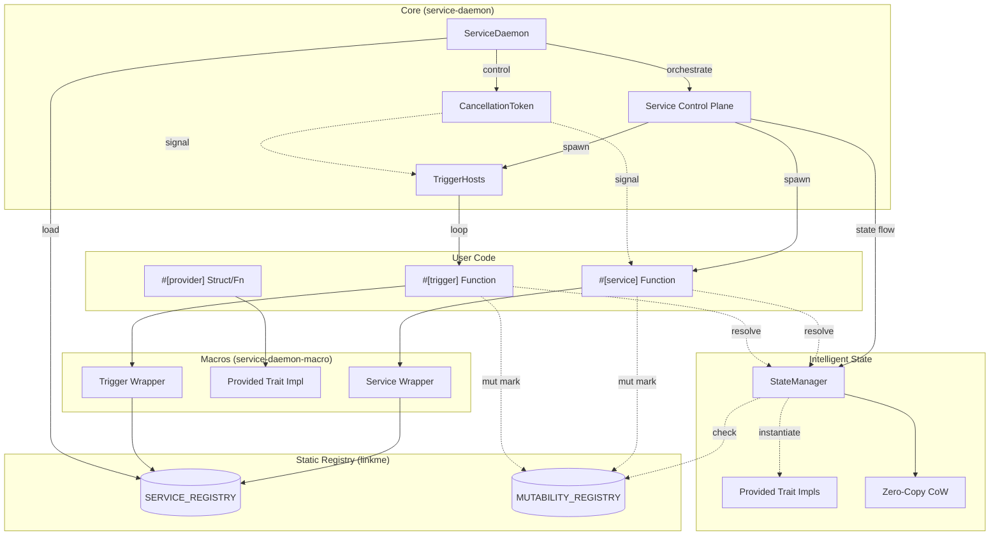

# Service Daemon Architecture

This document describes the internal architecture of the `service-daemon-rs` framework, explaining how its components interact to provide automatic service management and type-based dependency injection.

## Project Overview

The `service-daemon-rs` is a high-level framework for building resilient, modular Rust applications. It automates the boilerplate associated with:
1. **Service Orchestration**: Managing the lifecycle of long-running tasks.
2. **Dependency Injection (DI)**: Automatically resolving and injecting dependencies based on types.
3. **Event Triggers**: Decoupling event sources from service logic.

## High-Level Architecture

The framework is built around a **unified service registry** and **decentralized dependency injection**.

- **Unified Registry**: Both standard services and event-driven triggers are collected into a single `SERVICE_REGISTRY` at link time.
- **Decentralized DI**: Unlike traditional DI containers, there is no central registry for providers. Instead, each type provides its own resolution logic via the `Provided` trait, typically as a lazy `OnceCell` singleton.

## Getting Started for Contributors

### Development Environment
- **Rust**: Latest stable version.
- **Tokio**: The framework is built exclusively on the `tokio` runtime.
- **Cargo Expand**: Extremely helpful for debugging macro expansion. Install via `cargo install cargo-expand`.

### Standard Workflow
1. **Modify Core/Macros**: Make changes in `service-daemon` or `service-daemon-macro`.
2. **Run Tests**: Use `cargo test --workspace` to run integrated tests.
3. **Verify Expansion**: Use `cargo expand -p service-daemon-demo` to see how your changes affect user code.



## Step-by-Step Technical Details

### 1. Registration Phase (Compile & Link Time)

The framework uses the `linkme` crate to perform "distributed registration". 

- **Macros**: When you annotate a function with `#[service]`, the macro generates a static entry and a wrapper function.
- **Linker**: During the linking phase of compilation, all these static entries across different modules (and even different crates in the workspace) are collected into a single contiguous slice: `SERVICE_REGISTRY`.

### 2. Initialization Phase (`auto_init`)

When `ServiceDaemon::auto_init()` is called:
1. It iterates through the `SERVICE_REGISTRY`.
2. For each entry, it registers the service into the `ServiceDaemon` instance.
3. It initializes the `CancellationToken` for graceful shutdown management.

### 3. Dependency Injection (Decentralized & Lazy)

The `service-daemon-rs` uses **Type-Based Decentralized Resolution**. There is no "Container" object that holds all instances.

- **The `Provided` Trait**: Each type that can be injected must implement the `Provided` trait. The `#[provider]` macro automates this.
- **Async Singletons**: Each `Provided::resolve()` implementation typically uses a `tokio::sync::OnceCell` to ensure that only one instance of the type is created (Singleton pattern) and shared via `Arc<T>`.
- **Recursive Resolution**: When a service starts, its macro-generated wrapper calls `Provided::resolve()`. If that provider has its own `Arc<T>` fields, it recursively calls `resolve()` for those types.
- **No Manual Mapping**: Dependency resolution happens entirely based on types at compile time.

### 4. Execution Phase (`run`)

Once started via `daemon.run().await`:
1. **Spawning**: Each service is spawned as a separate `tokio` task.
2. **Monitoring**: The `ServiceDaemon` tracks the `JoinHandle` and status via the `GLOBAL_STATUS_PLANE`. It also automatically wraps each service execution in a `tracing::Span` named `service` with the service's name, enabling automatic log correlation.
3. **Restart Policy**: If a service fails (returns `Err`), the daemon applies an **Exponential Backoff** policy with jitter to prevent "thundering herd" issues.
4. **Error Handling**: The framework uses a specialized `ServiceError` type and `service_daemon::Result` for improved error diagnostics and type safety. Key methods are marked with `#[must_use]` to ensure errors are handled or explicitly ignored.
5. **Wave-Based Lifecycle**: Upon receiving a `SIGINT` (Ctrl+C) or `SIGTERM`:
    - The `ServiceDaemon` initiates a **Wave-Based Lifecycle**.
    - It groups services by their `priority` (`u8`).
    - **Startup**: Descending order (Highest → Lowest). Each wave waits for services to reach `Healthy` status (via `done()`) before proceeding.
    - **Shutdown**: Ascending order (Lowest → Highest). Services are notified via `ShuttingDown` status.
    - A grace period (e.g., 30s) is enforced per wave before forcing an abort.

### 5. Event Triggers (Specialized Services)

Triggers are not a separate primitive; they are **Specialized Services**.
- **Unified Registry**: The `#[trigger]` macro registers an entry directly into the `SERVICE_REGISTRY`, treating it as a standard service with a specialized host.
- **Host Wrapper**: Instead of running user code directly, the trigger wrapper spawns a "Host" (e.g., `cron_trigger_host`). 
- **Reload Awareness**: Trigger hosts use `is_shutdown()` to gracefully exit and restart when dependencies change.
- **Inversion of Control**: The Host manages the event source (cron, queue, etc.) and executes the user's handler when the event occurs.
- **Watch Trigger**: A special trigger type that subscribes to `StateManager` notifications. It fires whenever a `TrackedRwLock` or `TrackedMutex` guard is dropped for the target type.
- **Declarative Parameter Detection**: The `#[trigger]` macro categorizes parameters into three groups:
    - **DI Resources**: Parameters of type `Arc<T>` (not marked with `#[payload]`). These are resolved via `T::resolve().await` **inside the event loop** on every firing, ensuring triggers always have the latest promoted state snapshots.
    - **Event Payloads**: Either the first non-`Arc<T>` parameter or any parameter explicitly marked with `#[payload]`.
    - **Cancellation Token**: Parameters of type `CancellationToken` are automatically injected to allow cooperative trigger shutdown.
- **Attribute Stripping**: To ensure valid Rust code after transformation, the macro strips the internal `#[payload]` attribute.
- **Trace correlation**: It automatically injects the trigger name and a unique ID into the `tracing` context via a span.

### 6. Unified Status Plane & Lifecycle Orchestration

The framework implements a sophisticated Status Plane that manages the transition between service generations (restarts, reloads, recoveries).

#### Unified ServiceStatus Enum
The daemon manages a `GLOBAL_STATUS_PLANE` (`DashMap<String, ServiceStatus>`) that tracks the lifecycle state of each service:

| Status | Description |
|--------|-------------|
| `Initializing` | Fresh start, first run |
| `Restoring` | Warm start with shelved data available |
| `Recovering(String)` | Crash recovery, error context from previous failure |
| `Healthy` | Steady state, set after `done()` is called |
| `NeedReload` | Dependency changed, preparing for warm restart |
| `ShuttingDown` | Graceful shutdown in progress |
| `Terminated` | Clean exit, ready for collection |

#### Handshake Protocol
Services must call `done()` to signal completion of initialization. This triggers the transition:
- `Initializing | Restoring | Recovering` → `Healthy`
- `NeedReload | ShuttingDown` → `Terminated`

##### Implicit Handshake
To support a smooth developer growth curve, the framework implements an **Implicit Handshake**. If a service enters its main loop and calls any of the following lifecycle utilities while still in a "Starting" phase, the framework automatically triggers `done()`:
- `is_shutdown()`
- `sleep(duration)`
- `wait_shutdown()`

This ensures that minimalist services (which typically only use `while !is_shutdown()`) reach the `Healthy` state without hanging the wave-based startup synchronization.

#### Implicit Context (Task-Local Storage)
The Control Plane uses `tokio::task_local` to provide services with their `ServiceIdentity` (name, tokens) and current `ServiceStatus` without requiring explicit parameter passing. This enables functions like `state()`, `done()`, `shelve()`, and `unshelve()` to be called synchronously from anywhere within the service's call stack.

#### Managed Value Persistence (Shelf)
The framework provides a named state persistence system (the "Shelf") that survives service reloads and crashes:
- **Strict Isolation**: Each service has its own bucket keyed by `ServiceIdentity.name`.
- **`shelve(key, data)`**: Stores data in the service's private bucket in the global `GLOBAL_SHELF` store.
- **`unshelve(key)`**: Removes and returns data from the bucket by its key.
- **Crash Survival**: Unlike previous designs, shelf data now survives crashes and serves as a checkpoint for recovery.

#### Exception Handoff
When a service task panics or returns an `Err`, the supervisor captures the error message and sets the status to `Recovering(error_message)`. The next generation can access this via `state()` to implement custom recovery logic.

### 7. Intelligent State Management (Zero-Copy CoW)

The framework implements a "Hybrid State" pattern that optimizes for the common case (read-only) while supporting transparent mutation.

### State Unification & Managed State
The framework uses a dual-path execution model for state providers, optimized for both performance and safely shared mutability.

#### 1. The Fast Path (Immutable Singletons)
Every `#[provider]` is an immutable singleton by default. It is initialized once into a `StateManager`'s `OnceCell`. Access via `Arc<T>` is direct and involves zero locking.

#### 2. Dynamic Promotion (Zero-Copy CoW)
If any service requests `Arc<RwLock<T>>` or `Arc<Mutex<T>>`, the system promotes the type to a **Managed State**.
- **CoW Mutation**: Write operations in `TrackedRwLock` trigger a Copy-on-Write of the internal `Arc<T>`.
- **Zero-Copy Snapshots**: Snapshot reads (`resolve().await` or `snapshot().await`) return the current `Arc<T>`. This is an $O(1)$ operation that never blocks writers.
- **Atomic Publishing**: When a write guard is dropped, the new state is atomically published to the `watch` channel.

#### 3. Macro Illusion
The `#[service]` and `#[trigger]` macros perform a "Macro Illusion" by redirecting standard `RwLock` and `Mutex` imports to `service_daemon::utils::managed_state`. This allows developers to use standard Rust patterns while gaining automatic change tracking for `Watch` triggers.

> [!NOTE]
> The `mutable = true` attribute was removed in favor of this dynamic promotion model. Promotion is now fully automatic upon first lock acquisition.
- **Documentation Hint Preservation**: To prevent the macros from "breaking" the IDE's intellisense:
    - **Spanning**: The macros use `quote_spanned!` when generating the new function signature. It captures the `Span` of the original `Arc`, `RwLock`, and `Mutex` tokens and applies them to the new generated tokens. This allows `rust-analyzer` to correctly associate documentation and navigation with the original source.
    - **Qualified Path Handling**: The `decompose_type` utility in `common.rs` supports qualified paths (e.g., `std::sync::Arc`), ensuring that the macro correctly identifies and wraps dependencies even if they aren't imported by their short names.
- **Efficient**: Uses atomic checks to ensure zero overhead when no `Watch` triggers are active for a type.

---

## Macro Anatomy (Before & After)

Understanding how macros transform code is essential for contributors.

### The `#[service]` Transformation

**User Code:**
```rust
#[service]
pub async fn my_service(port: Arc<Port>) -> anyhow::Result<()> {
    // logic
}
```

**Expanded Code (Simplified):**
```rust
// 1. Logic preserved in the original function
pub async fn my_service(port: Arc<Port>) -> anyhow::Result<()> {
    // logic
}

// 2. Generated Wrapper for the Daemon
pub fn my_service_wrapper(token: CancellationToken) -> BoxFuture<'static, anyhow::Result<()>> {
    Box::pin(async move {
        // DI Resolution
        let port = <Port as Provided>::resolve().await;
        
        // Execution Loop with Backoff/Shutdown support handled by Daemon
        my_service(port).await
    })
}

// 3. Static Registration
#[linkme::distributed_slice(SERVICE_REGISTRY)]
static __SERVICE_ENTRY_MY_SERVICE: ServiceEntry = ServiceEntry {
    name: "my_service",
    wrapper: my_service_wrapper,
    // ...
};
```

### The `#[trigger]` Transformation

Trigger macros generate an internal **Event Loop Host**.

**User Code:**
```rust
// Use short template names with the prelude
use service_daemon::prelude::*;

#[trigger(template = Queue, target = MyQueue)]
async fn my_handler(payload: String) -> anyhow::Result<()> { ... }
```

> [!NOTE]
> **Developer Experience**: The macro now supports unqualified names (like `Cron`, `Watch`) and the `TT` alias. Using `service_daemon::prelude::*` is recommended to enable IDE autocompletion for these attributes.

**Expanded Code (Simplified):**
```rust
pub fn my_handler_wrapper(token: CancellationToken) -> BoxFuture<'static, anyhow::Result<()>> {
    Box::pin(async move {
        // 1. Resolve the target event source
        let receiver = MyQueue::subscribe().await;
        
        // 2. Run the specialized Trigger Host
        service_daemon::utils::triggers::queue_trigger_host(
            "my_handler",
            receiver,
            move |payload| {
                Box::pin(async move {
                    my_handler(payload).await
                })
            },
            token
        ).await
    })
}
```

---

## Extending the Framework

### Adding a New Trigger Template
1. **Define the Host**: Add a new host function in `service-daemon/src/utils/triggers.rs` (e.g., `webhook_trigger_host`).
2. **Update the Macro**: Modify `service-daemon-macro/src/trigger.rs` to recognize the new template name and generate the call to your new host.
3. **Update Logic**: Ensure the macro correctly maps parameters (payload vs dependencies).

### Adding a "Magic Provider"
Magic providers (like `Notify` or `Queue`) are handled in `service-daemon-macro/src/provider.rs`.
1. Add a new template generator function (e.g., `generate_mqtt_template`).
2. Update `generate_struct_provider` to detect the template name in the `#[provider(default = ...)]` attribute.

---

## Troubleshooting & Debugging

### High-Level Error: "Missing Provider"
**Symptoms**: Compile error `the trait Provided is not implemented for MyType`.
**Cause**: You are trying to inject `Arc<MyType>` but `MyType` is not marked with `#[provider]`.
**Fix**: Add `#[provider]` to `MyType` or the function that creates it.

### Linker Errors
**Symptoms**: `linkme` related errors or services "not found" at runtime.
**Cause**: Usually occurs if a module containing services is not explicitly included in the crate tree (`mod` statement missing in `main.rs` or `lib.rs`).
**Fix**: Ensure the module is reachable during compilation.

### Macro Debugging Tips
- Always use `cargo expand` to verify that your macro is generating valid syntax.
- Use `proc_macro_error` to provide helpful error messages during expansion instead of panicking.

---

## Key Components

| Component | Responsibility |
| :--- | :--- |
| `ServiceDaemon` | Main orchestrator, manages task lifecycles and restarts. |
| `SERVICE_REGISTRY` | Global list of all services found at link-time. |
| `Provided` | Trait that enables a type to be injected. |
| `ServiceError` | Specialized error type for common failure modes. |
| `RestartPolicy` | Configures backoff timing and jitter. |
| `CancellationToken` | Orchestrates graceful coordination for shutdown. |
