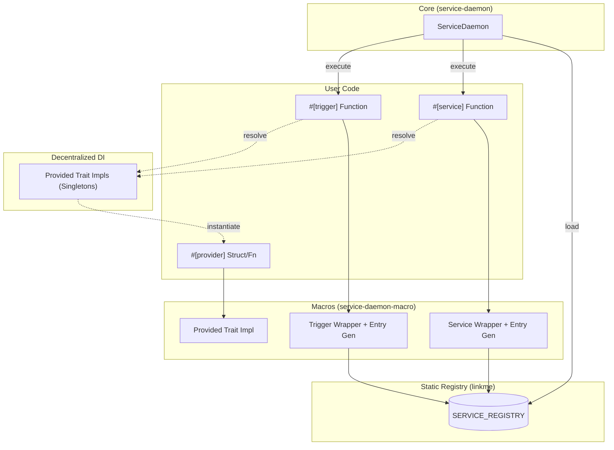

# Service Daemon Architecture

This document describes the internal architecture of the `service-daemon-rs` framework, explaining how its components interact to provide automatic service management and type-based dependency injection.

## Project Overview

The `service-daemon-rs` is a high-level framework for building resilient, modular Rust applications. It automates the boilerplate associated with:
1. **Service Orchestration**: Managing the lifecycle of long-running tasks.
2. **Dependency Injection (DI)**: Automatically resolving and injecting dependencies based on types.
3. **Event Triggers**: Decoupling event sources from service logic.

## High-Level Architecture

The framework is built around a **unified service registry** and **decentralized dependency injection**.

- **Unified Registry**: Both standard services and event-driven triggers are collected into a single `SERVICE_REGISTRY` at link time.
- **Decentralized DI**: Unlike traditional DI containers, there is no central registry for providers. Instead, each type provides its own resolution logic via the `Provided` trait, typically as a lazy `OnceCell` singleton.

## Step-by-Step Technical Details

### 1. Registration Phase (Compile & Link Time)

The framework uses the `linkme` crate to perform "distributed registration". 

- **Macros**: When you annotate a function with `#[service]`, the macro generates a static entry and a wrapper function.
- **Linker**: During the linking phase of compilation, all these static entries across different modules (and even different crates in the workspace) are collected into a single contiguous slice: `SERVICE_REGISTRY`.

### 2. Initialization Phase (`auto_init`)

When `ServiceDaemon::auto_init()` is called:
1. It iterates through the `SERVICE_REGISTRY`.
2. For each entry, it registers the service into the `ServiceDaemon` instance.
3. It initializes the `CancellationToken` for graceful shutdown management.

### 3. Dependency Injection (Decentralized & Lazy)

The `service-daemon-rs` uses **Type-Based Decentralized Resolution**. There is no "Container" object that holds all instances.

- **The `Provided` Trait**: Each type that can be injected must implement the `Provided` trait. The `#[provider]` macro automates this.
- **Async Singletons**: Each `Provided::resolve()` implementation typically uses a `tokio::sync::OnceCell` to ensure that only one instance of the type is created (Singleton pattern) and shared via `Arc<T>`.
- **Recursive Resolution**: When a service starts, its macro-generated wrapper calls `Provided::resolve()`. If that provider has its own `Arc<T>` fields, it recursively calls `resolve()` for those types.
- **No Manual Mapping**: Dependency resolution happens entirely based on types at compile time.

### 4. Execution Phase (`run`)

Once started via `daemon.run().await`:
1. **Spawning**: Each service is spawned as a separate `tokio` task.
2. **Monitoring**: The `ServiceDaemon` tracks the `JoinHandle` and status (Running, Restarting, Stopped) of each service. It also automatically wraps each service execution in a `tracing::Span` named `service` with the service's name, enabling automatic log correlation.
3. **Restart Policy**: If a service fails (returns `Err`), the daemon applies an **Exponential Backoff** policy with jitter to prevent "thundering herd" issues.
4. **Graceful Shutdown**: Upon receiving a `SIGINT` (Ctrl+C) or `SIGTERM`:
    - The `CancellationToken` is cancelled.
    - All services are awaited.
    - A grace period (e.g., 30s) is enforced before forcing an abort.

### 5. Event Triggers (Specialized Services)

Triggers are not a separate primitive; they are **Specialized Services**.
- **Unified Registry**: The `#[trigger]` macro registers an entry directly into the `SERVICE_REGISTRY`.
- **Host Wrapper**: Instead of running user code directly, the trigger wrapper spawns a "Host" (e.g., `cron_trigger_host`). 
- **Inversion of Control**: The Host manages the event source (cron, queue, etc.) and executes the user's handler when the event occurs. It automatically injects the trigger name and a unique ID into the `tracing` context via a span, removing the need for an explicit `id` parameter. Dependencies are injected lazily via DI just like a standard service.

## Key Components

| Component | Responsibility |
| :--- | :--- |
| `ServiceDaemon` | Main orchestrator, manages task lifecycles and restarts. |
| `SERVICE_REGISTRY` | Global list of all services found at link-time. |
| `Provided` | Trait that enables a type to be injected. |
| `RestartPolicy` | Configures backoff timing and jitter. |
| `CancellationToken` | Orchestrates graceful coordination for shutdown. |
